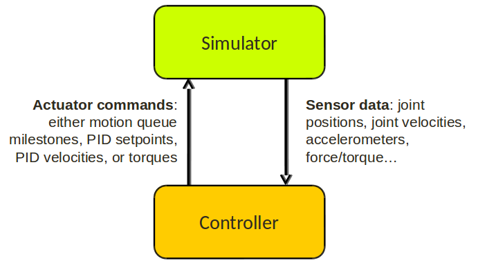

# Klamp't Manual: Control

* [Controllers](#controllers)
+ [Default motion queue controller](#default-motion-queue-controller)
  - [API summary](#api-summary)
+ [Custom controllers](#custom-controllers)
  - [API summary](#api-summary-1)
* [Actuators](#actuators)
+ [API summary](#api-summary-2)
* [Sensors](#sensors)
+ [Sensor measurements and attributes](#sensor-measurements-and-attributes)
  - [`JointVelocitySensor`](#-jointvelocitysensor-)
  - [`CameraSensor`](#-camerasensor-)
  - [`LaserRangeSensor`](#-laserrangesensor-)
  - [`DriverTorqueSensor`](#-drivertorquesensor-)
  - [`ContactSensor`](#-contactsensor-)
  - [`ForceTorqueSensor`](#-forcetorquesensor-)
  - [`Accelerometer`](#-accelerometer-)
  - [`TiltSensor`](#-tiltsensor-)
  - [`GyroSensor`](#-gyrosensor-)
  - [`IMUSensor`](#-imusensor-)
  - [`FilteredSensor`](#-filteredsensor-)
* [State estimation](#state-estimation)
+ [Using state estimators](#using-state-estimators)

Controllers provide the &quot;glue&quot; between the physical robot's actuators, sensors, and planners. They are very similar to planners in that they generate controls for the robot, but the main difference is that a controller is expected to work online and synchronously within a fixed, small time budget. As a result, they can only perform relatively light computations.

## Controllers

The number of ways in which a robot may be controlled is infinite, and can range from extremely simple methods, e.g., a linear gain, to extremely complex ones, e.g. an operational space controller or a learned policy. Yet, all controllers are structured as a simple callback loop: repeatedly read off sensor data, perform some processing, and write motor commands. The implementation of the internal processing is open to the user.

### Default motion queue controller

The default controller for each robot is a motion-queued controller with optional feedforward torques, which simulates typical controllers for industrial robots. It supports piecewise linear and piecewise cubic interpolation, as well as time-optimal acceleration-bounded trajectories.   The trajectory interpolation profile is the standard trapezoidal velocity profile, except it also accepts interruption and arbitrary start and goal velocities.

(Note: One limitation of the API is that it is impossible to have certain joints controlled by a motion queue, while others are controlled by PID commands.)

#### API summary

TODO

Specifically, the default controller is a `FeedforwardPolynomialPathController`.

### Custom controllers

Controllers can be dynamically and automatically loaded from world XML files via a statement of the form `<controller type="TheControllerType" attr1="value" ... />` under the `<simulation><robot>` element. The following controllers are supported:

- [<tt>JointTrackingController</tt> (JointTrackingController.h)](../Control/JointTrackingController.h): a simple open-loop controller that accepts a desired setpoint.
- [<tt>MilestonePathController</tt> (PathController.h)](../Control/PathController.h): an open-loop controller based on a `DynamicPath` trajectory queue.
- [<tt>PolynomialPathController</tt> (PathController.h)](../Control/PathController.h): an open-loop controller based on a `PiecewisePolynomialSpline` trajectory queue. Somewhat more flexible than `MilestonePathController`.
- [<tt>FeedforwardJointTrackingController</tt> (FeedforwardController.h)](../Control/FeedforwardController.h): a controller that additionally computes feedforward torques for gravity compensation and acceleration compensation. Works properly only with fixed-based robots. Otherwise works exactly like `JointTrackingController`.
- <tt>FeedforwardMilestonePathController</tt>: see above.
- <tt>FeedforwardPolynomialPathController</tt>: see above.
- [<tt>SerialController</tt> (SerialController.h)](../Control/SerialController.h): a thin communication layer that serves sensor data and accepts commands to/from a client controller through a serial interface.  It listens on the port given by the setting servAddr and sends sensor data at the rate writeRate (in Hz).  Sensor data and commands are converted to/from JSON format, in a form that is compatible with the Python API dictionaries used by the `control.BaseController` class (see the [Python API documentation](http://motion.cs.illinois.edu/software/klampt/0.8/pyklampt_docs/Manual-Control.html#experimental-controller-api)).

#### API summary

Any controller must subclass the `RobotController` class ([Controller.h](../Control/Controller.h)) and overload the Update method. The members sensors and command are available for the subclass to use. The basic control loop repeatedly executes:

1. The `RobotSensors*` sensors structure is filled in by the Klamp't simulation (or physical robot).
2. The `Update` method is called.  Here, the controller should fill in the `RobotMotorCommands*` command structure as necessary.
3. The command structure is read off by the Klamp't simulation (or physical robot).

New controller types can also be defined for dynamic loading in world XML files using the `RobotControllerFactory::Register(name,ptr)` function. This hook must be called before the world file is loaded. Afterward, the specified controller type will be instantiated whenever the registered type appears in the world file.

Custom controllers may expose various configuration settings to be loaded from XML files by implementing the `*Settings` methods. (These may also be manipulated by GUI programs and higher-level controllers/planners). They may also accept arbitrary external commands by overloading the `*Command*` methods.

## Actuators

At the lowest level, a robot is controlled by _actuators_. These receive instructions from the controller and produce link torques that are used by the simulator. Klamp't supports three types of actuator:

- _Torque control_ accepts torques and feeds them directly to links.
- _PID control_ accepts a desired joint value and velocity and uses a PID control loop to compute link torques servo to the desired position. Gain constants kP, kI, and kD should be tuned for behavior similar to those of the physical robot. PID controllers may also accept feedforward torques.
- _Locked velocity__control_ drives a link at a fixed velocity. _Experimental_. (Note: this is different from &quot;soft&quot; velocity control which feeds a piecewise linear path to a PID controller)

Note that the PID control and locked velocity control loops are performed as fast as possible with the simulation time step. This rate is typically faster than that of the robot controller. Hence a PID controlled actuator typically performs better (rejects disturbances faster, is less prone to instability) than a torque controlled actuator with a simulated PID loop at the controller level.

_Important_: When using Klamp't to prototype behaviors for a physical robot, the simulated actuators should be calibrated to mimic the robot's true low-level motor behavior as closely as possible. It is also the responsibility of the user to ensure that the controller uses the simulated actuators in the same fashion as it would use the robot's physical actuators. For example, for a PID controlled robot with no feedforward torque capabilities, it would not be appropriate to use torque control in Klamp't. If a robot does not allow changing the PID gains, then it would not be appropriate to do so in Klamp't. Klamp't will not automatically configure your controller for compatibility with the physical actuators, nor will it complain if such errors are made.

### API summary

The `RobotMotorCommand` (Command.h) structure contains a list of `ActuatorCommand`s that are then processed by the simulator.

## Sensors

Klamp't can emulate a handful of sensors typically found on robots. At the user's level of abstraction, they generically provide streaming numerical-valued measurements. It is up to the user to process these raw measurements into meaningful information.

The following sensors are natively supported:

- `JointPositionSensor`: Standard joint encoders.
- `JointVelocitySensor`: Velocity sensors. Here velocities are treated as raw measurements, not differenced from a position encoder, and hence they are rarely found in real life. However, these will be good approximations of differenced velocity estimates from high-rate encoders.
- `CameraSensor`: An RGB or RGB-D camera.
- `LaserRangeSensor`: A laser rangefinder sensor.
- `DriverTorqueSensor`: Torques fed back from a robot's motors.
- `ContactSensor`: A contact switch/sensor defined over a rectangular patch.
- `ForceTorqueSensor`: A force/torque sensor at a robot's joint. Can be configured to report values from 1 to 6DOF.
- `Accelerometer`: An accelerometer. Can be configured to report values from 1 to 3 channels.
- `TiltSensor`: A tilt sensor. Can be configured to report values from 1 to 2 axes, and optionally tilt rates.
- `GyroSensor`: A gyroscope. Can be configured to report accelerations, velocities, or absolute rotations.
- `IMUSensor`: An inertial measurement unit that uses an accelerometer and/or gyroscope to provide estimates of a link's transformation and its derivatives. It will fill in the gaps that are not provided by the accelerometer / gyro using either integration or differencing.
- `FilteredSensor`: A &quot;virtual sensor&quot; that simply filters the measurements provided by another sensor.

Each sensor derives from a standard base class, which is SensorBase in the C++ API [Control/Sensor.h](../Control/Sensor.h).  This base class provides functionality for configuring the sensor's settings and retrieving its measurements.  A sensor's settings are configured via attribute/value pairs, which are fed to the sensor's SetSetting method.  More details on sensor-specific settings are listed below. 

Sensor settings may also be dynamically configured via an XML tag of the form `<sensors> <TheSensorType name="some_name" attr1="value" ... " > </sensors>`. These XML strings can be inserted into .rob files under a line `property sensors [SENSORS_XML_FILE]`, URDF files under the `<klampt>` element, or world XML files under the `<simulation>` and `<robot>` elements.  See [the Hubo-II+ model](../data/robots/huboplus/huboplus_col.rob) for an example of configuring sensors in a .rob file, and [the simulation sensor test environment](../data/simulation_test_worlds/sensortest.xml) for an example of configuring sensor in an XML file.

### Sensor measurements and attributes

Formal documentation is not yet complete for most sensors.  For the most part, the attributes of a sensor match the members corresponding C++ class.  Please see the C++ class attributes and comments for the most complete information.

####`JointPositionSensor`

Settings are:

- `indices` (int list): a list of link indices actually read.  May also be empty to indicate all DOFs on the robot are read.
- `qresolution` (float list): resolution of each reading, in radians. E.g. "0.01 ... 0.01" indicates that each reading will be rounded to the nearest 0.01 radian
- `qvariance` (float list): variance of each reading, in radians

[C++ API documentation](http://motion.cs.illinois.edu/klampt/klampt_docs/classJointPositionSensor.html).

#### `JointVelocitySensor`

Settings are:

- `indices` (int list): a list of link indices actually read.  May also be empty to indicate all DOFs on the robot are read.
- `qresolution` (float list): resolution of each reading, in rad/s. E.g. "0.1 ... 0.1" indicates that each reading will be rounded to the nearest 0.1 rad/s
- `qvariance` (float list): variance of each reading, in rad/s.

[C++ API documentation](http://motion.cs.illinois.edu/klampt/klampt_docs/classJointVelocitySensor.html).

#### `CameraSensor`

Simulates a camera or RGB-D sensor.  Measurements give the pixel measurements of the RGB sensor (if present) followed by the pixel measurements of the depth sensor (if present). RGB measurements are three floating point measurements in the range [0,1] giving the RGB channels of each pixel, in scan-line order.  Depth measurements are in meters.

Settings are:

- `link` (int): the link on which this sensor lies.
- `rgb` (bool): if true, the camera provides RGB output.
- `depth` (bool): if true, the camera provides depth output.
- `xres`, `yres` (int): the x and y resolution of the sensor.
- `xfov`, `yfov` (float): the x and y field of view, in radians.
- `zmin`, `zmax` (float): minimum and maximum range of the depth sensor.

[C++ API documentation](http://motion.cs.illinois.edu/klampt/klampt_docs/classCameraSensor.html).

#### `LaserRangeSensor`

See the [C++ API documentation](http://motion.cs.illinois.edu/klampt/klampt_docs/classLaserRangeSensor.html) for attributes.

#### `DriverTorqueSensor`

See the [C++ API documentation](http://motion.cs.illinois.edu/klampt/klampt_docs/classDriverTorqueSensor.html) for attributes.

#### `ContactSensor`

See the [C++ API documentation](http://motion.cs.illinois.edu/klampt/klampt_docs/classContactSensorSensor.html) for attributes.

#### `ForceTorqueSensor`

See the [C++ API documentation](http://motion.cs.illinois.edu/klampt/klampt_docs/classForceTorqueSensor.html) for attributes.

#### `Accelerometer`

See the [C++ API documentation](http://motion.cs.illinois.edu/klampt/klampt_docs/classAccelerometer.html) for attributes.

#### `TiltSensor`

See the [C++ API documentation](http://motion.cs.illinois.edu/klampt/klampt_docs/classTiltSensor.html) for attributes.

#### `GyroSensor`

See the [C++ API documentation](http://motion.cs.illinois.edu/klampt/klampt_docs/classGyroSensor.html) for attributes.

#### `IMUSensor`

See the [C++ API documentation](http://motion.cs.illinois.edu/klampt/klampt_docs/classIMUSensor.html) for attributes.

#### `FilteredSensor`

See the [C++ API documentation](http://motion.cs.illinois.edu/klampt/klampt_docs/classFilteredSensor.html) for attributes.

## State estimation

Controllers may or may not perform state estimation. If state estimation is performed, it is good practice to define the state estimator as independent of the controller, such as via a subclass of `RobotStateEstimator`. The `RobotStateEstimator` interface is fairly sparse, but the calling convention helps standardize their use in controllers.

### Using state estimators 
Controllers should instantiate a state estimator explicitly on construction. Inside the `Update` callback, the controller should:

1. Call `ReadSensors(*sensors)`, then `UpdateModel()` to update the robot's model.
2. Read off the estimated state of the robot model (and potentially other information computed by the state estimator, such as uncertainty levels) and compute its command as usual.
3. Just before returning, call the `ReadCommand(*command)` and `Advance(dt)` methods on the `RobotStateEstimator` object.

A few experimental state estimators are available. `OmniscientStateEstimator` gives the entire actual robot state to the controller, regardless of the sensors available to the robot. `IntegratedStateEstimator` augments accelerometers and gyros with an integrator that tries to track true position. These integrators are then merged (in a rather simple-minded way) to produce the final model.

