# Klamp't Manual: Geometry and Appearance

* [Geometries and collision geometries](#geometries-and-collision-geometries)
    + [Geometric representations](#geometric-representations)
    + [Geometric operation support](#geometric-operation-support)
    + [API summary](#api-summary)
    + [Geometry caching](#geometry-caching)
* [Appearance](#appearance)

Klamp't uses a variety of geometry types to define geometric primitives, triangulated meshes, and point clouds.  Each geometry may also be associated with an [Appearance](#appearance).

## Geometries and collision geometries
Klamp't stores Geometry datain an object's local frame.

The notion of a _collision geometry_ combines some underlying geometric data with transformations and collision acceleration structures. Collision geometries have a _current transformation_ that sets where they exist in space, and is used for collision testing. Collision geometries also support an additional, nonnegative margin setting that &quot;expands&quot; the underlying geometry when performing collision testing.  The margin does not actually affect the geometric data, but rather it changes the distance threshold that is used to consider colliding vs. noncolliding geometries.

### Geometric representations

The following geometric representations are currently supported:
- _Geometric primitive_ (``Primitive``): axis-aligned boxes, oriented boxes, lines, rays, segments, triangles, planar polygons, spheres, ellipsoids, and planar circles.
- _Convex polytope_ (``ConvexHull``): A convex hull of a set of points.
- _Triangle mesh_ (``TriangleMesh``): the most common geometry representation used in video games and CAD models.  Can also contain appearance data.
- _Point cloud_ (``PointCloud``): most commonly used in laser scanners and RGBD sensors.  Can also contain color and other per-point properties.  If the `radius` property is given, then each point is treated like a sphere. 
- _Implicit surface voxel grid_ (``ImplicitSurface``): a volumetric representation where values < 0 are inside, 0 is the surface, and > 0 are outside. Usually a signed distance function (SDF).  Can also represent other implicit functions and TSDFs for some operations (visualization, conversion, inside-outside tests).
- _Occupancy map voxel grid_ (``OccupancyGrid``): a volumetric representation where values > 0.5 (or some other value) are occupied.
- _Height map / depth map_ (``Heightmap``): an elevation map or a perspective depth map.  Can also contain color and other properties.

In addition, there is a notion of a geometry *Group*, which can combine multiple
sub-geometries.

### Geometric operation support

Not all representations support all operations, and some representations yield much better performance (speed and accuracy) than others. To get optimal performance from your program, you should learn which  [operations are suited for which representations](https://motion.cs.illinois.edu/RoboticSystems/Geometry.html). 

To get a better sense of how operations affect the geometries, the ``geometrytest.py`` test program in ``Klampt-examples`` can be used.  This allows you to convert any two geometries into any supported format and perform various queries.  Use the Actions menu to convert and switch between proximity query modes.  Klampt-examples and [geometrytest.py](https://github.com/krishauser/Klampt-examples/blob/master/Python3/testing/geometry/geometrytest.py) on Github.

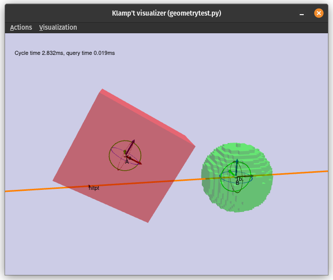

The rest of this section provides detailed information about Klampt's support for various geometry operations.  (Here, 🕑 means support is on the TODO list for the near future.)

#### Loading / Saving

All types supported.

Triangle meshes can be saved/loaded from nearly all types (STL, OBJ, OFF, PLY, GLTF, etc), unless you are building from source and Assimp is unavailable at build time.

Point clouds can be saved/loaded from PCL format. 

Primitives, convex hulls, and voxel grids use custom formats. 

Heightmaps are stored in a custom JSON format. Heightmap images can be loaded from many image file formats on Windows or if ImageMagick was installed while KrisLibrary is built; otherwise, only BMP, TGA, and PPM are supported.  

#### OpenGL drawing

| Geometric primitive | Convex polytope | Triangle mesh | Point cloud | Implicit surface | Occupancy grid | Heightmap | 
|----|----|----|----|----|----|----|
| ✔️  | ✔️  | ✔️  | ✔️  | ✔️  | ✔️  | ✔️  |

#### Type conversions

(Converting from the type listed in column to type listed in row.)

| From → / To ↓ | Geometric primitive | Convex polytope | Triangle mesh | Point cloud | Implicit surface | Occupancy grid | Heightmap | 
|-------|----|----|----|----|----|----|----|
|**GP** |    | ❌ | ❌ | ❌ | ❌ | ❌ | ❌ |
|**CP** | ✔️  |    | ✔️¹ | ✔️  | ✔️  | ✔️  | ✔️  |
|**TM** | ✔️  | ✔️  |    | ❌ | ✔️  | ✔️  | ✔️  |
|**PC** | ✔️  | ✔️  | ✔️  |    | ✔️  | ✔️  | ✔️  |
|**IS** | ✔️  | ✔️  | ✔️  | ❌ |    | ❌ | ✔️  |
|**OG** | ✔️  | ✔️  | ✔️  | ✔️  | ✔️  |    | ✔️  |
|**HM** | ✔️  | ❌ | ✔️  | ✔️  | ✔️  | ✔️  |    |

1. Convex decomposition of a non-convex watertight mesh can be performed with an appropriate parameter to the convert function.

These are shown in the following image:

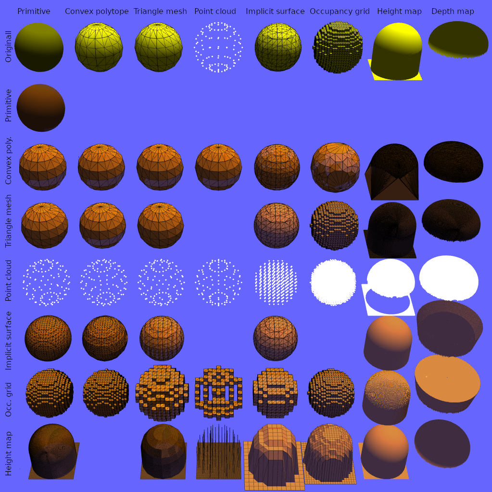

Note that a depth map is considered to be viewed from the "bottom up", so the occupied space is considered to be any space above the map.  Here, the depth values outside of the sphere are assumed invalid.

Indirect conversions to a third type can be used to do some unsupported conversions.  For example, convex polytope -> triangle mesh -> heightmap can replace the unsupported convex polytope -> heightmap conversion. Occupancy grid -> triangle mesh -> implicit surface can replace the unsupported occupancy grid -> implicit surface conversion.

Many conversions (mesh -> convex polytope, implicit surface, occupancy grid, heightmap) also depend on a resolution parameter.  If the resolution is set too low, then the fidelity of the resulting geometry may suffer.  As an example, the below image shows a CAD model of the Boston Dynamics Atlas torso converted to an implicit surface at two different resolutions:

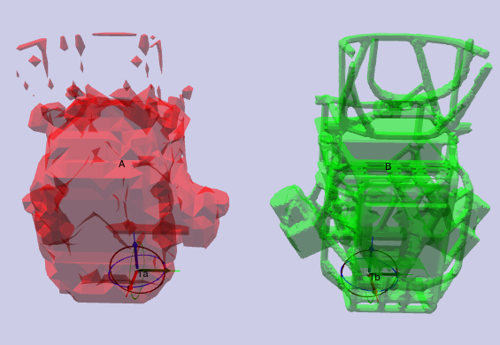

If in doubt, you should visualize the result (in Python, you can simply run `from klampt import vis; vis.debug(geom)`).

We perform computation speed tests to profile the performance of geometric operations.  The test set contains both simple and complex geometries and is tested on a machine with specs... TODO.  Simple test geometries are approximately spherical, have unit size, and have the following complexity: 
- GP: sphere
- CP: 8 vertices
- TM: 624 triangles
- PC: 761 points
- IS/OG: 64 x 64 x 64 grid
- HM: 256 x 256 grid

While complex test geometries have the following complexity:
- CP: 3,122 vertices
- TM: 70,224 triangles
- PC: 157,000 points
- IS/OG: 256 x 256 x 256 grid
- HM: 2,048 x 2,048 grid

Example conversion speeds are shown below (in ms).  Algorithmic complexity is approximately linear in the number of elements for all representations except for Convex Polytope, which is superlinear.  Conversions are listed from the type listed in column to type listed in row. 

*Simple geometries*:

| From → / To ↓ | Geometric primitive | Convex polytope | Triangle mesh | Point cloud | Implicit surface | Occupancy grid | Heightmap | 
|----------------|-------|-------|-------|-------|-------|-------|-------|
| Primitive      |       |       |       |       |       |       |       | 
| ConvexHull     | 2.289 |       | 6.244 | 2.838 |495.649| 2.827 | 1192.522 | 
| TriangleMesh   | 0.011 | 0.044 |       |       | 38.945| 0.173 | 7.988 | 
| PointCloud     | 0.056 | 0.049 | 0.102 |       | 7.286 | 0.043 | 3.521 | 
| ImplicitSurface| 0.499 | 17.712| 22.407|       |       |       |106.069| 
| OccupancyGrid  | 0.569 | 17.732| 1.508 | 0.038 | 1.025 |       |106.331| 
| Heightmap      | 5.396 |       | 4.428 | 0.812 | 12.108| 0.052 |       | 

*Complex geometries*:

| From → / To ↓ | Geometric primitive | Convex polytope | Triangle mesh | Point cloud | Implicit surface | Occupancy grid | Heightmap | 
|----------------|-------|-------|-------|-------|-------|-------|-------|
| Primitive      | 0.000 |       |       |       |       |       |       | 
| ConvexHull     | 0.072 | 0.002 | 765.821 | 70.139 | 12509.097 | 1614.323 | 3989.334 | 
| TriangleMesh   | 0.001 | 21.802 | 0.707 |       | 978.975 | 766.626 | 718.425 | 
| PointCloud     | 0.005 | 22.913 | 10.826 | 8.696 | 631.070 | 619.788 | 424.437 | 
| ImplicitSurface| 0.351 | 236.135 | 14057.825 |       | 33.795 |       | 6995.770 | 
| OccupancyGrid  | 0.387 | 239.799 | 165.434 | 174.888 | 83.796 | 33.489 | 7010.963 | 
| Heightmap      | 10.661 |       | 32.363 | 8.649 | 993.740 | 992.110 | 4.293 | 

#### Proximity query acceleration data structures

To accelerate proximity queries (collision, ray casting, distances, etc.), most geometries create auxiliary data structures.  These are initialized when a proximity query is first called. These structures are cached as long as the collision geometry undergoes rigid transforms via `SetTransform` (C++) / `setCurrentTransform` (Python). 

However, the data structures must be refreshed if the geometry data is changed.  The overhead of precomputation can be small for simple geometries.  However, for complex geometries, the overhead can be substantial, so it is best to avoid interleaving changes to the geometry data with proximity queries.

| **Geometric primitive** | None |
|-------------------------|------|
| **Convex polytope**     | SOLID3 data structure |
| **Triangle mesh**       | PQP bounding volume hierarchy |
| **Point cloud**         | Sparse voxel grid and octree |
| **Implicit surface**    | Octree |
| **Occupancy grid**      | List of occupied and surface cells |
| **Heightmap**           | None |

Example precomputation speeds are shown below (in ms):

|  | Geometric primitive | Convex polytope | Triangle mesh | Point cloud | Implicit surface | Occupancy grid | Heightmap | 
|------------|-------|-------|-------|-------|-------|-------|-------|
|**Simple**  | 0.000 | 0.000 | 1.203 | 0.142 | 0.975 | 1.395 | 0.128 | 
|**Complex** | 0.000 | 0.000 |504.044|13.737 |630.696|1073.331| 7.041 | 

#### Miscellaneous queries

Bounding box queries yield an axis-aligned (C++ and Python) or oriented bounding box (C++ only).

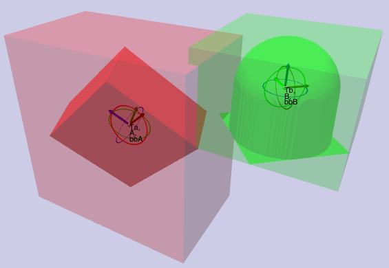

Ray casts find the first point of intersection between the geometry and a ray.

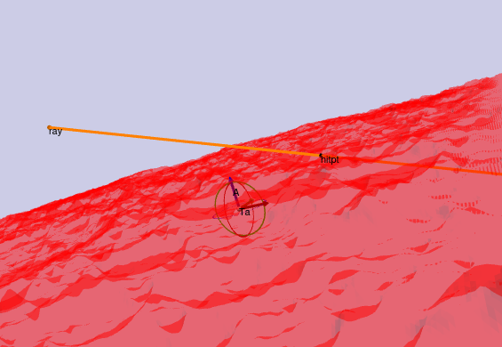

Support queries find the farthest point on the geometry in some direction.

|  | Geometric primitive | Convex polytope | Triangle mesh | Point cloud | Implicit surface | Occupancy grid | Heightmap | 
|-----------------|----|----|----|----|----|----|----|
|**Bounding box** | ✔️  | ✔️  | ✔️¹ | ✔️¹ | ✔️  | ✔️  | ✔️  |
|**Ray cast**     | ✔️  | ❌²| ✔️  | ✔️  | ✔️  | ✔️  | ✔️  |
|**Support**      | ✔️  | ✔️  | ✔️  | ✔️  | ❌ | ❌ | ❌ |

1. A fast approximate method is available.
2. A limitation of SOLID3.

#### Point queries

|  | Geometric primitive | Convex polytope |  Triangle mesh | Point cloud | Implicit surface | Occupancy grid | Heightmap |
|---------------|----|----|----|----|----|----|----|
|**Containment**| ✔️  | ✔️  | ✔️¹ | ✔️  | ✔️  | ✔️  | ✔️  |
|**Distance**   | ✔️² | ✔️² | ✔️  | ✔️² | ✔️² | 🕑 | 🕑  |

1. uses a heuristic to determine inside/outside.
2. signed distance supported.

An example of point containment queries is shown below. 

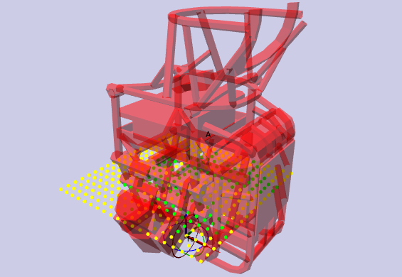

An example of a point distace query is shown below with the query asking for the distance and closest point on the red geometry to the center of the green circle. 

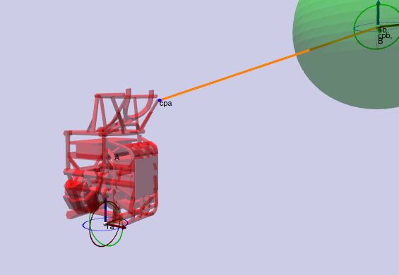

Example computation speeds are shown below (in ms):

*Simple geometries*

|  | Geometric primitive | Convex polytope | Triangle mesh | Point cloud | Implicit surface | Occupancy grid | Heightmap | 
|-----------------|-------|-------|-------|-------|-------|-------|-------|
|**Bounding box** | 0.000 | 0.001 | 0.000 | 0.000 | 0.001 | 0.001 | 0.000 |
|**Ray cast**     | 0.000 |       | 0.000 | 0.000 | 0.000 | 0.000 | 0.003 |
|**Support**      | 0.000 | 0.000 | 0.001 | 0.003 |       |       |       | 
|**Pt. Containment**  | 0.000 | 0.002 | 0.005 | 0.000 | 0.000 | 0.000 | 0.000 | 
|**Pt. Distance**     | 0.000 | 0.003 | 0.006 | 0.003 | 0.000 |       |       |

*Complex geometries*

|  | Geometric primitive | Convex polytope | Triangle mesh | Point cloud | Implicit surface | Occupancy grid | Heightmap | 
|-----------------|-------|-------|-------|-------|-------|-------|-------|
|**Bounding box** | 0.001 | 0.003 | 0.001 | 0.000 | 0.001 | 0.001 | 0.001 | 
|**Ray cast**     | 0.000 |       | 0.000 | 0.000 | 0.000 | 0.000 | 0.020 |
|**Support**      | 0.000 | 0.000 | 0.047 | 0.538 |       |       |       | 
|**Pt. Containment**  | 0.000 | 0.003 | 0.004 | 0.000 | 0.000 | 0.000 | 0.000 | 
|**Pt. Distance**     | 0.000 | 0.005 | 0.010 | 0.042 | 0.000 |       |       | 

#### Collision detection

Collision detection detects whether two objects overlap.  The extended version returns the element indices that overlap  up to some number of max contacts, and if max contacts = 1 this costs no more time than the simple (boolean) version.  Below, the orange triangles on the red object collide with the green triangles on the yellow object.

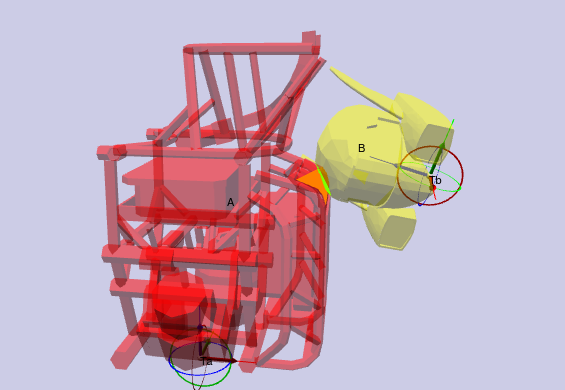

|  | Geometric primitive | Convex polytope | Triangle mesh | Point cloud | Implicit surface | Occupancy grid | Heightmap |
|-------|----|----|----|----|----|----|----|
|**GP** | ✔️² | ✔️² | ✔️² | ✔️² | ✔️¹ | ✔️² | ✔️³ |
|**CP** | ✔️² | ✔️  | ✔️  | ✔️  | ❌ | ✔️³ | ✔️³ |
|**TM** | ✔️² | ✔️  | ✔️  | ✔️  | ✔️³ | ✔️³ | ✔️³ |
|**PC** | ✔️  | ✔️  | ✔️  | ✔️  | ✔️  | ✔️³ | ✔️  |
|**IS** | ✔️¹ | ❌ | ✔️³ | ✔️  | ✔️³ | ✔️³ | ✔️³ |
|**OG** | ✔️² | ✔️³ | ✔️³ | ✔️³ | ✔️³ | ✔️³ | ✔️  |
|**HM** | ✔️³ | ✔️³ | ✔️³ | ✔️  | ✔️³ | ✔️  | 🕑 |

1. for a couple geometric primitives (usually point and sphere).
2. for common geometric primitives (usually point, sphere, box, and triangle)
3. not accelerated, or scaling to large geometries is poor.

Within-distance detection is a boolearn query that detects whether two objects are within a given distance from one another.  It is usually faster than distance calculation.  The extended version returns the element indices that overlap up to some number of max contacts, and if the max contacts = 1 then this costs no more time than the simple (boolean) version.   Below, the orange triangles on the red object are within 0.1 units from the green triangles on the yellow object.

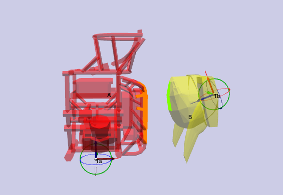

|  | Geometric primitive | Convex polytope | Triangle mesh | Point cloud | Implicit surface | Occupancy grid | Heightmap |
|-------|----|----|----|----|----|----|----|
|**GP** | ✔️² | ✔️² | ✔️² | ✔️² | ✔️¹ | ✔️² | ❌ | 
|**CP** | ✔️² | ✔️  | ✔️  | ✔️  | ❌ | ✔️³ | ❌ | 
|**TM** | ✔️² | ✔️  | ✔️  | ✔️  | ✔️³ | ✔️³ | ❌ | 
|**PC** | ✔️² | ✔️  | ✔️  | ✔️  | ✔️  | ✔️³ | ❌ | 
|**IS** | ✔️¹ | ❌ | ✔️³ | ✔️  | ✔️³ | ✔️³ | ❌ | 
|**OG** | ✔️² | ✔️³ | ✔️³ | ✔️³ | ✔️³ | ❌ | ❌ | 
|**HM** | ❌ | ❌ | ❌ | ❌ | ❌ | ❌ | ❌ | 

1. for a couple geometric primitives (usually point and sphere).
2. for common geometric primitives (usually point, sphere, box, and triangle)
3. not accelerated, or scaling to large geometries is poor.

Example computation speeds are shown below (in ms).  Note that speeds vary significantly on the relative pose, size, and resolution of the objects, where performance worsens with close-but-not-colliding, highly overlapping, similar sized, and high-resolution objects.

*Simple geometries*

|  | Geometric primitive | Convex polytope | Triangle mesh | Point cloud | Implicit surface | Occupancy grid | Heightmap |
|-------|-------|-------|-------|-------|-------|-------|-------|
|**GP** | 0.000 | 0.003 | 0.001 | 0.014 | 0.001 | 0.007 | 0.011 | 
|**CP** | 0.003 | 0.002 | 0.011 | 0.014 |       | 0.004 | 0.072 | 
|**TM** | 0.001 | 0.011 | 0.012 | 0.437 | 0.124 | 0.617 | 0.029 | 
|**PC** | 0.014 | 0.014 | 0.437 | 0.170 | 0.039 | 8.042 | 0.016 | 
|**IS** | 0.001 |       | 0.124 | 0.039 | 8.439 | 1.314 | 0.499 | 
|**OG** | 0.007 | 0.004 | 0.617 | 8.042 | 1.314 | 1.396 | 0.932 | 
|**HM** | 0.011 | 0.072 | 0.029 | 0.016 | 0.499 | 0.932 |       | 

*Complex geometries*

|  | Geometric primitive | Convex polytope | Triangle mesh | Point cloud | Implicit surface | Occupancy grid | Heightmap |
|-------|-------|-------|-------|-------|-------|-------|-------|
|**GP** | 0.001 | 0.007 | 0.002 | 0.313 |       | 0.005 | 0.001 | 
|**CP** | 0.007 | 0.006 | 8.827 | 28.404|       | 0.089 | 63.090| 
|**TM** | 0.002 | 8.827 | 0.011 | 2.295 | 4.608 | 31.010| 0.884 | 
|**PC** | 0.313 | 28.404| 2.295 | 4.537 | 1.905 |560.186| 0.021 | 
|**IS** |       |       | 4.608 | 1.905 | 7.504 | 87.130| 3.685 | 
|**OG** | 0.005 | 0.089 |31.010 |560.186| 87.130| 27.407| 12.617|  
|**HM** | 0.001 |63.090 | 0.884 | 0.021 | 3.685 |12.617 |       |

#### Distance query

Distance queries determine the minimium distance between objects.  Some geometry pairs also support signed distance queries, which return the negative penetration depth if the objects are overlapping.  

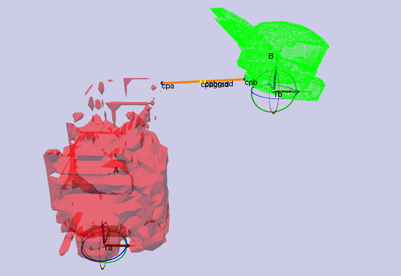

|  | Geometric primitive | Convex polytope | Triangle mesh | Point cloud | Implicit surface | Occupancy grid | Heightmap |
|-------|----|----|----|----|----|----|----|
|**GP** | ✔️² | ✔️² | ✔️² | ✔️  | ✔️¹ | ❌ | ❌ |
|**CP** | ✔️² | ✔️  | ❌ | ✔️  | ❌ | ❌ | ❌ |
|**TM** | ✔️² | ❌ | ✔️  | ✔️  | 🕑 | ❌ | ❌ |
|**PC** | ✔️  | ✔️  | ✔️  | ✔️  | ✔️  | ❌ | ❌ |
|**IS** | ✔️¹ | ❌ | 🕑 | ✔️  | ❌ | ❌ | ❌ |
|**OG** | ❌ | ❌ | ❌ | ❌ | ❌ | ❌ | ❌ |
|**HM** | ❌ | ❌ | ❌ | ❌ | ❌ | ❌ | ❌ |

1. for a couple of primitives (usually point and sphere).
2. for common geometric primitives (usually point, sphere, box, and triangle)

Example computation speeds are given below (in ms):

*Simple geometries*

|    | Geometric primitive | Convex polytope | Triangle mesh | Point cloud | Implicit surface | Occupancy grid | Heightmap |
|----------------|-------|-------|-------|-------|-------|-------|-------|
| Primitive      | 0.001 | 0.006 | 0.003 | 0.003 | 0.001 |       |       | 
| ConvexHull     | 0.006 | 0.005 |       | 0.034 |       |       |       | 
| TriangleMesh   | 0.003 |       | 0.186 | 0.762 |       |       |       | 
| PointCloud     | 0.003 | 0.034 | 0.762 | 0.138 | 0.046 |       |       | 
| ImplicitSurface| 0.001 |       |       | 0.046 |       |       |       | 
| OccupancyGrid  |       |       |       |       |       |       |       | 
| Heightmap      |       |       |       |       |       |       |       | 

*Complex geometries*

|  | Geometric primitive | Convex polytope | Triangle mesh | Point cloud | Implicit surface | Occupancy grid | Heightmap |
|----------------|-------|-------|-------|-------|-------|-------|-------|
| Primitive      |       | 0.028 | 58.720 | 3.375 |       |       |       | 
| ConvexHull     | 0.028 | 0.065 |       | 1.124 |       |       |       | 
| TriangleMesh   | 58.720 |       | 0.351 | 11.014 |       |       |       | 
| PointCloud     | 3.375 | 1.124 | 11.014 | 37.619 | 2.434 |       |       | 
| ImplicitSurface|       |       |       | 2.434 |       |       |       | 
| OccupancyGrid  |       |       |       |       |       |       |       | 
| Heightmap      |       |       |       |       |       |       |       | 

#### Contact detection

Contact detection is used in physics simulation and stability prediction to produce accurate estimates of **all** the contact points that would be active between two objects that are touching.  Below, the contact points are shown as orange points and normals are shown as red lines.

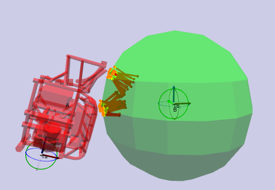

|  | Geometric primitive | Convex polytope | Triangle mesh | Point cloud | Implicit surface | Occupancy grid | Heightmap |
|-------|----|----|----|----|----|----|----|
|**GP** | ✔️² | ✔️  | ✔️¹ | ✔️  | ✔️² | ❌ | ❌ |
|**CP** | ✔️  | ✔️  | ❌ | ✔️  | ❌ | ❌ | ❌ |
|**TM** | ✔️¹ | ❌ | ✔️  | ✔️  | ✔️  | ❌ | ❌ |
|**PC** | ✔️  | ✔️  | ✔️  | ✔️  | ✔️  | ❌ | ❌ |
|**IS** | ✔️² | ❌ | ✔️  | ✔️  | ❌ | ❌ | ❌ |
|**OG** | ❌ | ❌ | ❌ | ❌ | ❌ | ❌ | ❌ |
|**HM** | ❌ | ❌ | ❌ | ❌ | ❌ | ❌ | ❌ |

1. Only produces a single contact point, may lead to inaccurate simulations.
2. For some primitives.

Example computation speeds are given below (in ms):

*Simple geometries*

|  | Geometric primitive | Convex polytope | Triangle mesh | Point cloud | Implicit surface | Occupancy grid | Heightmap |
|----------------|-------|-------|-------|-------|-------|-------|-------|
| Primitive      | 0.000 | 0.005 | 0.001 | 0.001 | 0.001 |       |       | 
| ConvexHull     | 0.005 | 0.001 |       |       |       |       |       | 
| TriangleMesh   | 0.001 |       | 0.018 | 0.631 | 0.192 |       |       | 
| PointCloud     | 0.001 |       | 0.631 | 0.252 | 0.004 |       |       | 
| ImplicitSurface| 0.001 |       | 0.192 | 0.004 |       |       |       | 
| OccupancyGrid  |       |       |       |       |       |       |       | 
| Heightmap      |       |       |       |       |       |       |       | 

*Complex geometries*

|  | Geometric primitive | Convex polytope | Triangle mesh | Point cloud | Implicit surface | Occupancy grid | Heightmap |
|----------------|-------|-------|-------|-------|-------|-------|-------|
| Primitive      |       | 0.017 | 7.516 | 0.001 |       |       |       | 
| ConvexHull     | 0.017 | 0.003 |       |       |       |       |       | 
| TriangleMesh   | 7.516 |       | 0.009 | 9.136 | 21.625 |       |       | 
| PointCloud     | 0.001 |       | 9.136 | 29.329 | 0.006 |       |       | 
| ImplicitSurface|       |       | 21.625 | 0.006 |       |       |       | 
| OccupancyGrid  |       |       |       |       |       |       |       | 
| Heightmap      |       |       |       |       |       |       |       | 

#### Geometric operations

*Transforms* here refer to transforming the underlying geometry by translation, rotation, and/or scaling.  (Recall that all collision objects have a *current transform* which can be set with nearly zero overhead.)

*Remesh* operations refine the representation to a specified coarser or finer resolution.

*Union* operations gather multiple objects of the same type into a single object.  If a union cannot be performed, then a Group geometry is produced by the union operation.

*Extract ROI* operations extract a region (bounding box) from the object to produce an object of the same type.  The below ROI of a mesh was computed and then the original mesh was moved to the left for visualization clarity.

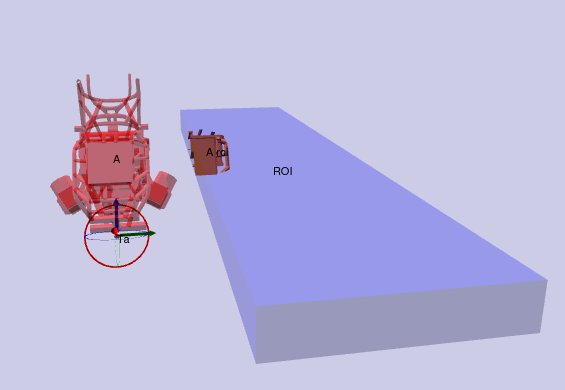

*Slice* operations take a planar slice through the object.

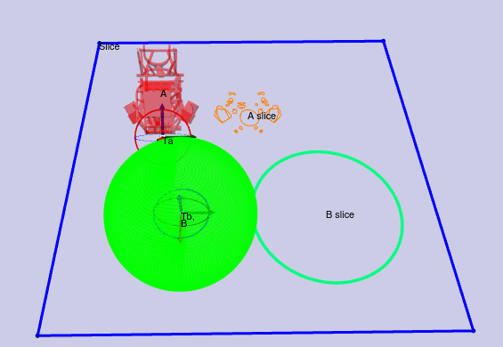

|  | Geometric primitive | Convex polytope | Triangle mesh | Point cloud | Implicit surface | Occupancy grid | Heightmap |
|----------|----|----|----|----|----|----|----|
|**Rigid transform** | ✔️  | ✔️  | ✔️  | ✔️  | ❌ | ❌ | ✔️  |
|**Nonuniform scale** | ❌ | ✔️  | ✔️  | ✔️  | ✔️  | ✔️  | ✔️  |
|**Scale + rigid transform** | ✔️  | ✔️  | ✔️  | ✔️  | ❌ | ❌ | ❌ |
|**Remesh**| ❌ | ❌ | ✔️  | ✔️  | ✔️  | ✔️  | ✔️  |
|**Union** | ❌ | ✔️  | ✔️  | ✔️  | ❌ | ❌ | ❌ |
|**ROI**   | ❌ | ❌ | ✔️  | ✔️  | ✔️¹ | ✔️¹ | ✔️¹² |
|**Slice** | ❌ | ❌ | ✔️  | ✔️  | ❌ | ❌ | ❌ |

1. Only axis-aligned.
2. Depth maps not supported.

*Merge* operations union a geometry into an existing representation: (merging the type listed in row into target type listed in column)

| Into → / From ↓ | Geometric primitive | Convex polytope | Triangle mesh | Point cloud | Implicit surface | Occupancy grid | Heightmap |
|-------|----|----|----|----|----|----|----|
|**GP** | ❌ | ❌ | ❌ | ❌ | ✔️  | ✔️  | ✔️  |
|**CP** | ❌ | ✔️  | ❌ | ❌ | ✔️  | ✔️  | ❌ |
|**TM** | ❌ | ❌ | ✔️  | ❌ | ✔️  | ✔️  | ✔️  |
|**PC** | ❌ | ❌ | ❌ | ✔️  | ✔️  | ✔️  | ✔️  |
|**IS** | ❌ | ❌ | ❌ | ❌ | ✔️  | ✔️  | ✔️  |
|**OG** | ❌ | ❌ | ❌ | ❌ | ❌ | ✔️  | ✔️  |
|**HM** | ❌ | ❌ | ❌ | ❌ | ❌ | ❌ | ✔️¹ |

1. domains must be aligned.  Support for unaligned domains is 🕑.

For triangle mesh and point cloud targets, it is recommended that you first convert the merged geometry into the desired type before merging.

Below is an illustration of a geometric primitive (sphere) being merged into a heightmap of a lunar terrain.  For visualization clarity, the primitive was moved to the right after merging.

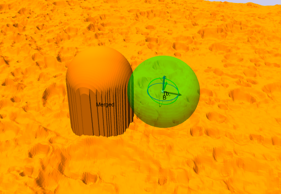

Computation speeds are shown below (in ms):

*Simple geometries*

|  | Geometric primitive | Convex polytope | Triangle mesh | Point cloud | Implicit surface | Occupancy grid | Heightmap | 
|-----------------|-------|-------|-------|-------|-------|-------|-------|
|**Transform**    | 0.000 | 0.078 | 0.003 | 0.016 | 0.003 | 0.004 | 0.000 | 
|**Remesh**       |       |       | 0.502 | 0.209 | 0.042 | 6.911 | 0.008 |
|**Union**        |       | 0.254 | 0.049 | 0.188 |       |       |       | 
|**ROI**          |       |       | 0.002 | 0.015 | 0.039 | 0.027 | 0.114 | 
|**Slice**        |       |       | 0.001 | 0.004 |       |       |       | 

|**Merge** Into → / From ↓ | Geometric primitive | Convex polytope | Triangle mesh | Point cloud | Implicit surface | Occupancy grid | Heightmap | 
|----------------|-------|-------|-------|-------|-------|-------|-------|
| Primitive      |       |       |       |       | 28.071 | 18.002 | 1.405 | 
| ConvexHull     |       | 0.170 |       |       | 785.527 | 47.786 |       | 
| TriangleMesh   |       |       | 4.195 |       | 323.612 | 17.878 | 1.836 | 
| PointCloud     |       |       |       | 0.834 | 61.015 | 14.178 | 1.159 | 
| ImplicitSurface|       |       |       |       | 17.738 | 23.709 | 12.708 | 
| OccupancyGrid  |       |       |       |       |       | 22.014 | 12.785 | 
| Heightmap      |       |       |       |       |       |       |       | 

*Complex geometries*

|  | Geometric primitive | Convex polytope | Triangle mesh | Point cloud | Implicit surface | Occupancy grid | Heightmap | 
|-----------------|-------|-------|-------|-------|-------|-------|-------|
|**Transform**    | 0.000 | 72.583| 0.349 | 3.878 | 14.325| 0.000 | 2.626 |
|**Remesh**       |       |       | 24.164|11.309 | 0.048 |338.694| 0.008 |
|**Union**        |       |133.693| 5.146 | 42.201|       |       |       | 
|**ROI**          |       |       | 0.002 | 2.405 | 0.177 | 0.106 | 5.983 |
|**Slice**        |       |       | 0.001 | 0.002 |       |       |       | 

|**Merge** Into → / From ↓ | Geometric primitive | Convex polytope | Triangle mesh | Point cloud | Implicit surface | Occupancy grid | Heightmap | 
|----------------|-------|-------|-------|-------|-------|-------|-------|
| Primitive      |       |       |       |       | 2725.712 | 1095.119 | 107.943 | 
| ConvexHull     |       | 133.480 |       |       | 83310.352 | 65026.609 |       | 
| TriangleMesh   |       |       | 529.401 |       | 3051.742 | 945.973 | 123.200 | 
| PointCloud     |       |       |       | 193.659 | 15528.338 | 953.143 | 77.381 | 
| ImplicitSurface|       |       |       |       | 1095.707 | 1526.846 | 1129.939 | 
| OccupancyGrid  |       |       |       |       |       | 1443.728 | 1012.194 | 
| Heightmap      |       |       |       |       |       |       |       | 

### API summary

#### C++

Geometry data is stored in the `AnyGeometry3D` type and collision geometries are stored in the `AnyCollisionGeometry3D` type. These are essentially container types that abstract the underlying geometry and collision acceleration data structures. To operate on the data therein, users will need to inspect the geometry's type and cast to the appropriate type. The data contained within an `AnyGeometry3D` is an instance of a ``Geometry3D[X]`` object.  The collision data contained within an `AnyCollisionGeometry3D` is stored in an instance of a ``Collider3D[X]`` object.

Detailed datatype documentation can be found in the following files:

- ``KrisLibrary/math3d/geometry3d.h`` defines 3D geometric primitives, including `Point3D`, `Segment3D`, `Triangle3D`, `AABB3D`, `Box3D`, `Sphere3D`, and `Ellipsoid3D`.  There is also a `GeometricPrimitive3D` class that abstracts common operations on any geometric primitive.
- ``KrisLibrary/meshing/TriMesh.h`` defines 3D triangle meshes.
- ``KrisLibrary/meshing/PointCloud.h`` defines a 3D point cloud. Each point may contain a variety of other named properties, including color, normal, id, etc.
- ``KrisLibrary/meshing/Heightmap.h`` defines a height map or depth map (as a perspective projected height map). The map may be colored and can contain other property images.
- ``KrisLibrary/meshing/VolumeGrid.h`` defines a volumetric grid, which may contain an implicit function or occupancy map.

### Geometry caching

When multiple objects load the same geometry file, Klamp't uses a caching mechanism to avoid reloading the file from disk and re-creating collision acceleration structures. This is essential for loading very large scenes with many replicated objects.

In C++, if you change the underlying geometry data in a `ManagedGeometry`, it will affect all other shared geometries.  To avoid this effect, call `ManagedGeometry.SetUnique` first.

## Appearance

Klampt appearances are relatively simple materials that work with OpenGL and can specify:

- Color
- Transparency
- Vertex / edge / face drawing with separate color/transparency
- Vertex / edge size
- 1D, 2D, or 3D textures
- Texture projection mapping
- Per-vertex / per-face colors
- Mesh creasing
- Silhouette drawing

Silhouette data and mesh creasing require some precomputation overhead, which can be substantial for complex geometries.  To avoid incurring this overhead, turn them off.

Some geometry types (TriangleMesh, PointCloud, Heightmap) can also contain appearance data.  An appearance created from these objects will load the associated apperance data upon initialization. 

All geometry types except for point clouds are converted to a triangle mesh for rendering.  This mesh is cached; if you change the geometry data, `GeometryAppearance.Refresh()` (C++) / `Appearance.refresh()` (Python) will need to be called.  Note that this will read the geometry's appearance again. If you change the geometry data but want to keep your manually-specified changes to the appearance, you will need to call `GeometryAppearance.RefreshGeometry()` (C++).  TODO: The Python API does not have a version of this yet.

Proper rendering of transparent objects requires some care to draw objects from back to front.  The `WorldModel.DrawGL()` method (C++) and the Python ``vis`` module handle this automatically. Artifacts may still appear between elements within an object, which are not automatically ordered.

## Known issues and plans

### Collisions

Availability
- ImplicitSurface - ConvexHull isn't implemented.  Could iterate over cells that the ConvexHull's bounding box overlaps, or use hierarchy.
- ImplicitSurface - box isn't implemented.  Could iterate over cells that the box's bounding box overlaps, or use hierarchy.

Speed
- ImplicitSurface - OccupancyGrid slow when close but not colliding
- OccupancyGrid - OccupancyGrid slow when close but not colliding
- Primitive - Heightmap is slow for perspective heightmaps when the primitive is near origin
- ConvexHull - Heightmap is slow for perspective heightmaps when the convex hull is near origin
- PointCloud - ImplicitSurface is slow when colliding
- PointCloud - OccupancyGrid is slow when colliding

Correctness
- TriangleMesh - perspective Heightmap can incorrectly return no collision for very large triangles that pass from behind the origin to collide with the heightmap. 

### Within distance

Availability (in addition to collision detection issues) 
- Primitive box - OccupancyGrid isn't implemented (requires box-box distance computation)
- OccupancyGrid - OccupancyGrid isn't implemented (requires box-box distance computation)
- Heightmap - anything isn't implemented 

Correctness
- Reported implicit surface elements can be outside of the actual geometry by tolerance

Speed (in addition to collision detection issues)
- PointCloud - PointCloud is slow

### Distance

Availability
- OccupancyGrid - anything isn't implemented.  Could implement brute-force detection at least for primitives and convex hulls.
- Heightmap - anything isn't implemented.  Could implement iterative detection for primitives and convex hulls.

Speed
- Primitive - TriangleMesh is slow 
- Primitive - PointCloud is slow
- point cloud - point cloud is slow
- point cloud - convex hull is slow
