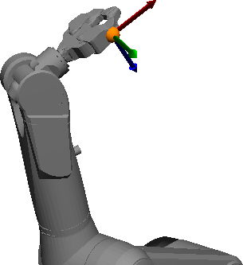
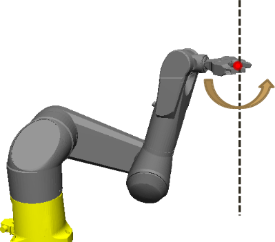
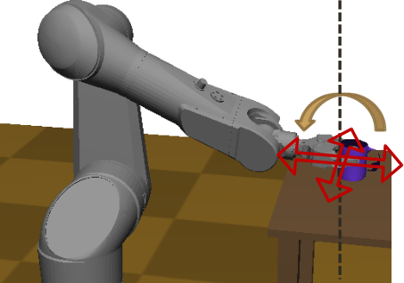

# Klamp't Manual: Inverse Kinematics 

* [IK Objective](#ik-objective)
    + [Usual Objective Types](#usual-objective-types)
    + [API summary](#api-summary)
* [IK Solver](#ik-solver)
    + [API summary](#api-summary-1)

There are two components that need to be set up to solve inverse kinematics problems. 
- First, an **[IK Objective](#ik-objective)** object must to be configure to define constraints on a constrained link.  
- Next, the **[IK Solver](#ik-solver)** is set up and called to find a configuration so that the transformations satisfy the constraints specified by the objectives. 

Multiple links can be constrained to different targets by creating several IK Objectives and passing these to the solver.

## IK Objective

An IK Objective defines a target in Cartesian world space coordinates that you want to achieve with a link of the robot.
Each IK Objective's constraint is specified to match some local coordinates on the link to some target coordinates, and can include both position and orientation. 

An objective contains:
- A link index
- A rotation constraint type: none, axial, fixed
- A position constraint type: none, planar, linear, fixed
- For non-none constraints, a local position and a target position
- For planar and linear constraints, a direction of the plane/line
- For non-none constraints, a target rotation
- For axial constraints, a rotation axis

Klamp't also supports relative IK Objectives that let you define a constraint from coordinates on one link relative to another on the same robot, but these are used less frequently. The main use case for these objectives is to perform multi-handed manipulation of a single object.  Relative objectives are specified by giving:
- a destination link index.  (By default -1, which means destination is in the world frame.)

### Usual Objective Types

| Constraint type  |  Point | Fixed | Hinge | Surface | 
| -----------------|--------|-------|-------|---------|
| Position         | fixed  | fixed | fixed | planar  |
| Rotation         | none   | fixed | axis  | axis    |
| Constrained dims | 3      | 6     | 5     | 3       |
| Useful for       | Point feet or fingers | Grasps, flat feet | Grasping cylindrical objects | Placing objects down with unspecified position and orientation|
|                  | |  |  |  |

The SimTest and RobotPose programs only support point and fixed constraint types. More exotic types must be created in code.

### API summary

IK Objectives are equivalent to the `IKGoal` class implemented in KrisLibrary/robotics/IK.h.  Its `link` member must be filled out prior to use and indicates the link's index on its robot.  If the constraint is meant to constrain the link to a target link on the robot (rather than the world), then the `destLink` member should be filled out.  By default, `destLink` is  -1, indicating that the target is in world coordinates.

**Easy setup.** For convenience, the `SetFromPoints` method is provided to map a list of local points to a list of target space points. This function covers most typical IK constraints. If there is a single point, the constraint is a fixed point constraint. If the points are collinear, the constraint is an edge constraint. If the points span a plane, the constraint is a fixed constraint.

**Detailed setup.** Position constraints are defined by the `localPosition`, `endPosition`, and optionally the `direction` members. There are four types of position constraint available.

- `Free`: no constraint
- `Planar`: the point is constrained in one dimension, i.e., to lie on a plane. Here `endPosition` refers to a point on the plane and `direction` refers to the plane normal.
- `Linear`: the point is constrained in two dimensions, i.e., to lie on a line. Here `endPosition` refers to a point on the line and `direction` refers to the line direction.
- `Fixed`: the point is constrained to a fixed point. Here `endPosition` refers to that point and `direction` is ignored.

Rotation constraints are defined by the `endRotation` and optionally the `localAxis` members. There are three types of rotation constraint available.

- `Free`: no constraint
- `Axis`: rotation is constrained about an axis. The direction localAxis maps to the `endRotation` direction. These must be unit vectors.
- `Fixed`: rotation is fixed. The `endRotation` member is a `MomentRotation` that represents the fixed orientation. To convert to a 3x3 matrix, call the `GetFixedGoalRotation` method. To convert from a 3x3 matrix, call the `SetFixedRotation` method.

## IK Solver

Klamp't contains a numerical IK solver. Numerical inverse kinematics solvers are extremely flexible and can solve for arbitrary combinations of IK constraints. They take the robot's current configuration as a starting point and run a descent technique to (hopefully) solve all constraints simultaneously. 
It also takes optional joint limits and subsets of active DOFs.

Input
- Robot model
- One or more IK objectives
- Seed configuration is given as the model's current configuration
- Tolerance on max constraint error
- Maximum iteration count
Optional input:
- sub-select active DOFs (default uses all ancestors of constrained links)
- custom joint limits
- "bias configuration" for redundant robots

Output:
- Success or failure (i.e. did not achieve desired tolerance)
- Solution configuration is returned inside Robot Model

Specifically, the solver performs Newton-Raphson root solving, with line search (never diverges).  These routines automatically try to optimize only over the relevant variables, e.g., if the only constraint is on the robot's right foot, then the arms, head, and left leg will not be included as optimization variables.

_Important_: To use the solver properly, you must understand the configuration of the Robot Model is crucial to this process.  First, it provides the seed configuration to the solver.  Second, it provides default joint limits.  Third, the output configuration of the solver is given inside the Robot Model.

IK solvers can also be queried for the IK *constraint residual* and the *constraint Jacobian*.  These stack the constraint errors of each objective, and can help you debug whether the solver has successfully converged, or whether your objectives were defined incorrectly.

### API summary

The SolveIK() functions in KrisLibrary/robotics/IKFunctions.h are the easiest way to solve IK constraints. For richer functionality, consult the documentation of the RobotIKFunction and RobotIKSolver classes and Get\*Dofs() functions.

