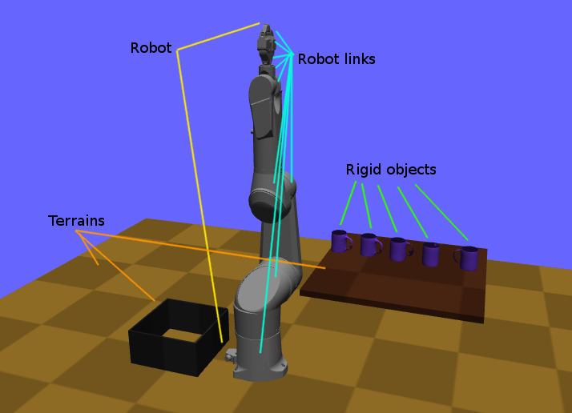
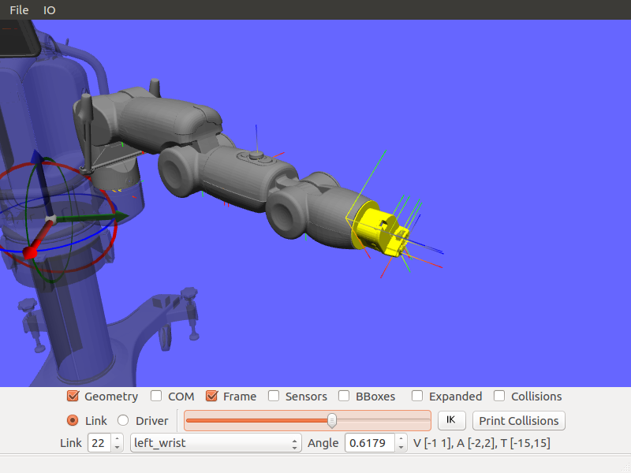

# Klamp't Manual: Kinematic modeling

* [World Models](#world-models)
    + [API summary](#api-summary)
* [Robot Models](#robot-models)
    + [API summary](#api-summary-1)
* [Robot Link Models](#robot-link-models)
    + [API summary](#api-summary-2)
* [Robot Joints and Drivers](#robot-joints-and-drivers)
    + [Floating bases and virtual links](#floating-bases-and-virtual-links)
        - [API summary](#api-summary-3)
* [Rigid Object Models](#rigid-object-models)
    + [API summary](#api-summary-4)
* [Terrain Models](#terrain-models)
    + [API summary](#api-summary-5)

Every physical object in Klamp't, whether real or imaginary, belongs to a World Model.  Specifically, a **[World Model](#world-models)** contains some number of entities, which can be of the types robot, robot link, rigid object, or terrain, as follows:
- **[Robots](#robot-models)** are articulated and possibly actuated objects containing multiple robot links
- **[Robot links](#robot-link-models)** are individual links of a robot
- **[Rigid objects](#rigid-object-models)** can rotate and translate, no independent actuation
- **[Terrains](#terrain-models)** do not move

Each robot link, rigid object, and terrain has an associated body, which has a coordinate frame and usually some attached **[Geometry](Manual-Geometry.md)** and **[Appearance](Manual-Geometry.md#appearance)**.

## World Models

A World Model can also:
- be drawn in OpenGL
- Can be created dynamically or loaded from an XML file (examples in [Klampt/data/](../data))
- Load robots, rigid objects, and terrains from many formats (examples are in Klampt/data/robots, Klampt/data/objects, and Klampt/data/terrains)
- Can be copied quickly without copying geometries
- Can be saved to disk

Each entity in a world has
 - An index into the list of entities of that type
 - A unique ID# in the World
 - A name string, which is ideally unique.
 - Consists of one (or more) bodies.

Note that the entity's ID# is not the same as its index.  The index is the index into the array containing it; this is not unique when compared across entity types. For example, a robot and a terrain could have index 0 (the first robot and the first terrain) but they will have different ID#s.

If names are not unique, entities must be addressed by index. Furthermore, some modules like `klampt.model.coordinate` assume names are unique; if not, unexpected behavior may result.

### API summary

See the WorldModel class (Klampt/Modeling/World.h)

## Robot Models

A Robot Model defines the kinematic structure of a robot, and more. Robot Models provide the following functions

- Describes a list of links with their parents (an open linkage, specified in topologically sorted order)
- Stores kinematic characteristics: link lengths, joint axis types, joint stops, inertial characteristics, and link geometry.
- Stores actuation limits
- Stores a &quot;current&quot; robot configuration and velocity. _Note: these should be thought of as temporary variables, see notes below._
- Computes and stores the robot's &quot;current&quot; link frames via forward kinematics.
- Computes the robot's Lagrangian dynamics terms.
- Stores link collision geometries and performs collision detection.
- Stores information about which links can self-collide.
- Names each link and contains semantics of the how the degrees of freedom of the robot map to &quot;joints&quot; and actuators.
- Loads and saves robot descriptions from disk.

For now, we will discuss only the kinematics of a Robot Model, saving [discussion of dynamics](Manual-Dynamics.md) for later.  The basic kinematic components are:
- Contains NL degrees of freedom (DOFs) and NL Robot Links.
- Each DOF has a numeric value describing its position.  The list of all DOFs is the robot's Configuration.
- Each DOF may also have a velocity.  The set of all velocities is the robot's Velocity.
- Each DOF has joint limits, velocity limits, acceleration limits, and torque limits.

*IMPORTANT*: The configuration / velocity of a Robot Model do not directly correspond with those of a physical / simulated robot. They do not even have to respect the joint/velocity limits. Think of them as temporary variables to help you perform calculations. (Sending commands to a physical / simulated robot will be [covered elsewhere](Manual-Control.md)!)

Klamp't works with arbitrary tree-structured articulated robots. Parallel mechanisms are not directly supported.  

### API summary

The Robot Model in the C++ API is implemented by the `RobotModel` class in [Klampt/Modeling/Robot.h](../Modeling/Robot.h).  This structure is based heavily on the KrisLibrary/robotics package for defining articulated robot kinematics and dynamics. `RobotModel` has the following class hierarchy:

<centering> `RobotModel` -&gt; `RobotWithGeometry` -&gt; `RobotDynamics3D` -&gt; `RobotKinematics3D` -&gt; `Chain` </centering>

The reasons for the class hierarchy are largely historical, but meaningful. For example, a protein backbone might be modeled as a `RobotKinematics3D` but not a `RobotDynamics3D`.

- `Chain` stores the topological sorting of the articulation (the parents member).
- `RobotKinematics3D` stores the kinematic and dynamic information of links, joint limits, the current configuration and the current link frames.  It also provides methods for computing forward kinematics, jacobians, and the center of mass.
- `RobotDynamics3D` stores the actuator limits and the current velocity. It provides methods for computing information related to the robot's dynamics.
- `RobotGeometry3D` stores link collision geometries and information about which links can self collide.  It performs self-collision testing and collision testing with other geometries.
- `RobotModel` defines link names and semantics of `Joints` and `Drivers`.

A `RobotModel` configuration is defined by a `Config` class (which is simply a typedef for `Vector`, see KrisLibrary/math/vector.h). The robot model's configuration is described in `RobotModel.q`, and the current transforms of its links are given in `RobotModel.links[index].T_World`. To ensure consistency between the configuration and the link frames, the `RobotModel.UpdateConfig(q)` method should be called to change the robot's configuration. `UpdateConfig` performs forward kinematics to compute the link frames, while simple assignment of the form `RobotModel.q=q` does not.

## Robot Link Models

A Robot Link corresponds to one of the robot model's DOFs.
- It holds all physical information about the link in its reference coordinate frame (name, index, parent, reference transform to parent, type of joint, joint axis, mass)
- It contains a collision geometry, which may be empty.  This model is specified relative to the link's coordinate system. 
- It also holds information regarding its current transformation given the robot model's current configuration.
- It also helps you calculate Jacobians, velocities, etc

The parent index of each link must be less than the link's index (topologically sorted order). A parent of -1 indicates that the link is attached to the world coordinate frame.  Each link may be _prismatic_ or _revolute_ and moves along or around a link axis given by a 3D vector. 

The current transformation of a link is calculated via forward kinematics, and describes its coordinates (position and orientation) _relative to the world frame_. For example, in the image shown below, the transforms of each link are shown with red axis indicating the local x direction, green axis indicating y, and blue axis indicating z.  The highlighted link is drawn with longer axes.

### API summary

Links are stored in the `RobotModel.links` member, which is an array of `RobotLink3D`s. The parent index of each link is stored in the `RobotModel.parents` member, which is a list of `int`s. The link type is stored in `RobotLink3D.type` and its axis is stored in `RobotLink3D.w`. `RobotLink3D` also contains mass parameters (`mass`, `inertia`, `com`), the reference transformation to its parent (`T0_Parent`), and the link's current transformation `T_World`.

Link geometries are stored in the `RobotModel.geometry` list, but to take advantage of the cache the `RobotModel.geomManagers` variable should be used for saving/loading/modifying the geometry. _Note: The transform of each collision geometry is only updated to the current link transform after `RobotModel.UpdateGeometry()` is called_.

## Robot Joints and Drivers

The DOFs of a robot are considered as generic variables that define the extents of the articulations between links.  However, more information about how sets of DOFs group together and map to motors also available in the Robot Model. A Robot Model's DOFs are organized into NJ &le; NL _Joints_, and ND &le; NL _Drivers_
- `Joint`: topology of one or more DOFs.  Joints can be normal, welded, freely rotating, or free floating.  Joints specify how to handle interpolation, and the distance between configurations.
- `Driver`: mapping from actuator controls to movement of one or more DOFs.  They specify how actuator commands are transmitted to forces / torques on links (e.g., the transmission).
- For fixed-base, fully actuated robots, each DOF has a single joint and a single driver: NL=NJ=ND

**Joints.** Most Joints will be of the `Normal` type, which map directly to a single DOF in the normal way. However, free-floating bases and other special types of Joints designate groups of DOFs that should be interpreted in special ways. These special Joints include:

- `Weld` joints, which indicate that a DOF should not move.
- `Spin` joints, which are able to rotate freely and infinitely.
- `Floating` joints, which translate and rotate freely in 3D (e.g., free-floating bases)
- `FloatingPlanar` joints, which translate and rotate freely in 2D (e.g., mobile wheeled bases)
- `BallAndSocket` joints, which rotate freely in 3D.
- `Closed` joints, which indicate a closed kinematic loop. _Note: this is simply a placeholder for potential future capabilities; these are not yet handled in Klamp't._

In C++ the joint type is referred to in CamelCase, while in files the joint type is referred to in lowercase.

**Drivers.** Although many robots are driven by motors that transmit torques directly to single DOFs, the `RobotModel` class can represent other drive systems that apply forces to multiple DOFs. For example, a cable-driven finger may have a single cable actuating three links, a mobile base may only be able to move forward and turn, and a satellite may have thrusters. Free-floating bases may have no drive systems whatsoever.

A robot is set up with a list of Drivers available to produce torques.
- `Normal` drivers act as one would expect a motor that drives a single DOF to behave.
- `Affine` drivers act as connected transmissions with linear relationships between multiple DOF (such as certain cable drives or gear linkages).
- The other driver types are not fully tested and/or supported, although we hope to add some of this functionality in the future.

### Floating bases and virtual links

To represent free-floating bases, you should use a set of 5 massless _virtual links_ and 1 physical link that represent the x, y, and z translations and rotations around the z, y, and x axes (roll-pitch-yaw convention). Likewise, a mobile robot may be represented by 2 virtual links + 1 physical link: two for x, y translations connected by prismatic joints, and the last for &theta;, connected to its parent by a revolute joint. A ball-and-socket joint may be represented by 2 virtual links + 1 physical link.

#### API summary

See `RobotKinematics3D.InitializeRigidObject` for an example of how to set up a floating base.

## Rigid Object Models

A Rigid Object Model is a Collision Geometry associated with a `RigidTransform` and other dynamic parameters. `Rigid Object`s may be loaded from `.obj` files or raw geometry files. In the latter case, the dynamic parameters are set to default values (e.g., `mass = 1`).

### API summary
See Klampt/Modeling/RigidObject.h.

## Terrain Models

A Terrain Model  is defined very simply as a Collision Geometry annotated with friction coefficients. They may be loaded from .env files or raw geometry files. In the latter case, some default friction value is assigned (set to 0.5).

### API summary
See Klampt/Modeling/Terrain.h.

