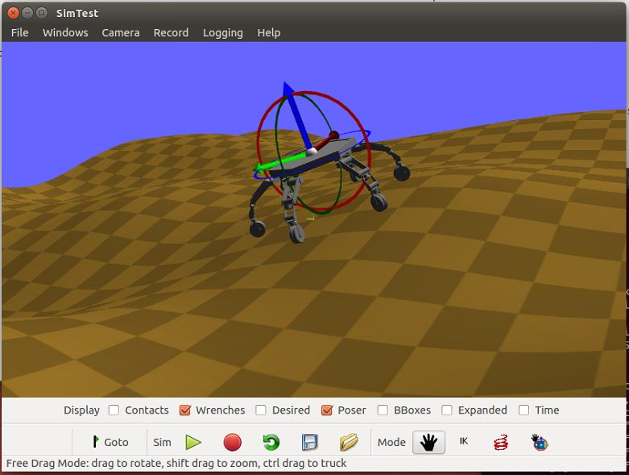
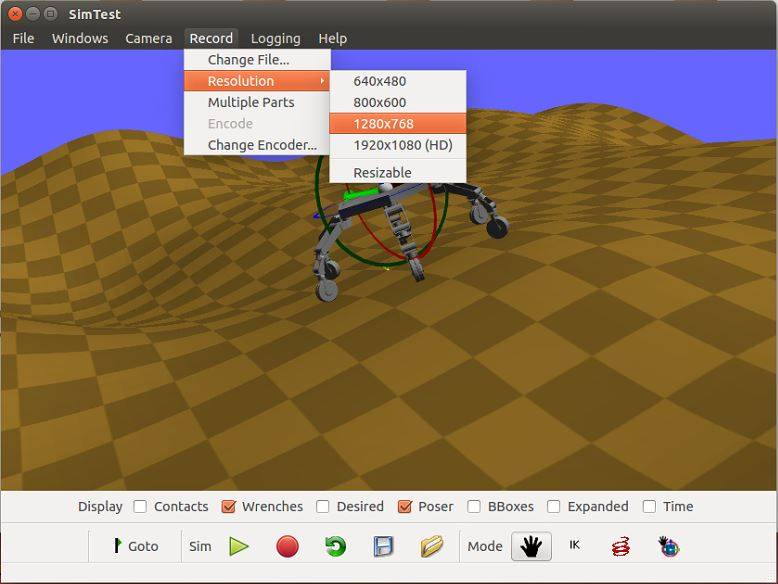
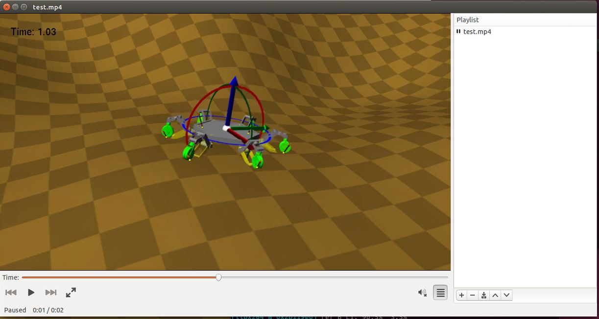

# Klamp't Tutorial: Animate a video of a path/trajectory using Apps

In this tutorial we learn how to generate a video using the Klampt built-in apps. Klampt provides recording tools to convert the captured frames into videos. In this tutorial, _SimTest_ is chosen for demonstration of this video generation process.

Difficulty: easy

Time: 5 minutes

### Animate a video of a path/trajectory using Apps

The previous tutorial presented how to visualize the robot motion given a path/trajectory file. You can also record also the whole animation file into a video. Built-in apps can load scenarios in two ways: 

1. load the XML file inside the program _File_ menu
2. load the XML file in the command line at the time the program is called

```
bin/SimTest [path to Klampt-examples]/data/athlete_fractal_1.xml 
```



After the robot world has been loaded, a pre-computed path file can be loaded to visualize the robot motion. For example, let's pull up Klampt-examples/data/motions/athlete_flex.path. 

During the execution of the path file, the video recording can be started by pressing on the red button and terminated by pressing the red button again. The name of the recorded file can be changed in the _Record_ menu so is the resolution.



After the termination of the recording, the program will convert the screenshots into a MPG video automatically. In this case that this conversion has failed, you can manually type one command to generate the video from these frames.

```
ffmpeg -y -f image2 -i image%04d.ppm test.mp4
rm -f *.ppm
```
Then test.mp4 file will be generated to display the animation of the recorded motion.




