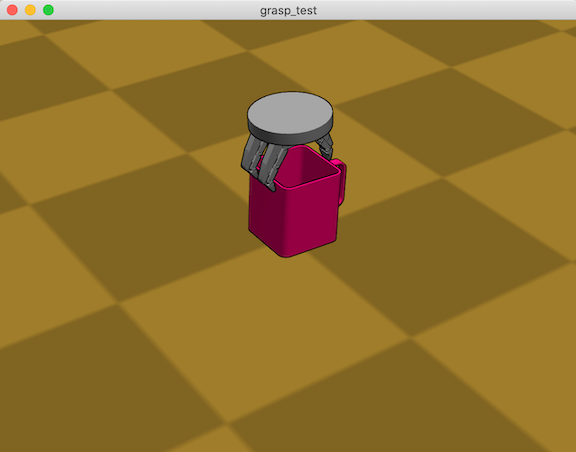
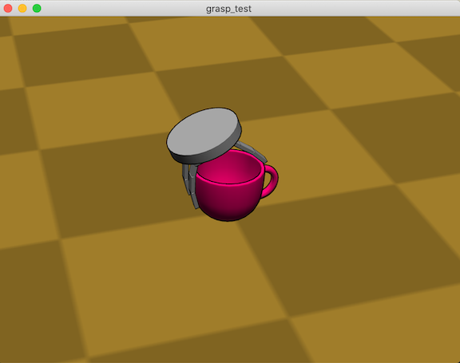

# Klamp't Tutorial: Grasping Simulation in Python 

In this tutorial, we will learn how to implement a simple grasping simulation for the gripper that has a free-floating moving base. Here we'll be using Klampt-examples/data/grasping_simulation.xml as the world file.

```pythons
import klampt 
from klampt import vis
from klampt.math import vectorops, so3, se3
from klampt.model import contact
from klampt.model.create import moving_base_robot
import time

world = klampt.WorldModel()
res = world.readFile('grasping_simulation.xml')
if not res:
    raise RuntimeError('Unable to load world')
```


### 1. Make Rigid Object from file

You can use a .off file for the  `RigidObject`. Since the object should be located on the ground safely before the grasp simulation, we approximate its height by using a bounding box surrounding the object.

```python
object = klampt.Geometry3D()
object.loadFile(file_name)
obj = world.makeRigidObject('object')
obj.geometry().set(object)
obj.geometry().scale(0.35)
contact_params = obj.getContactParameters()
contact_params.kRestitution = 0.0
contact_params.kFriction = 0.500000
contact_params.kStiffness = 200000.0
contact_params.kDamping = 1000.0
obj.setContactParameters(contact_params)

obj.setTransform(*se3.identity())
bmin, bmax = obj.geometry().getBB()
T = obj.getTransform()
spacing = 0.006
T = (T[0], vectorops.add(T[1], (-(bmin[0] + bmax[0]) * 0.5, -(bmin[1] + bmax[1]) * 0.5, -bmin[2] + spacing)))
obj.setTransform(*T)
obj.appearance().setColor(0.9, 0, 0.4, 1.0)

object_center = T[1]
object_r = np.sqrt(3)* np.max(np.abs([bmin[0], bmax[0], bmin[1], bmax[1], bmin[2], bmax[2]])) + 0.4

```

### 2. Set approach direction & starting position

You may set an approach direction as a unit vector on the hemisphere. By using spherical coordinates, define a unit vector using (theta, phi). 
```python
theta = np.pi
phi = np.pi/6
```

Then set the orientation and position of the moving base of gripper.  

```python
unit_vector_on_hemisphere = [np.sin(phi) * np.cos(theta), np.sin(phi) * np.sin(theta), np.cos(phi)]
R = so3.canonical(unit_vector_on_hemisphere)
R = R[3:9] + R[:3]
t = vectorops.add(vectorops.mul(unit_vector_on_hemisphere, object_r), object_center)
moving_base_robot.set_xform(world.robot(0), R, t)
```

### 3. Simulation
We're going to create the `GraspTest` Class that contains all methods needed for the grasping test. Let's start with the following skeleton code.

```python
class GraspTest:
    def __init__(self,world,sim):
        self.world = world
        self.sim = sim

    def idle(self):
        #Fill out this part: Do stuff to world. 
        sim.simulate(self.dt)
        return
    
    def done(self):
        #Return True if the simulation is done.
    
```

We need to define some variables in `__init__` function.

```python
self.sim.enableContactFeedbackAll()
self.num_total_links = 13 
self.dt = 0.02
self.joint_limits = world.robot(0).getJointLimits()
self.object_id = world.rigidObject(0).getID()

#approach
self.approach_velocity = 0.01

#close 
self.num_failure = 0 # count the number of failure in grasping
self.failure_limit = 80 # if the gripper fails over failure_limit, the trial is regarded as failure.
self.velocity_limit = 0.5 
self.angular_velocity = 0.8

self.gripper_state = 1
self.grasp_sucess = False
```

The contacts should be updated in `idle()` method each time step. For convenience, you can create contact checking methods in `GraspGL` class.

```python
def check_contact_terrain(self):
    num_contacts = 0
    terrain_id = self.world.terrain(0).getID()
    for idx in range(5, 18):
        link_id = self.world.robot(0).link(idx).getID()
        if self.sim.inContact(terrain_id, link_id):
            contact_points = self.sim.getContacts(terrain_id, link_id)
            num_contacts += len(contact_points)
    return num_contacts > 0

def check_contact_object(self):
    contacted_links = []
    for idx in range(5, 18):
        link_id = self.world.robot(0).link(idx).getID()
        if self.sim.inContact(self.object_id, link_id):
            contact_points = self.sim.getContacts(self.object_id, link_id)
            contacted_links += [idx]
    return contacted_links
```

The simulation plan is as below:

The gripper approaches the object until it touches the object. If it touches the ground first, grasp simulation is regarded as a failure and stops. If it touches the object first, the gripper stops approaching and starts closing its fingers to grasp the object. If the max of the sensed velocities of links is less than the threshold and the number of contacted links is greater than 4, it stops closing.

According to the plan, the gripper's states are defined as: 

- `done` = -1
- `collide_with_terrain` = 0
- `approaching` = 1
- `closing` = 2

Here are the examples of `idle()` and `done()` methods. 

```python
def idle(self):
    controller = self.sim.controller(0)
    if self.sim.getTime() > 1 and self.gripper_state > 0:
        contacted_links = self.check_contact_object()
        if self.gripper_state is approaching:
            if len(contacted_links) > 0:
                self.gripper_state = closing
            else:
                if self.check_contact_terrain():
                    self.gripper_state = collide_with_terrain
                Tr = self.world.robot(0).link(5).getTransform()
                translation = vectorops.add(so3.apply(Tr[0], [0, 0, -self.approach_velocity]), Tr[1])
                moving_base_robot.send_xform_linear(controller, Tr[0], translation, self.dt)
        if self.gripper_state is closing:
            q = controller.getCommandedConfig()
            if len(contacted_links) < self.num_total_links:
                for link_idx in range(9, 18):
                    new_q = q[link_idx] + self.angular_velocity * self.dt
                    q[link_idx] = np.clip(new_q, self.joint_limits[0][link_idx], self.joint_limits[1][link_idx])
                controller.setPIDCommand(q, [0] * len(q))
            if max(controller.getSensedVelocity()[9:18]) < self.velocity_limit and len(contacted_links) >= 4:
                self.gripper_state = done
                self.grasp_success = True
            else:
                self.num_failure += 1
                if self.num_failure > self.failure_limit:
                    self.gripper_state = done
    self.sim.simulate(self.dt)
    return 

def done(self):
    return self.gripper_state <= 0
```

After filling in `GraspTest` with your simulation plan, run the simulation, and see what happens.

```python
sim = klampt.Simulator(world)
grasp_test = GraspTest(world, sim)
vis.add('world',world)

def setup():
    vis.show()

def callback():
    grasp_test.idle()
    time.sleep(0.02)
    if grasp_test.done():
        vis.show(False) #hides the window if not closed by user

vis.loop(setup=setup, callback=callback)
print('succeds in grasping: ', grasp_test.grasp_success)
```
- Grasp test with RobotiQ gripper & Box-shaped finger gripper




You can evaluate the grasp performance by 
- Constructing Grasp Wrench Space from the contact information.
- Lifting the object and moving the gripper in random directions to check if the grasp is robust.