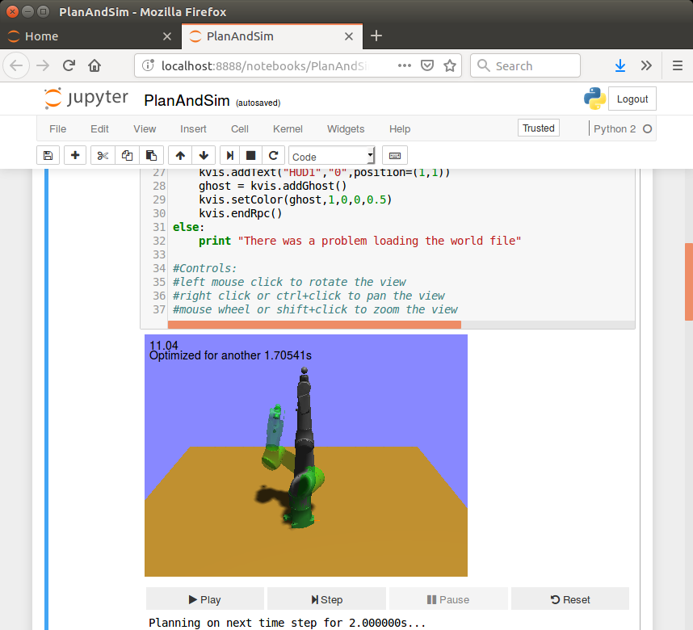

# Installing with Docker

Using [Docker](https://www.docker.com) is an easy way to install and use Klamp't on your machine.  We have a pre-built Docker image
for Jupyter Notebook, which lets you visualize Klampt through your web browser. 
We also have a very out-of-date image that uses X11 (maintained by Steve Kuznetsov).

If you are not familiar with Docker, it is a lightweight Virtual Machine (VM) that helps deploy cross-platform code without requiring
users to install complex dependencies. HOWEVER, data can be a little harder to input / extract from a VM. As a result, you will put
all your work in a "Work" folder which links up to a "Work" folder in the container.  You should put Klampt-examples, etc in that folder.
SAVE ANY FILES YOU WISH TO KEEP IN YOUR "WORK" FOLDER.  ALL OTHER FILES WILL NOT BE SAVED IF YOU RESTART THE CONTAINER.

## Installing Docker

### *nix

1. Follow the instructions on Docker's website to install Docker for Linux
   https://docs.docker.com/engine/install/ubuntu/
2. If you wish to access GPU inside docker container, follow the instructions on Nvidia's website to install nvidia-docker for Linux
   https://docs.nvidia.com/datacenter/cloud-native/container-toolkit/install-guide
   
   **Note:** Currently only Linux supports accessing GPU inside Docker, all other platforms are not supported

### Windows

1. Follow the instructions on Docker's website to install Docker Desktop on Windows

    a. Go to https://docs.docker.com/docker-for-windows/install/

### Mac

1. Follow the instructions on Docker's website to install Docker Desktop on Mac (both Intel and Apple chip)

    a. Go to https://docs.docker.com/docker-for-windows/install/

## Running the Jupyter Notebook image (recommended)

Once you have installed Docker, open the Docker command line and run

> docker pull hpbader93/jupyter-klampt

This will take some time as it downloads the container.

Afterwards, navigate to where you want the "Work" directory, and run

> mkdir Work

> git clone https://github.com/krishauser/Klampt-examples

> mv Klampt-examples Work

This will give you the Klampt-examples folder, which will contain some Jupyter Notebook examples.  Then, launch the Docker container with

> docker run -p 8888:8888 -v  "${PWD}/Work":/home/klamptuser/Work -t hpbader93/jupyter-klampt

It may be useful for you set a command line alias or shortcut, replacing ${PWD} with the absolute path for the directory holds the "Work" folder on your computer.

Finally, open up a web browser and navigate to http://192.168.99.100:8888/?token=Klampt.  This may or may not be the IP address of Docker,
and if it doesn't work, navigate to the top of your Docker console and make a note of the IP address at the top.

You should be able to run a Jupyter notebook containing Klamp't, which should look something like this:



## Running the X11 Image

On Linux distributions:

Once you've installed Docker, setup X forwarding `$ xhost +` before run the container.

You may also need to build the container by `$ docker build -t klampt .`.

On RPM Linux (like Red Hat or Fedora), use:

```sh
$ docker run -it -e DISPLAY=unix$DISPLAY -w /etc/Klampt --name klampt -v /tmp/.X11-unix:/tmp/.X11-unix klampt
```

On Debian Linux (like Ubuntu), use:

```sh
$ docker run -it -e DISPLAY=$DISPLAY -w /etc/Klampt --name klampt -v /tmp/.X11-unix:/tmp/.X11-unix --net=host klampt
```

On Windows, you need to get [`Xming`](http://sourceforge.net/projects/xming/) and install it, then run:

```
> Xming.exe :0 -multiwindow -clipboard -ac
> docker run -it -e DISPLAY=host.docker.internal:0.0 -w /etc/Klampt --name klampt klampt
```

On Mac (Outdated), run the following in iTerm.app or Terminal.app:

```sh
$ brew install socat
$ brew cask install xquartz
$ socat TCP-LISTEN:6000,reuseaddr,fork UNIX-CLIENT:\"$DISPLAY\"
```

Then, in whatever terminal you like (can be the same as above), but *not* in the Docker terminal, run:

```sh
$ docker run -it -e DISPLAY=host.docker.internal:0 -w /etc/Klampt --name klampt klampt
```

Finally, if `XQuartz` did not start automatically, start it:

```sh
$ open -a XQuartz
```

The parts of the `docker run` command are explained below. Not all parts apply to every operating system.

  Command                                       | Description                                     | Operating Systems |
| --------------------------------------------- | ----------------------------------------------- | ----------------- |
`-it`                                           | keeps the container active                      | all               |
`-e DISPLAY=$DISPLAY`                       | connects displays                               | all               |
`--name klampt`                                 | names the container                             | all               | 
`-w /etc/Klampt`                                | sets working directory                          | all               |
`-v /tmp/.X11-unix:/tmp/.X11-unix`              | mounts the x11 socket                           | all Linux         |
`--net=host`                                    | places container inside host's network stack    | Debian Linux      |
`klampt`                  | decides which image to run                      | all               |

## Test your docker visualization works correctly

You can test that your GUI works by typing the following commands in the interactive shell of container.

```
$ python3
>>> import klampt.vis
>>> klampt.vis.init("PyQt5")
>>> klampt.vis.debug()
```

After that, you should be able to see an X window popping up in your host machine.

### Using Klamp't 

Once you've created your own scripts that you wish to run, save them in some directory on your host, and amend the `docker run` command used above to include `-v /path/to/your/data:/home/Klampt/data`. For instance, the RPM Linux `run` command, if there is data at `/home/myuser/klamptdata`, would look like:

```sh
docker run -it -v /tmp/.X11-unix:/tmp/.X11-unix -e DISPLAY=unix$DISPLAY --name klampt \
	-v /home/myuser/klamptdata:/home/Klampt/data \ # shares data with the container
	klampt
```

Then, use the internal tools inside of the container (i.e. `SimTest`, `RobotTest`, etc.) on your files. They will be found in `/home/Klampt/data`. 


