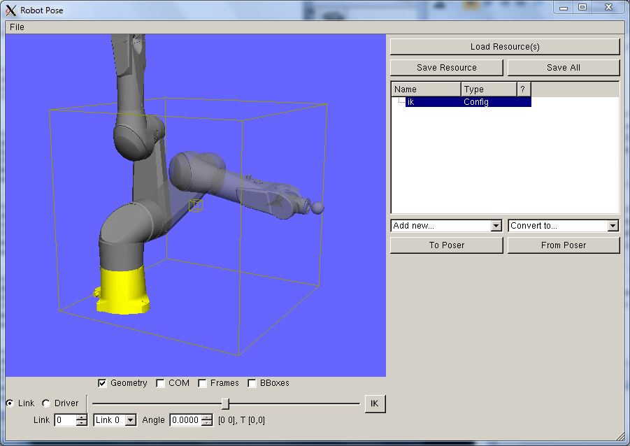
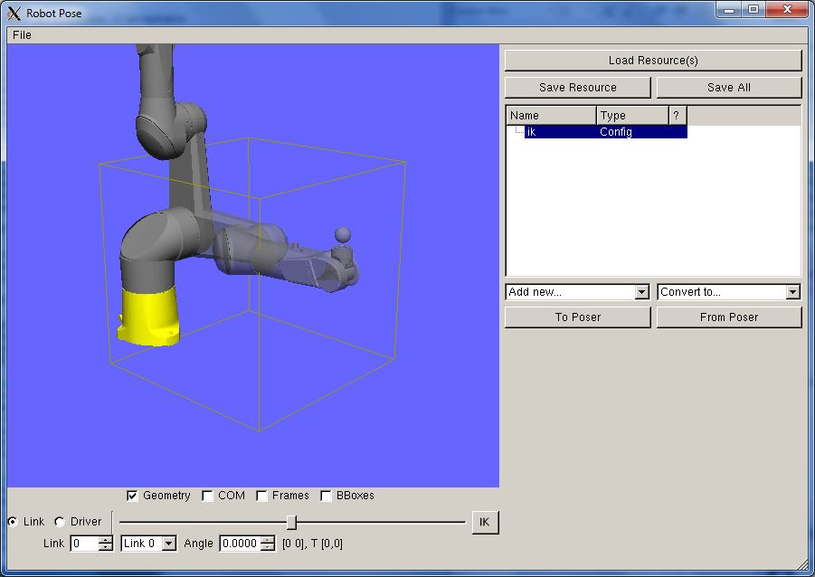

# Klamp't Tutorial: Inverse Kinematics in C++

In this tutorial you will learn how to set up and solve inverse kinematics (IK) problems in software. (Klamp't apps automatically support IK constraints while interacting with the robot poser, so using them should be relatively transparent.)

Klamp't natively supports numerical IK only, which uses numerical root-finding techniques to iteratively move an initial configuration toward solving the IK constraints. Another approach is analytic IK, which analytically inverts an IK problem by solving a system of symbolic equations. Numerical IK is more versatile in that any robot, any number of objectives, and any degrees of freedom can be solved simultaneously in a unified framework, and difficulties handling zero or multiple solutions are avoided. However, it is slower than analytic IK (milliseconds rather than microseconds) and requires appropriately chosen initial configurations to avoid local minima. Nevertheless, we prefer it due to its generality and versatility in handling complex contact formations, its convenient use in planning and optimization, and its comparatively simple API.

Difficulty: intermediate

Time: 15-30 minutes

This tutorial assumes you have already completed the C++  [simulation tutorial](Run-a-simulation-Cpp.md)  and know how to compile a new project that includes Klamp't.

An IK problem is specified as an array of IKGoal structures, which define a constraint for the robot in Cartesian space. Given a problem, you will then run a solver to hopefully find a constraint-solving configuration. This functionality is in the IK.h and IKFunctions.h files in the KrisLibrary/robotics package, and it would be helpful to keep them open for reference during this tutorial.

### Fixed point constraints

We'll start our example with a simple fixed-base robot and an end-effector point constraint.
```
#include <robotics/IK.h>
#include <robotics/IKFunctions.h>
#include <Modeling/World.h>

int main(int argc,char** argv) {
  //load a robot (you may want to edit this path as needed)
  Robot robot;
  if(!robot.Load("Klampt/data/robots/tx90ball.rob")) {
    printf("Error loading robot file\n");
    return 1;
  }

  //some parameters of the inverse kinematics problem
  int endEffectorLink = robot.links.size()-1;
  Vector3 localPosition(0,0,0);
  Vector3 endPosition(1.1,0,0.7);

  //set up the IK problem corresponding to the parameters
  IKGoal goal;
  goal.link = endEffectorLink;
  goal.localPosition = localPosition;
  goal.SetFixedPosition(endPosition);

  //print the error of the robot's initial configuration
  Vector3 wp;
  robot.GetWorldPosition(localPosition,endEffectorLink,wp);
  printf("Initial position: %g %g %g\n",wp.x,wp.y,wp.z);
  printf("Initial error: %g\n",RobotIKError(robot,goal));

  //we'll put more lines here later
  return 0;
}
```
Compile and run the program, and after some setup code you should get a printout like:
```
  Real tolerance = 1e-3;
  int iters = 100;
  int verbose = 1;
  vector<IKGoal> problem;
  problem.push_back(goal);
  bool res = SolveIK(robot,problem,tolerance,iters,verbose);
  if(!res) {
    printf("Failed solving IK problem\n");
  }
  else {
    printf("Success solving IK problem, %d iterations used\n",iters);
  }
  cout<<"Final configuration: "<<robot.q<<endl;
  robot.GetWorldPosition(localPosition,endEffectorLink,wp);
  printf("Final position: %g %g %g\n",wp.x,wp.y,wp.z);
  printf("Final error: %g\n",RobotIKError(robot,goal));
```

If you compile again, you'll get some printouts giving the progress of the solver and the Newton-Raphson root finder.
```
SolveIK(tol=0.001000,iters=100):
NewtonRoot::GlobalSolve(): Reached convergence on f, new distance 0.000426152
Succeeded! 0.001658 seconds
Success solving IK problem, 7 iterations used
Final configuration: 7 0 -0.0424954 0.877663 -0.855769 0.106637 0.149797 0
Final position: 1.09957 1.55775e-05 0.699731
Final error: 0.000426152
```

The Final configuration item gives you the robot's configuration that meets the constraints. If you copy this line, starting with the 7, to a file with the .config extension, say "ik.config" it can be loaded into the RobotPose app to visually examine the result:
```
./RobotPose data/robots/tx90ball.rob [MY_APP_PATH]/ik.config
```



Let's now return to your program source code. You can play with the parameters tolerance, iters, and verbose, which control the behavior of the solver. The tolerance parameter defines how closely the constraint must be met before termination, and you can try setting this to a smaller value, say 1e-6. The iterations parameter defines the maximum number of iterations used before the solver quits with failure, and you can try setting this to something like 5. You can also try setting verbose=0 so that no output is generated inside the solver.
### Fixed rotation constraints

Another common constraint is a fixed rotation. To specify these constraints you must provide a desired orientation of the link as a 3x3 matrix. Specifically, you must provide an object of the Matrix3 class that specifies the rotation that brings the link's local coordinate system to the desired orientation.

We'll start with a simple example that tries to keep the end effector link in the identity orientation. Replace the IKGoal setup lines with the following lines:
```
  //some parameters of the inverse kinematics problem
  int endEffectorLink = robot.links.size()-1;
  Vector3 localPosition(0,0,0);
  Vector3 endPosition(1.1,0,0.7);
  Matrix3 endRotation;
  endRotation.setIdentity();

  //set up the IK problem corresponding to the parameters
  IKGoal goal;
  goal.link = endEffectorLink;
  goal.localPosition = localPosition;
  goal.SetFixedPosition(endPosition);
  goal.SetFixedRotation(endRotation);
```
If you recompile and run, you'll see output like the following:
```
Initial position: 0.0257 0.05 1.6682
Initial error: 1.0743
NewtonRoot::GlobalSolve(): Max iters reached, distance was decreased to 0.0251648
Failed solving IK problem
Final configuration: 7 0 -0.0446806 1.49406 0.00197358 -0.000634665 1.4891 0.0436836
Final position: 1.07484 0.000976157 0.698171
Final error: 0.0251648
```

It looks like the robot is unable to satisfy the constraint! If we inspect the configuration using RobotPose:
```
bin/RobotPose data/robots/tx90ball.rob [MY_APP_PATH]/ik.config
```
we see that the ball at the end of the robot's arm is upright, which is what the orientation constraint is trying to achieve. However, it looks like the target position is just a tad out of the robot's reach.



Now if we change the endPosition variable to be (1.0,0,0.7) and re-run the program, you'll see that the IK solver is successful. We'll talk a bit about this in the next section

_Aside:_ If you do not express orientation constraints in 3x3 matrix form, then you'll be happy to know that Klamp't has robust routines for converting all major rotation representations to and from 3x3 matrices. The file KrisLibrary/math3d/rotation.h contains definitions for  [Euler angle](http://klampt.org/krislibrary_docs/classMath3D_1_1EulerAngleRotation.html),  [quaternions](http://klampt.org/krislibrary_docs/classMath3D_1_1QuaternionRotation.html),  [axis-angle](http://klampt.org/krislibrary_docs/classMath3D_1_1AngleAxisRotation.html), and  [moment](http://klampt.org/krislibrary_docs/classMath3D_1_1MomentRotation.html)  (a.k.a. exponential map) representations. Each of these classes can be converted quickly to and from 3x3 matrices using the getMatrix and setMatrix methods.

### Failures and global optimization

Let's discuss a few possible outcomes for the IK solver. We've already seen the best outcome, which is  _success_. We've also seen the possibility of  _correct failure_, which occurs if the robot cannot reach the desired IK constraint. The final possibility is  _incorrect failure_, which is caused mostly by local minima in the configuration space, and occasionally by allocating too few iterations to achieve the desired tolerance. In this latter case, you will see the constraint violation error reach a low -- but perhaps not-low-enough -- value. But distinguishing between true failure and local minima is fairly challenging.

If you have reason to believe that the solver is encountering local minima, the most effective approach is to try to restart from another configuration. This is known as a  _random restart_technique, which tends to be fairly effective because the basin of attraction of the IK constraint (in other words, the set of start points that converge successfully) is usually ``reasonably'' large, so that the probability of sampling at random a start configuration in it is non-negligible. The pseudocode will look like this:
```
robot.q = start configuration
IKSolve(robot,problem)
iters = 0
while (IKError(robot,problem) > threshold and iters < maxIterations)
  robot.q = random configuration
  IKSolve(robot,problem)
  iters = iters+1
```
The drawback of such a technique is that it will need to call the IK solver maxIterations times for true failure cases, which could be computationally expensive.

### Setting up IK constraints using point sets

Another convenient way to set up IK constraints, particularly for robots with contact, is to use the IKGoal.SetFromPoints method. Rather than explicitly specifying the type of constraint, you specify a list of points on the robot link that you want to constrain to a list of points in the world. This will automatically detect whether you want a point-to-point, edge-to-edge, or face-to-face constraint.

Try replacing the goal setup lines with the following:
```
  goal.link = endEffectorLink;
  vector<Vector3> localpts(2),worldpts(2);
  localpts[0] = localPosition;
  localpts[1] = localPosition + Vector3(0.1,0,0);
  worldpts[0] = endPosition;
  worldpts[1] = endPosition + Vector3(0,0,-0.1);
  goal.SetFromPoints(localpts,worldpts);
```
This will be similar to the original point constraint, except that it will try to match a vector (0.1,0,0) sticking out of the local x-axis of the link to be oriented downward in the world frame (0,0,-0.1).

An important note is that the order of points matters, because localpos[0] will be matched to worldpos[0], localpos[1] will be matched to worldpos[1], etc.

### More...

This just scratches the surface of what you can do with IK constraints. You can constrain a link to another link using the "target" index, set up sliding constraints, and axial rotation constraints. You can also constrain the robot's center of mass to lie at or above a certain point. For help with these items please consult the API documentation for  [IKGoal](http://klampt.org/krislibrary_docs/structIKGoal.html)  and  [RobotIKFunction](http://klampt.org/krislibrary_docs/structRobotIKFunction.html).


