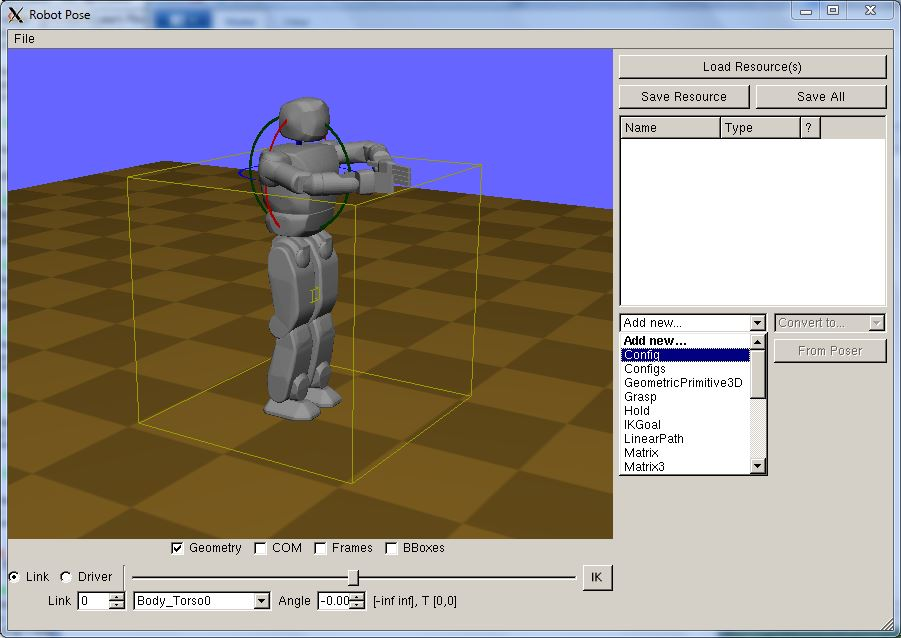
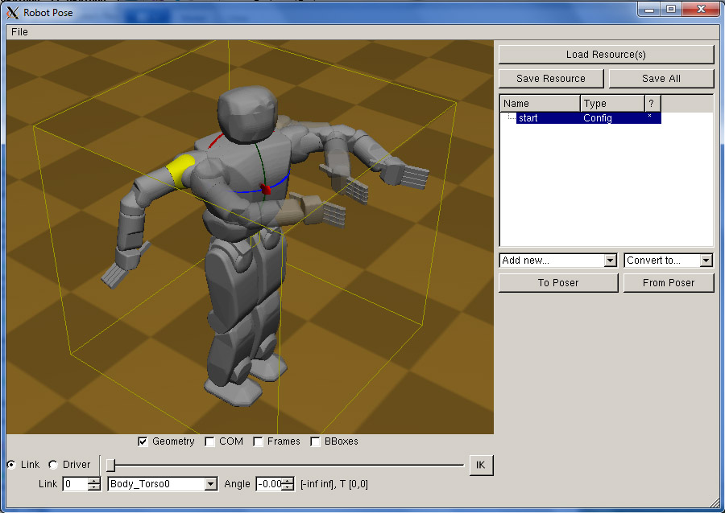
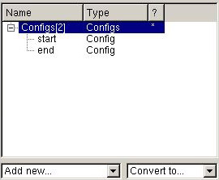
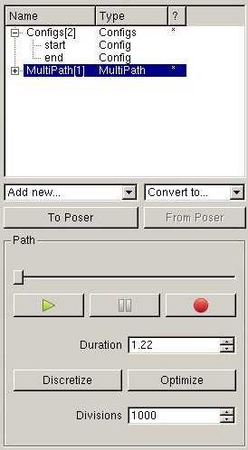
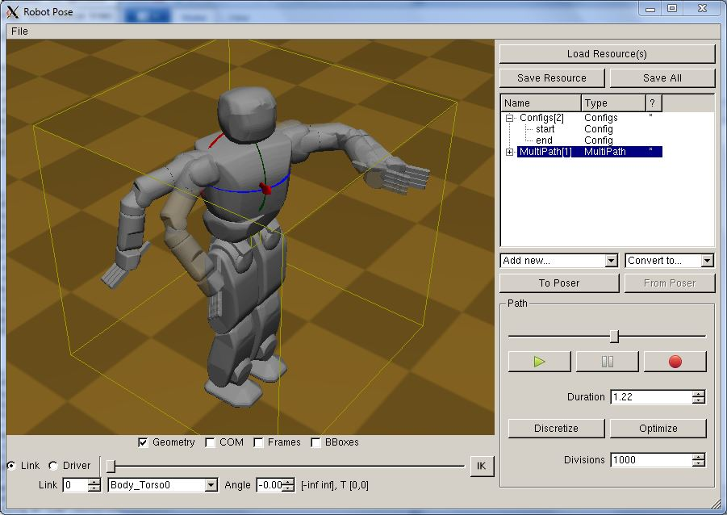
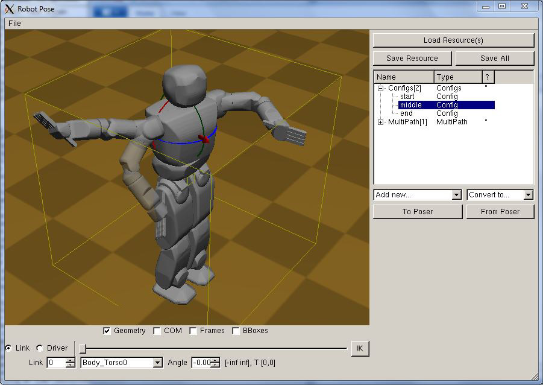
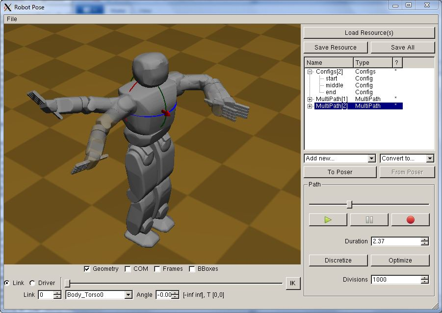

# Klamp't Tutorial: Generate a path/trajectory from keyframes using Apps

In this tutorial we learn how to generate a time-parameterized trajectory from keyframes. This will describe how to generate time-optimal trajectories.

Difficulty: easy

Time: 5 minutes

_Note for users that compiled from source_: These instructions assume that RobotPose is built with Qt support. For instructions using the GLUI version, please refer to the manual.

### Path/Trajectory generation using Apps
First, launch the RobotPose program with your desired robot or world file:
```
./RobotPose [path to Klampt]/data/hubo_plane.xml
```
We will begin by saving the start configuration to a resource. Select Add Resource... -> Config, and select it. Let's change its name to something more sensible by double clicking its name, entering "start", and pressing enter. Now, click the "From Poser" button, which stores the current configuration into the "start" resource.



Now let's pose an end configuration. Use the poser (right-drag) to move the robot's arms around to some pose of your choosing.




Repeating the steps above, save the configuration to another Config resource, and name it "end".

The next step combines the resources as milestones in the Configs compound type. To do so, select Add Resource... -> Configs, and drag the "start" and "end" resources under it. Click the "+" button to expand the resource tree to make sure they are in the right order, as follows.



Next, select the Configs[2] resource and click the Optimize button in the bottom right. (You may also play around with the "Num divs" parameter, which will control the number of divisions the optimization routine will use when discretizing the path. A finer discretization results in more optimal paths but takes longer to optimize.)

Voila! you will see a new resource, named MultiPath[1]. Select this resource and press play to watch the trajectory animated.



At this point, you can go ahead and save the resource to disk. The saved MultiPath file can be read into the SimTest program. (You may also choose Convert to... -> Linear Path to convert it into a linear path type before saving. This is useful to use the Python Klamp't trajectory controllers, which read linear path files.)

Let's look at a typical usage case: you've generated a motion, tested it in simulation or on a real robot, and found a problem part-way through the motion. How will you edit the motion?

We'll start by creating a new intermediate keyframe and then editing it to a new desired configuration. Select the MultiPath resource, and move the playback slider to some intermediate configuration.



Next, click the "To poser" button, which will update the poser to the currently interpolated robot configuration. Pose this robot as desired, and save the posed robot to a new Config resource, called "middle". Drag the resource into the Configs[2] resource and place it between "start" and "end", as shown here.



Now, select the Configs[2] resource and click Optimize again. A new MultiPath pops up. Pressing play will show that the new path passes through the "middle" milestone before continuing on to "end".



That's all there is to it! If you'd like to uniformly speed up or slow down the motions you may edit the Duration parameter, or for more detailed control you can edit the timing of the MultiPath by expanding it into its component resources and editing the "times" sub-resource.
