# Klamp't Tutorial: Run a simulation with Apps

In this tutorial we learn how to run a simulation, interact with the simulated robot via the poser, and to simulate paths and trajectories. It is assumed that you have already successfully installed Klampt.

Difficulty: easy

Time: 5 - 10 minutes

### Starting and navigating the simulation
First, let's start up a simulation with the NASA ATHLETE robot. From a command line, change directories into the Klampt folder, and run the SimTest program:
```
./SimTest data/athlete_plane.xml
```
(If you are running Windows, you will need to add an .exe extension onto the SimTest program name in the command line.)

Here data/athlete_plane.xml is an example of a  _world file_. World files are simple XML files that specify the starting positions of objects, robots, and fixed terrain elements in the world, configure robot controllers, and specify miscellaneous simulation parameters. This is a particularly simple world file that just has the ATHLETE robot standing above a flat ground.

You can also just run SimTest and it will prompt you to choose a world file (unless you compiled without Qt support).

If all goes well you should see a screen like this:

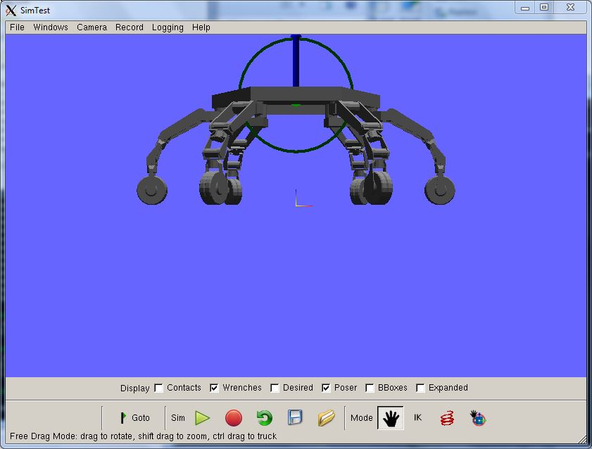

Click and drag on the world with the left mouse button, and observe the view rotating:


Now hold the Shift key and drag up and down with the left mouse button. The view zooms:

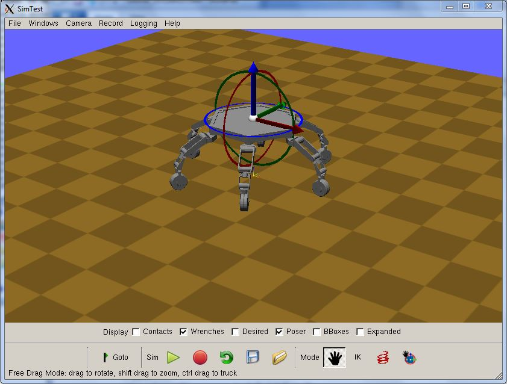

Now click on the Play button (green arrow). As the robot hits the ground you should see the orange arrows at the feet briefly extend sharply upward, and then quickly settle into a stable distribution:

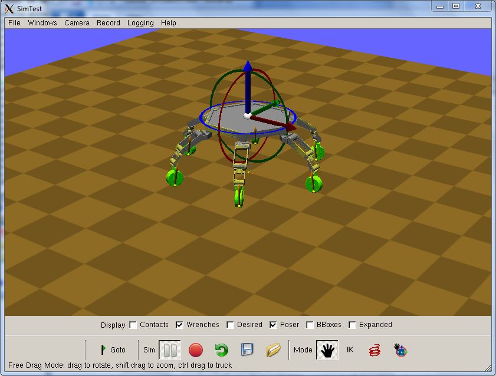


### Using the poser

Go ahead and navigate around the simulation, holding Shift to zoom and Control to pan. Zoom in on one of the legs of the robot, and click and drag it up and down with the  _right_  mouse button. You will see a ghosted yellow robot move its leg to another pose. This is the  _poser_. The grey robot doesn't move... yet.

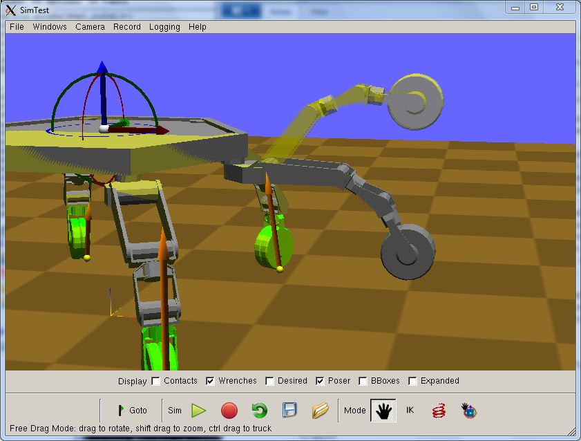

Now click on the red spring icon to turn on  _force application mode_. Right click and drag on the free limb, and watch the robot get pulled around:

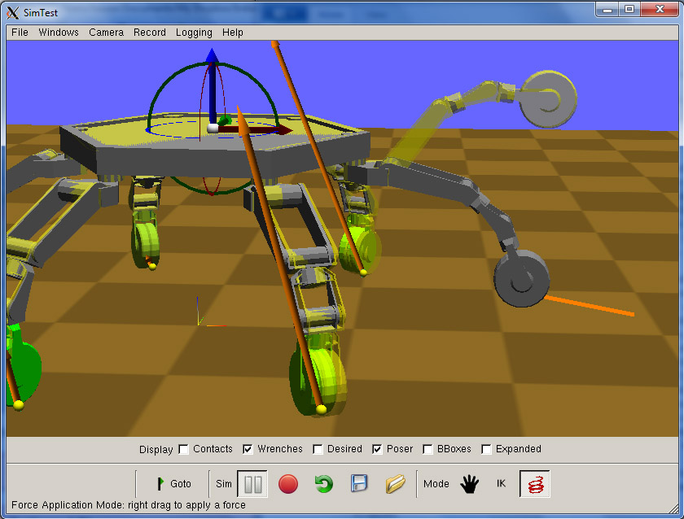

Let the robot settle down, and then pause the simulation with the Pause button (the two grey vertical bars). Switch back to the hand icon, and try right-clicking the center of the 3D posing widget and dragging it around. Note that the poser configuration moves around freely in space.

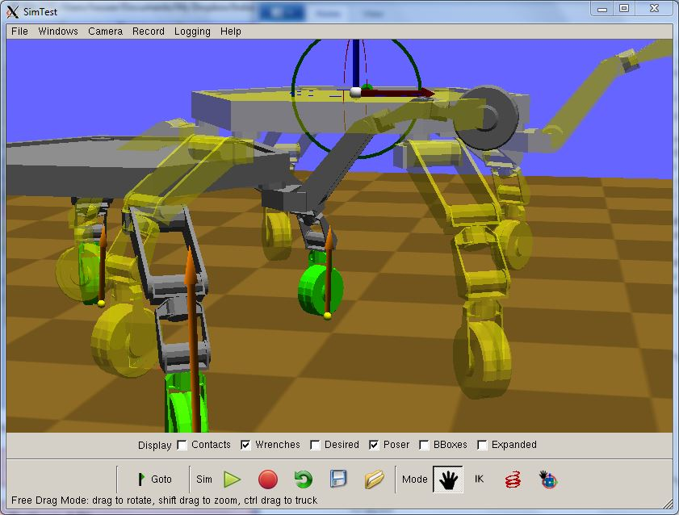

What happens when you start simulating again?

Nothing! This is because a legged robot is unable to freely move its base without properly applying forces to the environment. This needs to be done via a coordinated motion of all the legs. Let's try this now.

Navigate so that all five legs in contact are in view. Then, click the IK button to bring up Inverse Kinematics Posing Mode. Click on the circle with the cross in the middle, and then right click on all of the legs on the ground. This will freeze the poser's legs in place as the rest of the body is moved.

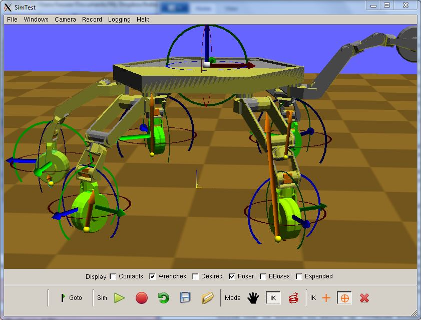

Now switch to the plain cross, and right-drag on the free limb. This adds a point constraint to the free limb and you can see the body of the robot move to try and maintain the fixed feet constraints.

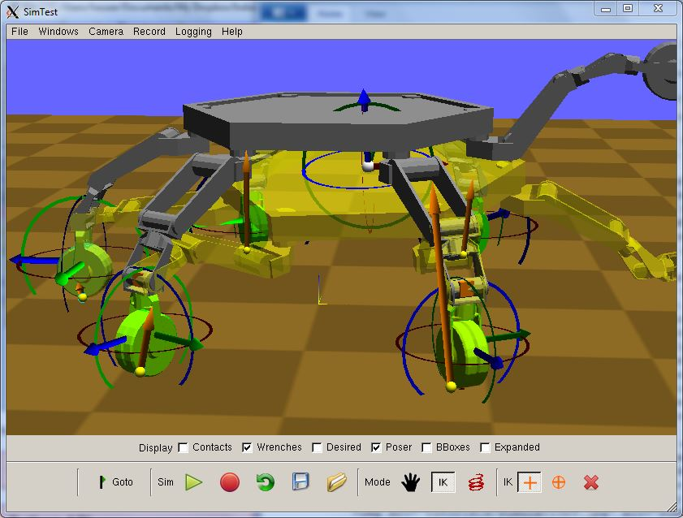

Press "Goto" and watch the robot move to the desired configuration.

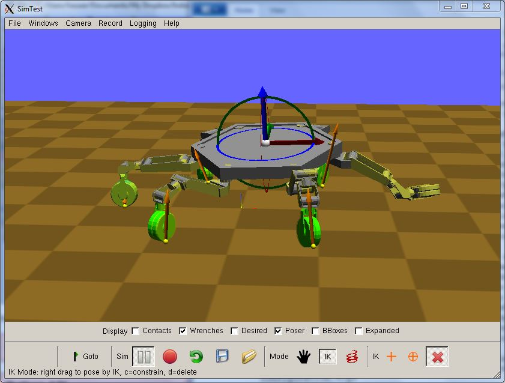

[Note: you may delete previously added IK constraints by choosing the red X and right-clicking on the constraints you wish to discard.]

You're all done! You may continue to play with the poser or continue to the tutorial below on simulating paths.

### Simulating paths and trajectories

Motions in Klamp't are specified in  _configuration space_. First, let's take a little detour to talk about configurations...

A  _configuration_  of a robot is a vector-like quantity that specifies all joint angles and transformations of free-floating bases of the robot. A configuration is represented as a tuple of D numbers, where D is the dimensionality of the robot. Each number is a  _degree of freedom_  (DOF) that maps to a translation or rotation of a  _link_  as specified by the Klamp't robot file (.rob or .urdf file).

For example, ATHLETE has 42 DOF, as follows:
```
hex x, hex y, hex z, hex yaw, hex pitch, hex roll,  
hip yaw 1, hip pitch 1, knee pitch 1, knee roll 1, ankle pitch 1, ankle roll 1  
...  
hip yaw 6, hip pitch 6, knee pitch 6, knee roll 6, ankle pitch 6, ankle roll 6
```
The first 6 DOF correspond to the transformation of the body of the robot, while the remaining 6 groups of 6 DOF correspond to the joint angles of each leg.  _It is important to note that order matters! When translating between Klamp't and other modules (e.g., your own robot or ROS) you must take care to map values properly into the convention specified in your Klamp't robot file._

Note that DOF can mostly be treated as independent elements in a Cartesian space, except for the rotation DOF, which must be interpolated in a different way to account for the non-Cartesian nature of the space of rotations. In most typical use cases, Klamp't will take care of these DOF automatically.

Klamp't distinguishes between two types of motions.
1.  The first type, known as a  _path_, is a geometric curve that passes along a list of configurations, but without timing specified.
2.  The second type, known as a  _trajectory_, stores both the path and its time-parameterization.

Depending on your needs, you may want to work with either paths or trajectories. Paths are often simpler to work with because timing is deferred to the robot. On the other hand, trajectories provide the greatest amount of control over the speed of motion, and are preferrable for dynamic tasks.

First, let's look at a simple path, data/motions/athlete_flex.milestones. Open it up in a text editor. You will see it has three lines, and on each line there are two tuples. These are configuration and velocity  _milestones_  that the robot should pass through.

(Side note: When stored to a text string, a tuple (x1,...,xD) is a whitespace-separated list of D+1 values)
```
D x1  ... xD
```
Now run the following command:
```
./SimTest data/athlete_plane.xml -milestones data/motions/athlete_flex.milestones
```
Using the Display checkboxes, uncheck Poser and check Desired. Now press play. You will see a transparent green robot, which shows the commanded configuration. It almost entirely overlaps the grey robot, but not entirely. Watch the motion play with a smooth interpolation between the milestones.

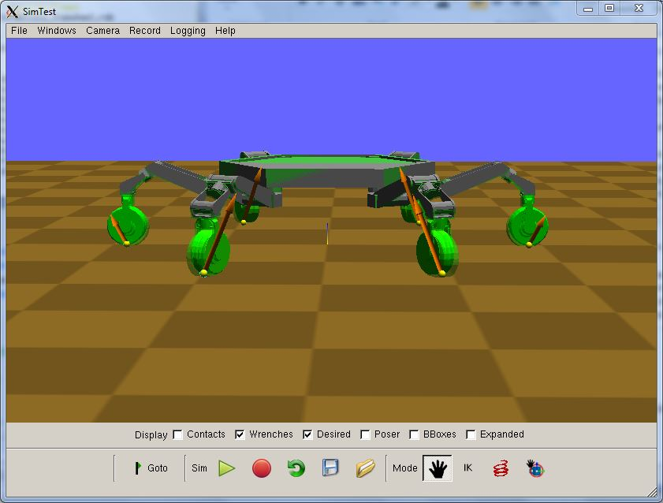

Now we'll run a time-parameterized trajectory. Run the following command

```
./SimTest data/athlete_plane.xml -path data/motions/athlete_flex.path
```
(You may also choose Load Path... from the File menu once the previous path completes)

This file is a  _Linear Path_  which is the simplest possible trajectory: a list of milestones that must be met at specified points in time. It is named this way because its timing and movement is given by a piecewise linear interpolation in time and configuration space. Opening it up in a text editor, you will see many lines, each of which contains a time and a configuration.

This particular motion starts at 0s, meets the middle configuration at 1s, and ends at 2s. Let's try playing around with the timing.

First, let's make it slower so that it completes in 10 seconds. Edit the first entry on Line 2 to 5, and edit the first entry on Line 3 to 10. Re-run SimTest or reload the path. Observe how the path is executed slower before.

Now, let's speed up the trajectory so that it completes in 1 second. Edit the first entry on Line 2 to 0.5, and edit the first entry on Line 3 to 1.0. Re-run SimTest or reload the path. Look at it go!

Note that although we made the path faster, it's certainly not as smooth as the milestone path execution. This is because the milestone path smoothly blends between milestones while satisfying the robot's dynamic limits, while a linear path blindly executes the timing that you provide. Thus, a trajectory provides a finer granularity of control, but if you are not careful, it comes at a higher risk of violating constraints and damaging the robot.

_Important note: no blending is performed between the robot's start configuration and the start of a linear path._So if the path does not start at the robot's start configuration, then the commanded configuration will jump at the beginning of execution. In summary,  _linear paths assume that you know what you're doing_.

If you are only interested in fixed-base robots or working with robots' arms, feel free to stop here or move on to the  [Trajectory Tutorial](Trajectory_keyframes.md)  to learn about how you can generate and optimize trajectories. However, if you are interested in legged robots or dexterous manipulation, be sure to read on...


### Paths and trajectories with contact

In both of the prior examples, observe that although the start, middle, and end milestones have the same feet positions, the feet move in and out while the robot interpolates between those configurations. This is because the milestones are interpolated in configuration space, without knowing that the feet are supposed stay still. This is quite bad! Not only is the contact being broken, but the robot needs to exert strong forces to maintain the desired configurations (Observe that during simulation, the friction forces point inward and outward to resist the sliding.)

We have provided an example joint space trajectory that has been generated at a finer resolution. Load the simulation with the file data/motions/athlete_flex_opt.path. Although the motion is still interpolated in configuration space, the finer resolution keeps the feet more stationary, which causes less strain on the robot, as seen here.

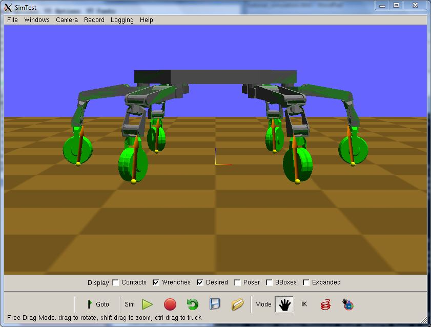


SimTest can also generate such trajectories automatically with a third motion type: is a  _Multi Path_. A MultiPath specifies the constraints on a robot, and can even specify motions that make and break contact. Open up data/motions/athlete_flex.xml in a text editor. You will see an XML file that contains a set of `<ikgoal>` elements. These are the foot positioning constraints. (Disregard exactly what the text means for now; it's easier to edit these in a GUI.) You will also see a list of milestones, which have a time and a configuration. So essentially, this encodes a linear path plus foot constraints.

If you now load data/motions/athlete_flex.xml, you will now see a bunch of lines written to your console while SimTest does some processing for a few seconds. It's solving for a finely discretized path whose configurations meet the foot constraints. (In particular, the configurations are no more than 0.01 units apart in configuration space, and the foot constraints have no more than 0.001 unit error. Consult the Klamp't manual if you'd like to generate such paths to your own custom tolerances.)

Simulate the path and observe that the foot constraints are indeed kept fixed.

That's it! If you would like to know more about paths, trajectories, and trajectory optimization, you may want to complete the  [Trajectory Tutorial](Trajectory_keyframes.md). You can also play around with the SimTest logging facilities to analyze the results of your motion. Or, proceed to the following sections 
to learn how to execute simulations programmatically using the Klamp't API.

