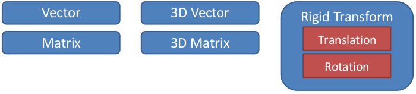

# Math concepts

Klamp't assumes basic familiarity with 3D geometry and linear algebra concepts. It heavily uses structures that representing vectors, matrices, 3D points, 3D rotations, and 3D transformations. These routines are heavily tested and fast.

The main mathematical objects used in Klampt are as follows:
- `Vector`: a variable-length (n-D) vector.
- `Matrix`: a variable-size (m x n) matrix.
- `Vector3`: a 3-D vector.
- `Matrix3`: a 3x3 matrix.
- `Rotation`: a 3D rotation, specifically an element of the special orthogonal group SO(3), usually represented by a `Matrix3`.
- `RigidTransform`: a rigid transformation `T(x) = R*x + t`, with `R` a rotation and `t` a `Vector3`

The [Klamp't math tutorial](http://motion.pratt.duke.edu/klampt/tutorial_math.html) is recommended to help better understand how to represent mathematical objects and perform operations on them.

## C++ API

Users should become familiar with the definitions in the following files:

- KrisLibrary/math/math.h contains definitions for basic mathematical routines.  `Real` is typedef'ed to `double` and (probably) should not be changed.
- KrisLibrary/math/vector.h contains a `Vector` class (typedef'ed to `VectorTemplate<Real>`).
- KrisLibrary/math/matrix.h contains a `Matrix` class (typedef'ed to `MatrixTemplate<Real>`).
- KrisLibrary/math/angle.h contains functions for interpolating and measuring distances of angles on SO(2).
- KrisLibrary/math3d/primitives.h contains 2D and 3D mathematical primitives. The classes `Vector2`, `Vector3`, `Matrix2`, `Matrix3`, `Matrix4`, `RigidTransform2D` and `RigidTransform` are efficient implementations of 2D and 3D vector/matrix operations.
- KrisLibrary/math3d/rotation contains several representations of rigid 3D rotations, including euler angles, moments (aka exponential maps), angle-axis form, and quaternions. All representations can be transformed into one another. All routines are implemented to be numerically robust.

The `Vector`, `Vector3`, and `RigidTransform` classes are the most widely used math classes in Klamp't. `Vector`s accept all the basic arithmetic operations as well as dot products, norms, and distances.  Applying a transformation (`Matrix3` or `RigidTransform`) to a point (`Vector3`) is expressed using the \* operator.

## Python API

3D math operations are found in the [klampt.math](http://motion.pratt.duke.edu/klampt/pyklampt_docs/namespaceklampt_1_1math.html) module under the following files.

- [vectorops](http://motion.pratt.duke.edu/klampt/pyklampt_docs/vectorops_8py.html): basic vector operations on lists of numbers.
- [so2](http://motion.pratt.duke.edu/klampt/pyklampt_docs/so2_8py.html): routines for handling 2D rotations.
- [so3](http://motion.pratt.duke.edu/klampt/pyklampt_docs/so3_8py.html): routines for handling 3D rotations.
- [se3](http://motion.pratt.duke.edu/klampt/pyklampt_docs/se3_8py.html): routines for handling 3D rigid transformations

The use of [numpy / scipy](http://numpy.org/) is recommended if you are doing any significant linear algebra.