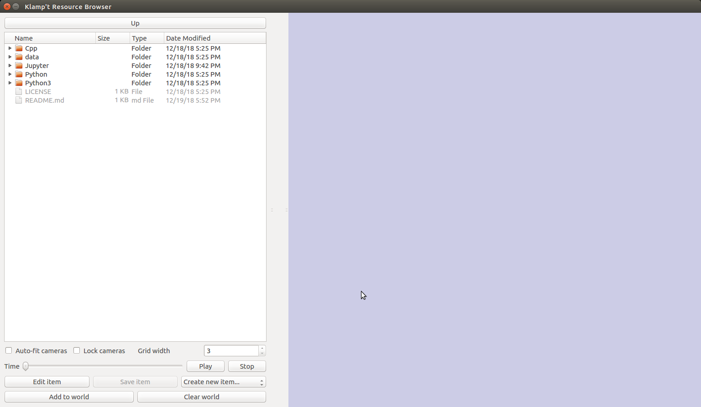
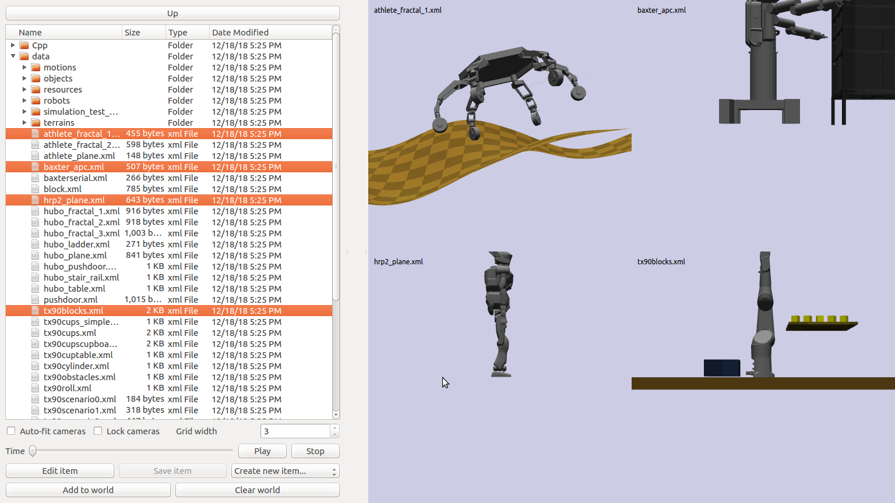
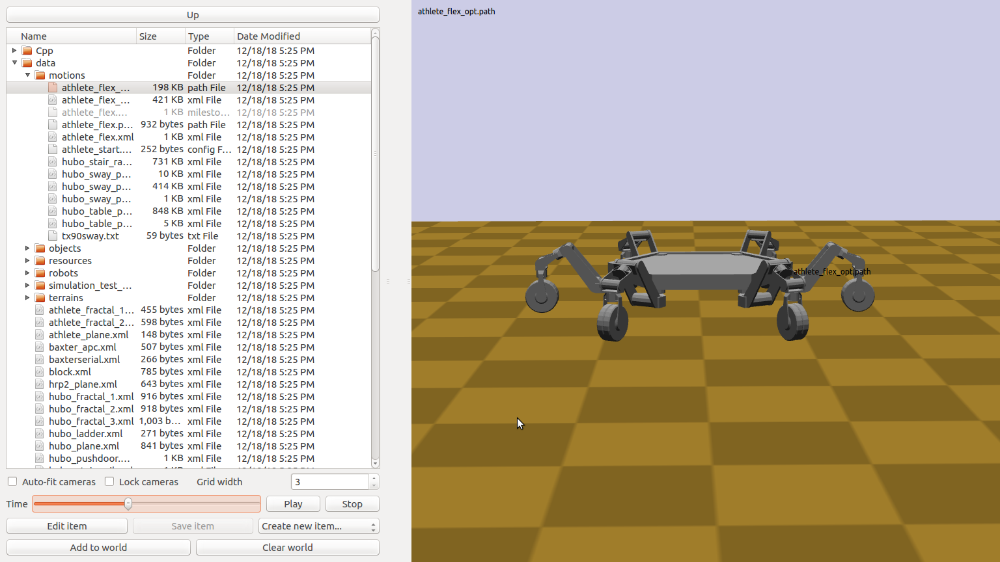
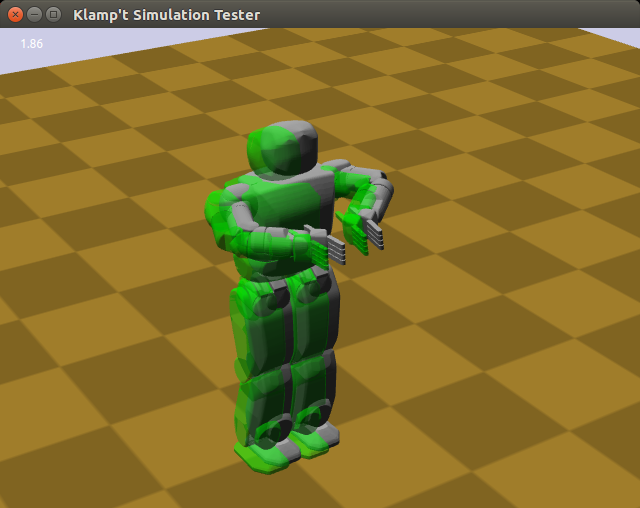

Running Klamp't apps
====================================

Klamp't comes with a few utility programs that are installed into your Python/Scripts folder.

- ``klampt_browser``: a program for browsing through and editing resources.
- ``klampt_path``: a command-line utility for modifying paths.
- ``klampt_sim``: an imitation of the SimTest program. 
  An entry point to fast prototyping of controllers using the Python API.
- ``klampt_thumbnails``: a utility program for generating thumbnails of
  worlds, robots, objects, and resources.

klampt\_browser
---------------

``klampt_browser`` is the most convenient way to browse through many Klamp't files.  It handles
any resource type that can be visualized, and multiple items (including folders) can be
examined easily using a split-screen visualization.

When you launch the program with no arguments, you will be greeted with a file browser
and empty scene:

If you then navigate the file tree to some Klampt items, like worlds, you can select them
and they will pop up in the scene.  Multiple items can be selected using Ctrl + clicking.

The browser has a "reference world" that you will need to add elements to.  By default, it
is empty. You can configure the reference world on the command line, such as::

    klampt_browser Klampt-examples/data/athlete_plane.xml

Or, you may select the elements you want in your world, like world XML files, robots,
rigid objects, and static meshes, and click the "Add to World" button.

Once you have a reference world, selecting resources like Config,
Configs, Trajectory, and IKGoal will be displayed in context of the first
robot in the reference world.  For example, now that the athlete\_plane.xml world
has been set up as the reference world, selecting the
``Klampt-examples/data/motions/athlete_flex.path`` file will show an animation:

klampt\_path
------------

``klampt_path`` performs basic editing of Trajectory (``.path``), Configs (``.configs``),
and MultiPath (``.xml``) files.  You can shift / scale the time, and concatenate multiple
paths together.

klampt\_sim
-----------

``klampt_sim`` performs simulation of a world, and can prototype Python controllers specified
in the experimental Controller API.  The following image shows the output from::

    klampt_sim Klampt-examples/data/hubo_plane.xml

klampt\_thumbnails
-------------------

``klampt_thumbnails`` generates a folder of thumbnail PNGs given a folder containing Klampt
resources.  This is most useful when you have programmatically generated many worlds, configurations,
or motions.

Example files
-------------

The `Klampt-examples Github project <https://github.com/krishauser/Klampt-examples>`_
is a companion to the main Klampt project, and you are highly recommended to download
this to get started.

World files for different robots and problem setups are available in the
Klampt-examples/data subdirectory:

-  ``hubo\*.xml``: the KAIST Hubo humanoid.
-  ``puma\*.xml``: the Puma 760 industrial robot.
-  ``tx90\*.xml``: the Staubli TX90L industrial robot.
-  ``baxter\*.xml``: the Rethink Robotics Baxter robot.

Other test robots, objects, and environments are available in the
``Klampt-examples/data/{robots,objects,terrains}`` subdirectories. Some files of
interest may include:

-  athlete.rob: the NASA ATHLETE hexapod (incomplete, missing wheel
   geometry).
-  atlas.rob: the Boston Dynamics ATLAS robot.
-  cartpole.rob: a cart-pole balancing control problem.
-  footed\_2d\_biped.rob: a simple 2D biped mimicking a human's forward
   motion.
-  footed\_2d\_monoped.rob: a simple 2D monoped.
-  hrp2.rob: the AIST HRP-2 humanoid
-  pr2.rob: the Willow Garage PR2 robot (requires KrisLibrary to be
   built with Assimp support)
-  robonaut2.rob: the NASA Robonaut2 humanoid torso.
-  robotiQ\_3finger.rob: the RobotiQ 3-finger Adaptive Gripper.
-  simple\_2d\_biped.rob: a simple 2D biped mimicking a human's lateral
   motion.
-  swingup.rob: a simple pendulum swingup control problem.
-  plane.env: a flat plane environment
-  block.obj: a 40cm block
-  block\_small.obj: an 8cm block

Utilities and Demos
~~~~~~~~~~~~~~~~~~~

The ``Klampt-examples/Python/utils`` and
``Klampt-examples/Python/demos`` folders contain a few example
utilities and programs that can be built upon to start getting a flavor
of programming Klamp't applications in Python.

Demos:

-  ``gl_vis.py``: a simple visualization of a simulation using a
   visualization plugin.
-  ``gl_vis_widgets.py``: a plugin with widgets for visual editing,
   and demonstrating custom GUI menu actions.
-  ``kbdrive.py``: drive a simulated robot around using the keyboard.
   The first 10 joints can be driven via a positive velocity with the
   top row of keys 1,2,...,0 and a negative velocity with the second row
   of keys q,w,...,p.
-  ``path_test.py``: tests the :meth:`~klampt.model.trajectory.path_to_trajectory`
   function with various options.
-  ``planning_test.py``: performs tests of the motion planning module,
   with various options.
-  ``resource_demo.py``: demonstrates various functions of the
   `klampt.io.resource <Manual-Resources.html>`__ module.
-  ``robotiq.py``: modeling and simulating the RobotiQ 3-finger
   Adaptive Gripper. This code emulates the underactuated transmission
   mechanism of each finger.
-  ``robotiqtest.py``: performs a simulation of the RobotiQ gripper
   closing and opening on an object.
-  ``sensor_test.py``: demonstrates how to use a simulated camera sensor.
-  ``sphero.py``: simulates the Sphero 2.0 robot driving around.
-  ``trajectory_test.py``: demonstrates the various types of
   :class:`~klampt.model.trajectory.Trajectory` and the
   :meth:`~klampt.model.trajectory.execute_trajectory` function.
-  ``vis_template.py``: demonstrates several functions of the vis
   module.

Utility programs:

-  ``make_planar_rob.py``: makes a canonical planar robot.
-  ``config\_to\_driver\_trajectory.py``: converts a linear path from
   configuration space (# of DOF) to driver space (# of actuators).
-  ``driver\_to\_config\_trajectory.py``: converts a linear path from
   driver space (# of actuators) to configuration space (# of DOF).
-  ``multipath\_to\_path.py``: simple script to convert a
   :class:`~klampt.model.multipath.MultiPath` to
   a timed milestone trajectory. Parameters at the top of the script
   govern the speed of the trajectory.
-  ``multipath\_to\_timed\_multipath.py``: simple script to convert a
   :class:`~klampt.model.multipath.MultiPath` to a timed MultiPath. Parameters at the top of the script
   govern the speed of the trajectory.
-  ``tri2off.py``: converts old-style .tri files to .off files.
-  ``robot_to_mesh.py``: converts a robot at a given pose to a static
   mesh file.
