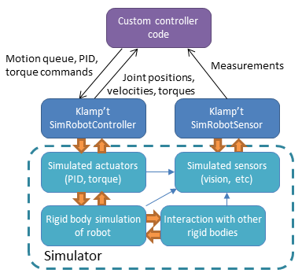
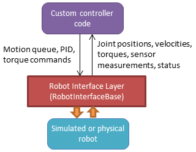
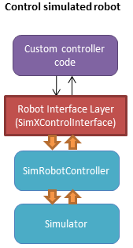
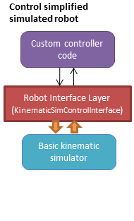
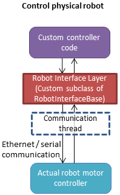
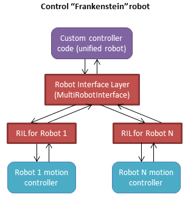

Control
=======================

Controllers provide the "glue" between the physical robot's actuators,
sensors, and planners. Like planners, they generate controls for the
robot, but controllers are expected to work online and synchronously
within a fixed, small time budget. As a result, they can only perform
relatively light computations.

The number of ways in which a robot may be controlled is infinite, and
can range from extremely simple methods, e.g., a linear gain, to
extremely complex ones, e.g. an operational space controller or a
learned policy. Yet, all controllers are structured as a simple callback
loop: repeatedly read off sensor data, perform some processing, and
write motor commands. The implementation of the internal processing is
open to the user.

Simulated Robot Controllers
---------------------------

.. note::

    If you are planning to write a controller that only works in 
    simulation, then continue reading this section.  Otherwise, you
    should skip ahead to the `Experimental Robot Interface Layer <#experimental-robot-interface-layer>`__
    section to learn how to build controllers that work both in simulation
    and on real robots.

The overall structure of a simulated robot controller is shown below. The
primary interfaces to your Python code are in the
:class:`~klampt.SimRobotController` and :class:`~klampt.SimRobotSensor` classes.

|SimRobotController|

Actuators
~~~~~~~~~

At the lowest level, a robot is driven by forces coming from *actuators*.
These receive instructions from the controller and produce link torques
that are used by the simulator. Klamp't simulators support two types of
actuator:

-  *Torque control* accepts torques and feeds them directly to links.
-  *PID control* accepts a desired joint value and velocity and uses a
   PID control loop to compute link torques servo to the desired
   position. Gain constants kP, kI, and kD should be tuned for behavior
   similar to those of the physical robot. PID controllers may also
   accept feedforward torques.

Note that PID control is performed as fast as possible with the simulation
time step. This rate is typically faster than that of the robot controller.
Hence a PID controlled actuator typically performs better (rejects
disturbances faster, is less prone to instability) than a torque controlled
actuator with a simulated PID loop at the controller level.

.. important::
   When using Klamp't to prototype behaviors for a physical
   robot, the simulated actuators should be calibrated to mimic the robot's
   true low-level motor behavior as closely as possible. It is also the
   responsibility of the user to ensure that the controller uses the
   simulated actuators in the same fashion as it would use the robot's
   physical actuators. For example, for a PID controlled robot with no
   feedforward torque capabilities, it would not be appropriate to use
   torque control in Klamp't. If a robot does not allow changing the PID
   gains, then it would not be appropriate to do so in Klamp't. Klamp't
   will not automatically configure your controller for compatibility with
   the physical actuators, nor will it complain if such errors are made.

Default Motion Queue Controller
~~~~~~~~~~~~~~~~~~~~~~~~~~~~~~~

|Motion queue illustration|

The default :class:`~klampt.SimRobotController` for simulated robots
is a motion-queued controller with optional feedforward torques,
which simulates typical controllers for industrial robots. It
supports direct access to actuators, piecewise linear and piecewise cubic
interpolation, as well as time-optimal acceleration-bounded
trajectories. The trajectory interpolation profile is the standard
trapezoidal velocity profile, except it also accepts interruption and
arbitrary start and goal velocities.

|Trapezoidal velocity profiles|

(Note: One limitation of the API is that it is impossible to have
a subset of joints controlled by a motion queue, while others are
controlled by PID or torque commands.)

API summary
~~~~~~~~~~~~

**Basic commands**

-  ``controller = sim.getController(RobotModel or robot index)``:
   retrieves the simulation controller for the given wobot
-  ``controller.setPIDGains (kP,kI,kD)``: overrides the PID gains in the
   RobotModel to kP,kI,kD (lists of floats of lengths
   robot.numDrivers())
-  ``controller.setRate(dt)``: sets the time step of the internal
   controller to update every dt seconds
-  ``controller.setPIDCommand(qdes,[dqes])``: sets the desired PID
   setpoint
-  ``controller.setVelocity(dqdes,duration)``: sets a linearly
   increasing PID setpoint for all joints, starting at the current
   setpoint, and slopes in the list dqdes. After duration time it will
   stop.
-  ``controller.setTorque(t)``: sets a constant torque command t, which
   is a list of n floats.

**Motion queue operations (wraps around a PID controller)**

Convention: ``setX`` methods move immediately to the indicated
milestone, ``add/append`` creates a motion from the end of the motion
queue to the indicated milestone

-  ``controller.remainingTime()``: returns the remaining time in the
   motion queue, in seconds.
-  ``controller.set/addMilestone(qdes,[dqdes])``: sets/appends a smooth
   motion to the configuration qdes, ending with optional joint
   velocities dqdes.
-  ``controller.addMilestoneLinear(qdes)``: same as addMilestone, except
   the motion is constrained to a linear joint space path (Note:
   addMilestone may deviate)
-  ``controller.set/appendLinear(qdes,dt)``: sets/appends a linear
   interpolation to the destination qdes, finishing in dt seconds
-  ``controller.set/addCubic(qdes,dqdes,dt)``: moves immediately along a
   smooth cubic path to the destination qdes with velocity dqdes,
   finishing in dt seconds

**Querying robot state**

-  ``controller.getCommandedConfig()``: retrieve PID setpoint
-  ``controller.getCommandedVelocity()``: retrieve PID desired velocity
-  ``controller.getSensedConfig()``: retrieve sensed configuration from
   joint encoders
-  ``controller.getSensedVelocity()``: retrieve sensed velocity from
   joint encoders
-  ``controller.sensor(index or name)``: retrieve :class:`~klampt.SimRobotSensor`
   reference by index/name

Writing a Custom Controller
~~~~~~~~~~~~~~~~~~~~~~~~~~~

To wrap a controller around a simulated robot, the user should
implement a control loop. At every time step, the control loop reads
the robot's sensors, computes the control, and then sends the control
to the robot via the ``setPIDCommand`` or ``setTorqueCommand`` methods. 
You are also free to use the motion queue commands as well.  Finally,
advance the simulation.

The following example shows a very simple example that just moves
the commanded configuration by 1 radian / sec over 10 seconds.

.. code:: python

    import klampt
    world = klampt.WorldModel()
    world.readFile("my_world_file.xml")
    sim = klampt.Simulator(world)
    controller = sim.getController(0)
    dt = 0.01
    while sim.getTime() < 10:
        #TODO put your control code here
        q = controller.getCommandedConfig()
        q[1] += 1*dt    #move at 1 radian / sec
        controlller.setPIDCommand(q,[0]*len(q))

        #advance the simulation
        sim.simulate(dt)
    print("End configuration:",controller.getSensedConfig())

In general, your control loop can make use of sensors and planners. There
are countless ways to implement robot behaviors, and you are only limited by
your imagination.

Cartesian Control
------------------

Smooth Cartesian velocity control can be generated using the :class:`~klampt.control.cartesian\_drive.CartesianDriveSolver` class.
Its :meth:`~klampt.control.cartesian\_drive.CartesianDriveSolver.drive` method is called repeatedly to incrementally drive the
end effector (or end effectors) along desired translational and angular velocities.   At each time
step, a precise Cartesian motion (a screw motion) is executed, where possible. 

CartesianDriveSolver is better than using an IK solver to solve for each velocity increment, because the
errors of an IK solver will accumulate, causing a drift from the desired motion.  Instead, the solver
maintains a Cartesian "marker" that designates the desired pose, and its position is incremented via 
integration along the desired screw motion.  (There may be slight numerical errors due to the limits of
machine precision, but they will be imperceptable even at sub-millimeter resolutions.)

Some Cartesian velocities are not possible due to joint limits, velocity limits, and kinematic
constraints.  If a non-realizable velocity is commanded, then the solver moves the marker as far as possible
along the commanded screw motion.  Future commands will drive the marker from whatever pose was
achieved.  This means the robot can recover from being driven to singularities by driving the marker back
toward the reachable space.  (Note that it can still be challenging to recover from joint limits,
since the fraction of directions that lead back to the reachable set is reduced by each constraint met.)

The usage pattern with a simulated robot is as follows:

.. code:: python

    import klampt
    from klampt.control.cartesian_drive import CartesianDriveSolver

    world = klampt.WorldModel()
    world.readFile("my_world_file.xml")
    robot = world.robot(0)
    sim = klampt.Simulator(world)
    controller = sim.controller(0)

    #configure the solver
    driver = CartesianDriveSolver(robot)
    ee_link = robot.numLinks()-1  #what's the end effector link?
    tool_position = [0,0,0]   #local position of the tool center point on the end effector
    driver.start(controller.getCommandedConfig(),ee_link,endEffectorPositions=tool_position)

    #begin the loop
    dt = 0.01
    while sim.getTime() < 10:
        #TODO put your control code here
        q = controller.getCommandedConfig()
        ang_vel = [0,0,0]      #angular velocity
        lin_vel = [0.1,0,0]    #lin_vel
        (progress,qnext) = driver.drive(q,ang_vel,lin_vel,dt)
        controlller.setPIDCommand(qnext,[0]*len(q))
        if progress < 0:
            print("Progress stopped?")

        #advance the simulation
        sim.simulate(dt)
    print("End configuration:",controller.getSensedConfig())

This approach is local, and does not verify whether a path is executable or not.  Another approach
to Cartesian control is to convert from a Cartesian path to a joint-space path using the utilities
in :mod:`~klampt.model.cartesian_trajectory`.  Straight-line paths can be executed using
:meth:`~klampt.model.cartesian_trajectory.cartesian_move_to`.  For example, this code generates
a linear Cartesian path (0.25m forward in the X direction) that can be executed by joint-space motions::

    from klampt.model.cartesian_trajectory import cartesian_move_to
    from klampt.model.trajectory import path_to_trajectory,execute_trajectory
    from klampt.model import config,ik
    from klampt.math import vectorops
    
    ...setup world, robot, and controller as before

    # Now we set up a target
    ee_link = robot.numLinks()-1
    T0 = robot.link(ee_link).getTransform()
    goal = ik.objective(robot.link(ee_link),R=T0[0],t=vectorops.add(T0[1],[0.25,0,0]))
    # Calling this function will generate a path from the current e.e. transform to goal
    path = cartesian_move_to(robot,goal)
    if path is None:
        print("Couldn't find a path!")
    else:
        # Now the path can be executed on a controller... note that it's untimed,
        # so a little work needs to be done to make it timed.  The path_to_trajectory
        # utility function helps a lot here!  It has many options so please consult
        # the documentation...
        traj = path_to_trajectory(path,smoothing=None,timing='Linf')
        speed = 1.0   #can vary the execution speed here or in path_to_trajectory.
        execute_trajectory(traj,controller,speed=speed)

    while sim.getTime() < 10:
        #advance the simulation
        sim.simulate(dt)

Importantly, the ``feasibilityTest`` argument can be used to verify constraints, such as
self collision::

    def feasibilityTest(q):
        robot.setConfig(q)
        return not robot.selfCollision()
    path = cartesian_move_to(robot,goal,feasibilityTest=feasibilityTest)

See the `Paths and Trajectories <Manual-Paths.html#trajectory-execution>`__ manual for more
detail about the :func:`~klampt.model.trajectory.path_to_trajectory` and :func:`~klampt.model.trajectory.execute_trajectory` functions. 

Experimental Robot Interface Layer
----------------------------------

Ideally, you'd like to be able to prototype a controller in simulation, and then
easily connect the same controller code to a real robot.  This is where the
Klamp't Robot Interface Layer (RIL) comes in.  The RIL API defines a
superset of common functionality that most robots' motor controllers provide.
It also provides a common interface to switch between simulated and real
robots. The overall diagram looks like the following:

|RobotInterfaceLayer|

To interface with your own robot, you will need to construct a subclass of RIL's
main :class:`~klampt.control.robotinterface.RobotInterfaceBase` class, or
find someone else's implementation for your brand / type of robot.

Because creating and debugging such an interface can take some time, it's useful
to test your control code in simulation so that it can work directly when you
switch to the real robot.  There are two ways to do this:

1. (preferable) Port your control code to use :class:`~klampt.control.robotinterface.RobotInterfaceBase`.
   Note there are some discrepancies between this and SimRobotController that you
   should watch out for.  Then, use one of the classes in :mod:`klampt.control.simrobotinterface`
   to test your controller in a simulator. 
2. Use your existing control code, but replace your SimRobotController object with a
   :class:`klampt.control.interop.SimRobotControllerToInterface` object that points
   to your robot's interface.

The reason why route 1 is preferable is that you can pick the RIL interface to
your simulated robot that corresponds most closely to your actual robot, whether
it's position controlled, velocity controlled, or provides motion queue functionality.
SimXControllInterface classes are available to use physics simulation as well as
basic kinematic simulation (KinematicSimControlInterface), which is faster.  This usage
is summarized in the following diagrams.

|RobotInterfaceLayer-simulation| |RobotInterfaceLayer-kinematic|

Using the RIL API
~~~~~~~~~~~~~~~~~~

For your controller code to use an RIL API, it should treat the API as a synchronous
process, in which all commands and queries at a given time step are placed within a
``startStep()``/``endStep()`` block.  The calling convention is:

.. code:: python

    interface = MyRobotInterface(...args...)
    if not interface.initialize():  #should be called first
        raise RuntimeError("There was some problem initializing interface "+str(interface))
    dt = 1.0/interface.controlRate()
    while interface.status() == 'ok':  #no error handling done here...
        t0 = time.time()
        interface.startStep()
        [any getXXX or setXXX commands here comprising the control loop]
        interface.endStep()
        t1 = time.time()
        telapsed = t1 - t0
        [wait for time max(dt - telapsed,0)]

Status Management
^^^^^^^^^^^^^^^^^

- ``interface.initialize()``: must be called before the control loop. May return False
  if there was an error connecting.
- ``interface.status()``: returns 'ok' if everything is ok.  Otherwise, returns an
  implementation-dependent string.
- ``interface.clock()``: returns the robot's clock, in s.
- ``interface.controlRate()``: returns the control rate, in Hz.
- ``interface.reset()``: if status() is not 'ok', tries to reset to an ok state.
  A controller should not issue commands until status() is 'ok' again.
- ``interface.estop()``: triggers an emergency stop.  Default just does a soft stop.
- ``interface.softStop()``: triggers a soft stop.

DOFs, Joints, and Parts
^^^^^^^^^^^^^^^^^^^^^^^

The number of DOFs in RIL is assumed equal to the number of joints with actuators / 
encoders.  If the robot has fewer actuators than encoders, the commands for 
unactuated joints should just be ignored.  If the robot corresponds to a Klampt
model (typical), then the number of DOFs should be ``model.numDrivers()``.

**DOF Accessors**

- ``interface.numJoints()``: returns the # of DOFs.
- ``interface.indices()``: returns a list of indices of all the robot's DOFs (equivalent to ``list(range(numDOFs()))``.
- ``interface.indices(joint_idx=j)``: returns the index of the given DOF index (equivalent to ``numDOFs()+j``).
- ``interface.jointName(j)``: returns the name of the j'th joint.

A robot can have "parts", which are named groups of DOFs.  For example, a
robot with a gripper can have parts "arm" and "gripper", which can be controlled
separately.  

**Part Accessors**

- ``interface.parts()``: retrieves the list of part names.
- ``interface.indices(part)``: retrieves the indices of this robot accessed by
  part ``part``.
- ``interface.indices(part,j)``: retrieves the index on this robot accessed by
  joint j on part ``part``.
- ``interface.partController(part)``: access a RIL interface to a part.

Command types
^^^^^^^^^^^^^^

Keep in mind that almost all robots will only implement a subset of these natively.

**Basic control**

- ``interface.setPosition(q)``: Immediate position control.
- ``interface.moveToPosition(q,speed=1)``: Smooth position control.
- ``interface.setVelocity(v,ttl=None)``: Immediate velocity control, with an optional time-to-live.
- ``interface.setTorque(t,ttl=None)``: Torque control, with an optional time-to-live.
- ``interface.setVelocity(v,ttl=None)``: Immediate velocity control, with an optional time-to-live.
- ``interface.setPID(q,dq,t_feedforward=None)``: PID command, with optional feedforward torque.
- ``interface.setPiecewiseLinear(times,milestones,relative=True)``: initiates a piecewise linear
  trajectory between the given times and milestones.  If relative=True, time 0 is the current time,
  but otherwise all the times should be greater than ``interface.clock()``.
- ``interface.setPiecewiseCubic(times,milestones,velocities,relative=True)``: initiates a piecewise
  cubic trajectory between the given times, milestones, and velocities.  If relative=True, time 0 
  is the current time, but otherwise all the times should be greater than ``interface.clock()``.

**Cartesian control**

Each RIL robot has at most one end effector.  If you have a robot with multiple end effectors,
you will need to create a `part <#dofs-joints-and-parts>`__ for each end effector.

All Cartesian items refer to the robot's base frame, which may not be the same as a
Klamp't world frame.  The task space is robot dependent.  However, for 6DOF robots,
the task space should be SE(3) (:mod:`klampt.math.se3` element). For 3DOF robots
the task space is likely to be 3D.

- ``interface.setToolCoordinates(x)``: sets the tool center point
- ``interface.getToolCoordinates()``: gets the tool center point 
- ``interface.setGravityCompensation(gravity=[0,0,-9.8],load=0,load_com=[0,0,0])``:
  sets the gravity compensation vector, load, and load position relative to the
  base frame of the robot.
- ``interface.setCartesianPosition(x)``: sets an immediate position command to the
  position x.
- ``interface.moveToCartesianPosition(x,speed=1.0)``: sets a move-to cartesian
  command.  This is not necessarily a straight line motion.
- ``interface.setCartesianVelocity(dx,ttl=None)``: sets an immediate velocity command
  with the task space velocity dx.  For an SE(3) task space, ``dx=(w,v)`` with ``w``
  the angular velocity and ``v`` is the translational velocity (in the robot base
  coordinate frame )
- ``interface.setCartesianForce(fparams,ttl=None)``: sets a Cartesian force command.  For
  an SE(3) task space, ``fparams=(torque,force)`` gives the wrench acting on the end
  effector.

Writing RIL Implementations for Your Robot
~~~~~~~~~~~~~~~~~~~~~~~~~~~~~~~~~~~~~~~~~~

.. important::

    This has not been thoroughly tested.

To implement an RIL layer for your robot, you will need to understand details on the
communication method used by the manufacturer, e.g., Ethernet, serial, ROS, or some other API.
Your RIL implementation should fill out as much of the RobotInterfaceBase methods as provided
by the communication layer.  The block diagram of the architecture looks like this:

|RobotInterfaceLayer-physical|

For RIL to work, there are a few functions your subclass will need to fill out, at a minimum:

  * :meth:`~klampt.control.robotinterface.RobotInterfaceBase.numDOFs` or :meth:`~klampt.control.robotinterface.RobotInterfaceBase.klamptModel`
  * Either :meth:`~klampt.control.robotinterface.RobotInterfaceBase.clock` or :meth:`~klampt.control.robotinterface.RobotInterfaceBase.controlRate`
  * Either :meth:`~klampt.control.robotinterface.RobotInterfaceBase.setPosition`, :meth:`~klampt.control.robotinterface.RobotInterfaceBase.moveToPosition`, :meth:`~klampt.control.robotinterface.RobotInterfaceBase.setVelocity`, 
    :meth:`~klampt.control.robotinterface.RobotInterfaceBase.setTorque`, or :meth:`~klampt.control.robotinterface.RobotInterfaceBase.setPID`
  * Either :meth:`~klampt.control.robotinterface.RobotInterfaceBase.sensedPosition` or :meth:`~klampt.control.robotinterface.RobotInterfaceBase.commandedPosition`

Given these implementations, we provide a convenience class,
:class:`~klampt.control.robotinterfaceutils.RobotInterfaceCompleter`,
that will automatically fill in all other parts of the RIL API, e.g., velocity
control, motion queue control, and Cartesian control.  (Note: move-to and
Cartesian control functions are only available if ``RobotInterfaceBase.klamptModel``
is implemented.)

.. note::

  The emulation of some components has rough edges, and this code is
  subject to change. If you plan to use RIL, we suggest that you install from
  source so that you can get the latest updates.

Multithreaded Implementations
^^^^^^^^^^^^^^^^^^^^^^^^^^^^^

The best practice for implementing an RIL API is to launch a thread that
synchrononously communicates with your robot, while relaying asynchronous
commands from the caller. The following code does a very basic job of this
for a position-controlled robot, which only relays the sensed/ commanded
positions to/from the robot. 

.. code:: python

  from klampt.control.robotinterface import *
  from klampt import *
  from threading import Thread,Lock

  class RobotCommThread:
    def __init__(self,connection):
      Thread.__init__(self)
      self.connection = connection
      self.doStop = False
      self.lock = Lock()
      self.commandedPosition = None
      self.sensedPosition = None
      self.new_commandedPosition = None
      self.status = 'ok'
      self.daemon = True  #flag in Thread that will help kill this Thread under Ctrl+C
    def run(self):
      while not self.doStop:
        with self.lock:
          ...read status, sensedPosition, commandedPosition from the robot...
          ...if disconnected, set status to 'disconnected'...
          if self.new_commandedPosition is not None:
            ...send new_commandedPosition to the robot...
            self.commandedPosition = new_commandedPosition
        #unlock
        time.sleep(0.001) # or some small amount

  class MyRIL(RobotInterfaceBase):
    def __init__(self):
      self.thread = None
      self.world = WorldModel()
      self.world.readFile(...path to robot file...)
      self.robot = self.world.robot(0)
    def initialize(self):
      ...connect to the robot, return False if unsuccessful...
      self.thread = RobotCommThread(robot_connection)
      self.thread.start()
    def stop(self):
      if self.thread is not None:
        self.thread.doStop = True
        self.thread.join()
        self.thread = True
    def klamptModel(self):
      return self.robot
    def controlRate(self):
      return ...whatever the robot's control rate is...
    def status(self):
      return self.thread.status
    def commandedPosition(self):
      with self.thread.lock:
        res = self.thread.commandedPosition
      return res
    def sensedPosition(self):
      with self.thread.lock:
        res = self.thread.sensedPosition
      return res
    def setPosition(self,q):
      with self.thread.lock:
        self.thread.new_commandedPosition = q

(Note: a complete implementation will do a better job of error handling.)

ROS Implementations
^^^^^^^^^^^^^^^^^^^

For a ROS implementation, ROS messaging  will already be running in a separate
thread, so you don't need to set up a new thread after you've run ``rospy.init_node(...)``.
This could happen, for example, in the ``initialize`` method.  Then, for all robot commands
provided by your robot's ROS interface:

1. In the appropriate RIL method, translate the Klamp't command to a ROS message.
2. Publish the message to the appropriate topic, or call the appropriate service.

For all sensor messages provided by your robot's ROS interface:

1. In ``initialize``, set up a subscriber to the sensor message.
2. The callback from that subscriber should just store the sensor message.
3. Overload the appropriate RIL method to translate the ROS message to a Klamp't object.
   For standard positions, velocities, and torques, use the sensedPosition(), sensedVelocity(),
   and sensedTorque() methods.

   For more complex, asynchronous items like laser sensors, cameras, RGB-D sensors, and
   force/torque sensors, you should use the sensors(), sensorMeasurements(), and
   sensorUpdateTime() methods. For best interpretability (and compatibility with Klampt's
   visualization tools, e.g. :class:`~klampt.control.interop.RobotInterfacetoVis`), you
   should also make sure the sensor is defined in the robot's klamptModel() model,
   and that these measurements match the format of the corresponding `Klamp't sensor <Manual-Sensors.html>`__.

As an example, consult the implementation of :class:`~klampt.control.io.roscontroller.RosRobotInterface`.
This class sends ROS JointTrajectory commands and receives ROS JointState sensor
messages.  

Frankenstein Robots
~~~~~~~~~~~~~~~~~~~

.. important::

    New in 0.8.3 and has barely been tested. Use at your own risk.

We often build robots out of several components, such as an arm and a gripper, 
and it can be a pain to coordinate the control of each component.  Klamp't
provides a convenience class, :class:`~klampt.control.robotinterfaceutils.MultiRobotInterface`,
that lets you assemble robots into parts.

|RobotInterfaceLayer-multirobot|

Experimental Controller Building Blocks
---------------------------------------

.. important::

    THESE DOCS ARE OUT OF DATE.  The API has changed a lot and the previously
    meager functionality is only slightly improved in 0.8.3.  It is not clear whether this
    API will be maintained.

A :class:`~klampt.control.controller.ControllerBlock` interface is a very simple object with two important
methods:

-  ``advance(self,**inputs)``:  given a set of named inputs, produce a
   dictionary of named outputs. The semantics of the inputs and outputs
   are defined by the caller.  The block moves forward single time step, 
   performing any necessary changes to internal state. 

-  ``signal(self,type,**inputs)``: sends some asynchronous signal to the
   controller. The usage is caller dependent. 

Optionally, it can also implement inputNames/outputNames, and get/setState.

Robot controller blocks
~~~~~~~~~~~~~~~~~~~~~~~~

A ControllerBlock that operates as the top-level controller for a robot
is said to follow the :class:`~klampt.control.controller.RobotControllerBase` convention.  The input
dictionary contains sensor messages, specifically containing
the following elements:

-  t: the current simulation time
-  dt: the controller time step
-  q: the robot's current sensed configuration
-  dq: the robot's current sensed velocity
-  The names of each sensors in the simulated robot controller, mapped
   to a list of its measurements.

The RobotControllerBase output dictionary represents a command message.
to be sent to the robot's low-level motor controllers.  A command message
can have one of the following combinations of keys, signifying which type
of joint control should be used:

-  qcmd: use PI control.
-  qcmd and dqcmd: use PID control.
-  qcmd, dqcmd, and torquecmd: use PID control with feedforward torques.
-  dqcmd and tcmd: perform velocity control with the given actuator
   velocities, executed for time tcmd.
-  torquecmd: use torque control.

The ``klampt_sim`` script accepts arbitrary feedback controllers in this
form.  To specify such a controller, provide as input a .py file with a
single ``make(robot)`` function that returns a subclass of ``ControllerBlock`` 
that implements the desired functionality.  For example,
to see a controller that interfaces with ROS, see
`klampt/control/io/roscontroller.py <https://github.com/krishauser/klampt/blob/master/Python/klampt/control/io/roscontroller.py>`__.

Building controllers from blocks
~~~~~~~~~~~~~~~~~~~~~~~~~~~~~~~~

Internally the controller can produce arbitrarily complex behavior.
Several common blocks are implemented in :mod:`klampt.control.blocks`.

-  ``TimedControllerSequence``: runs a sequence of sub-controllers,
   switching at predefined times.
-  ``MultiController``: runs several sub-controllers in parallel, with
   the output of one sub-controller cascading into the input of another.
   For example, a state estimator could produce a better state estimate
   q for another controller.
-  ``ComposeController``: composes several sub-vectors in the input into
   a single vector in the output. Most often used as the last stage of a
   MultiController when several parts of the body are controlled with
   different sub-controllers.
-  ``LinearBlock``: outputs a linear function of some number of
   inputs.
-  ``LambdaBlock``: outputs ``f(arg1,...,argk)`` for any arbitrary
   Python function ``f``.
-  ``StateMachine``: a base class for a finite state machine
   controller. The subclass must determine when to transition between
   sub-controllers.
-  ``TransitionStateMachine``: a finite state machine
   controller with an explicit matrix of transition conditions.

A trajectory tracking controller is given in
`klampt/control/blocks/trajectory\_tracking.py <https://github.com/krishauser/klampt/blob/master/Python/klampt/control/trajectory_tracking.py>`__.
Its make function accepts a robot model (optionally ``None``) and a
linear path file name.

A preliminary velocity-based operational space controller is implemented
in
`control-examples/OperationalSpaceController.py <https://github.com/krishauser/klampt/blob/master/Python/control-examples/OperationalSpaceController.py>`__,
but its use is highly experimental at the moment.

State estimation
~~~~~~~~~~~~~~~~~

Controllers may or may not perform state estimation. 

Using the controller.py interface, state estimators can be implemented
as ``ControllerBlock`` subclasses that calculate the estimated state
objects in the ``advance()`` method.

.. |Motion queue illustration| image:: _static/images/motion-queue.png
.. |Trapezoidal velocity profiles| image:: _static/images/trapezoidal-velocity-profile.png

