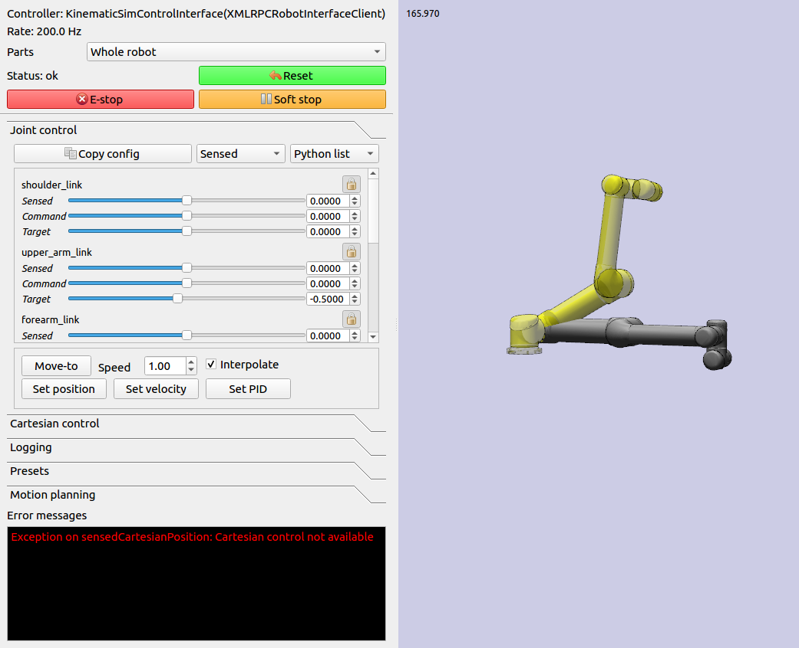

Control
=======================

Controllers provide the "glue" between the physical robot's actuators,
sensors, and planners. Like planners, they generate controls for the
robot, but controllers are expected to work online and synchronously
within a fixed, small time budget. As a result, they can only perform
relatively light computations.

The number of ways in which a robot may be controlled is infinite, and
can range from extremely simple methods, e.g., a linear gain, to
extremely complex ones, e.g. an operational space controller or a
learned policy. Yet, all controllers are structured as a simple callback
loop: repeatedly read off sensor data, perform some processing, and
write motor commands. The implementation of the internal processing is
open to the user.

In general, an application control loop can (and should!) make use of
sensors and planners. There are countless ways to implement robot
behaviors, and you are only limited by your imagination.

.. note::
    "Controller" is an overloaded term. Most robots involve a hierarchy
    of controllers, ranging from low level motor controllers and multi-axis
    Cartesian controllers that run at 100's of Hz, to sensor feedback logic
    like visual servoing or obstacle avoidance that run at 10s of Hz,
    up to motion planning, user interfaces, and mission control which
    operate at 1 Hz or less.  The word "controller" here refers to the
    lowest level controllers, while slower application-level controllers
    is referred to as the "application".  Klampt's Robot Interface Layer
    is the bridge between the two.

Klamp't Robot Interface Layer
-------------------------------

Starting in version 0.9, Klamp't Robot Interface Layer (RIL) is fully
adopted as Klampt's preferred method for interfacing with simulated and
real robots.  RIL is designed to save robot developers a huge amount of
time and solve a number of issues in a unified framework:

- *Building complex robot controllers from the ground up*: given motor
  drivers and a URDF, RIL utilities will automatically turn any set of
  servos into a unified robot, with functions available on the most
  sophisticated motor controllers. Klampt RIL can provide Cartesian control,
  smooth motion generation, and collision avoidance (by stopping).
- *Building Frankenstein robots from multiple parts*: multi-component robots
  with a set of arms, grippers, mobile base, etc. can be built and addressed
  as a unit.  A single line of code will do all the work of gathering state
  variables, multiplexing commands, and emulating behavior that parts don't
  inherently provide.
- *Easy switching between sim and real*: you'd like to prototype an application
  in simulation, and after debugging it in sim, switch immediately to a real
  robot.  RIL lets you do switch backends in one line of code.
- *Fine grained controller development and debugging*: developers can debug
  exactly how a controller operates, with complete control over step by step
  operation.
- *Procedural application control*: building high-level procedural application
  logic is easy.  Just command a motion, call ``interface.wait()``, and continue.

The RIL consists of the main :class:`~klampt.control.robotinterface.RobotInterfaceBase`
class, which provides a superset of common functionality that most robots' motor
controllers provide, as well as accessors for custom functionality.

The overall diagram looks like the following:

|RobotInterfaceLayer|

To interface with your own robot, you will need to subclass
:class:`~klampt.control.robotinterface.RobotInterfaceBase` to provide the intended
functionality, or find someone else's implementation for your brand / type of robot.

Writing Control Loops
~~~~~~~~~~~~~~~~~~~~~

An RIL API can either be synchronous or asynchronous.  Synchronous APIs are a little
more fussy, requiring that all commands and queries at a given time step are placed
within a ``beginStep()``/``endStep()`` block which is run at approximately a fixed rate.
The calling convention is:

.. code:: python

    interface = MyRobotInterface(...args...)
    if not interface.initialize():  #should be called first
        raise RuntimeError("There was some problem initializing interface "+str(interface))
    dt = 1.0/interface.controlRate()
    status = 'ok
    while status == 'ok':  #no error handling done here...
        t0 = time.time()
        interface.beginStep()
        status = interface.status()
        [any interface queries / commands here comprising the control loop]
        interface.endStep()
        t1 = time.time()
        telapsed = t1 - t0
        [wait for time max(dt - telapsed,0)]
    interface.close()

To make your code even simpler, we provide the helper classes ``TimedLooper`` and
``StepContext`` which are used as follows:

.. code:: python

    from klampt.control import TimedLooper,StepContext

    interface = MyRobotInterface(...args...)
    if not interface.initialize():  #should be called first
        raise RuntimeError("There was some problem initializing interface "+str(interface))
    looper = TimedLooper(dt = 1.0/interface.controlRate())
    status = 'ok'
    while status == 'ok' and looper:  #no error handling done here...
        with StepContext(interface):
            status = interface.status()
            [any interface queries/ commands here comprising the control loop]
    interface.close()
        
An asynchronous controller is much easier to work with: just initialize, and call
whatever queries and commands you wish:

.. code:: python

    interface = MyRobotInterface(...args...)
    if not interface.initialize():  #should be called first
        raise RuntimeError("There was some problem initializing interface "+str(interface))
    [any interface queries / commands can go here, for example...]
    q = interface.commandedPosition()
    q[0] += 0.1
    interface.moveToPosition(q)
    interface.wait()
    q[0] -= 0.1
    interface.moveToPosition(q)
    interface.wait()
    interface.close()

You are free to use the synchronous convention with asynchronous controllers as well.

To determine whether an RIL interface is asynchronous, test ``interface.properties.get('asynchronous',False)``.

Status Management
~~~~~~~~~~~~~~~~~

- ``interface.initialize()``: must be called before the control loop. May return False
  if there was an error connecting.
- ``interface.status()``: returns 'ok' if everything is ok.  Otherwise, returns an
  implementation-dependent string.
- ``interface.clock()``: returns the robot's clock, in s.
- ``interface.controlRate()``: returns the control rate, in Hz.
- ``interface.reset()``: if status() is not 'ok', tries to reset to an ok state.
  A controller should not issue commands until status() is 'ok' again.
- ``interface.estop()``: triggers an emergency stop.  Default just does a soft stop.
- ``interface.softStop()``: triggers a soft stop. 

DOFs, Joints, and Parts
~~~~~~~~~~~~~~~~~~~~~~~

The number of DOFs in RIL is assumed equal to the number of joints with actuators and
encoders.  If the robot has fewer actuators than encoders, the commands for 
unactuated joints should just be ignored.  If the robot corresponds to a Klampt
model (typical), then the number of DOFs should be ``model.numDrivers()``.

**DOF Accessors**

- ``interface.numJoints()``: returns the # of DOFs.
- ``interface.indices()``: returns a list of indices of all the robot's DOFs (equivalent to ``list(range(numJoints()))``.
- ``interface.indices(joint_idx=j)``: returns the index of the given DOF index (equivalent to ``j``).
- ``interface.jointName(j)``: returns the name of the j'th joint.

A robot can have "parts", which are named groups of DOFs.  For example, a
robot with a gripper can have parts "arm" and "gripper", which can be controlled
separately.  

**Part Accessors**

- ``interface.parts()``: retrieves the list of part names.
- ``interface.indices(part)``: retrieves the indices of this robot accessed by
  part ``part``.
- ``interface.indices(part,j)``: retrieves the index on this robot accessed by
  joint j on part ``part`` (equivalent to ``indices(part)[j]``).
- ``interface.partInterface(part)``: access a RIL interface to a part.

Command types
~~~~~~~~~~~~~~

RIL supports position control, velocity control, torque control,
piecewise linear and piecewise cubic interpolation, as well as
smooth move-to commands.  It also allows Cartesian commands to be configured
and issued. 

Each of these commands begins immediately and returns to the caller immediately.
A command overrides any prior command to the robot.

Keep in mind that almost all robots will only implement a subset of
these natively; other commands will be software emulated (via
:class:`klampt.control.robotinterfaceutils.RobotControllerCompleter`).
For example, simply implementing ``setPosition`` and then completing it
will suffice.

**Low-level control**

- ``interface.setPosition(q)``: Immediate position control.
- ``interface.setVelocity(v,ttl=None)``: Immediate velocity control, with an optional time-to-live.
- ``interface.setTorque(t,ttl=None)``: Torque control, with an optional time-to-live.
- ``interface.setPID(q,dq,t_feedforward=None)``: PID command, with optional feedforward torque.

**Motion queue control**

A motion queue will progressively dole out position, velocity, or PID commands to
the underlying joint controllers. A conceptual illustration is as follows.

|Motion queue illustration|

- ``interface.moveToPosition(q,speed=1)``: Smooth position control. The semantics of how the motion
  is generated is implementation-dependent.
- ``interface.setPiecewiseLinear(times,milestones,relative=True)``: initiates a piecewise linear
  trajectory between the given times and milestones.  If relative=True, time 0 is the current time,
  but otherwise all the times should be greater than ``interface.clock()``.
- ``interface.setPiecewiseCubic(times,milestones,velocities,relative=True)``: initiates a piecewise
  cubic trajectory between the given times, milestones, and velocities.  If relative=True, time 0 
  is the current time, but otherwise all the times should be greater than ``interface.clock()``.
- ``interface.destinationConfig()``: returns the final configuration of the queue.
- ``interface.destinationTime()``: returns the clock time at which the destination is expected to
  be reached.

**Cartesian control**

Each RIL robot has at most one end effector.  If you have a robot with multiple end effectors,
you will need to create a `part <#dofs-joints-and-parts>`__ for each end effector.

All Cartesian items are specified in some frame, which is by default the world frame defined by
the robot.  For 6DOF robots, the task space should be SE(3) (:mod:`klampt.math.se3` element).
For 3DOF robots the task space is likely to be 3D.

- ``interface.setToolCoordinates(x)``: sets the tool center point
- ``interface.getToolCoordinates()``: gets the tool center point 
- ``interface.setGravityCompensation(gravity=[0,0,-9.8],load=0,load_com=[0,0,0])``:
  sets the gravity compensation vector, load, and load position relative to the
  base frame of the robot.
- ``interface.setCartesianPosition(x,frame='world')``: sets an immediate position command
  to the position x.
- ``interface.moveToCartesianPosition(x,speed=1.0,frame='world')``: sets a move-to 
  cartesian command.  This is not necessarily a straight line motion.  (TODO: if the
  base moves, this might not end up at the right position!)
- ``interface.moveToCartesianPositionLinear(x,speed=1.0,frame='world')``: sets a move-to 
  cartesian command, moving in a straight line
- ``interface.setCartesianVelocity(dx,ttl=None,frame='world')``: sets an immediate velocity 
  command with the task space velocity dx.  For an SE(3) task space, ``dx=(w,v)`` with ``w``
  the angular velocity and ``v`` is the translational velocity.
- ``interface.setCartesianForce(fparams,ttl=None,frame='world')``: sets a Cartesian force 
  command.  For an SE(3) task space, ``fparams=(torque,force)`` gives the wrench acting 
  on the end effector.

For most robots, frame='world' is equivalent to frame='base'. For sub-robots, frame='base' is
measured with respect to the robot's base. When the robot's base might move, such as
a mobile manipulator, frame='world' moves the target while tracking the commanded base
frame, which will do the "right thing" in world coordinates.  'tool' and 'end effector'
are also possible frames (Note: these are not tested very thoroughly at the moment).

Controlling Simulated Robots
~~~~~~~~~~~~~~~~~~~~~~~~~~~~

It's extremely useful to test your application in simulation so that it can work
directly when you switch to the real robot.  To do so, Klamp't provides classes
in :mod:`klampt.control.simrobotinterface` that allow you to bind your robot to
Klampt simulations.

You should pick the RIL interface that corresponds most closely to your actual robot, whether
it's position controlled, velocity controlled, or provides motion queue functionality.
SimXControllInterface classes are available to use physics simulation as well as
basic kinematic simulation (:class:`~klampt.control.simrobotinterface.KinematicSimControlInterface`),
which is faster.  This usage is summarized in the following diagrams.

|RobotInterfaceLayer-simulation| |RobotInterfaceLayer-kinematic|

Note that underlying the physics simulation are the simulated robot controller
:class:`~klampt.SimRobotController` and sensor :class:`~klampt.SimRobotSensor` classes.
To configure the behavior of the simulated motors and sensors,
see :ref:`Robot Controllers in Simulation`, the `simulation documentation <Manual-Simulation.html>`__,
and the `sensor documentation <Manual-Sensors.html>`__.

Controller File Format
~~~~~~~~~~~~~~~~~~~~~~~~~

RIL interfaces are specified to most tools in a standardized controller file format, specifically, 
a .py file or python module with a single ``make(robot)`` function that returns a subclass of
``RobotInterfaceBase``.  For example, ``klampt.control.simrobotcontroller`` returns a kinematically
simulated robot interface.  Several example controller files for UR5 robots, Robotiq grippers, and
the Kinova Gen 3 are given in `Klampt-examples <https://github.com/krishauser/Klampt-examples>`__/robotinfo.

This file format is used by ``klampt_control`` and :class:`~klampt.model.robotinfo.RobotInfo`, and
we plan for it to be the method by which we refer to controller code in the future.

Implementing RIL for Your Robot
-------------------------------

To implement an RIL layer for your robot, you will need to understand details on the
communication method used by the manufacturer, e.g., Ethernet, serial, ROS, or some other API.
Your RIL implementation should fill out as much of the RobotInterfaceBase methods as provided
by the communication layer.  The block diagram of the architecture looks like this:

|RobotInterfaceLayer-physical|

For RIL to work, there are a few functions your subclass will need to fill out, at a minimum:

  * :meth:`~klampt.control.robotinterface.RobotInterfaceBase.numJoints`, :meth:`~klampt.control.robotinterface.RobotInterfaceBase.klamptModel`, or ``properties['klamptModelFile']``.
  * Either :meth:`~klampt.control.robotinterface.RobotInterfaceBase.controlRate` or :meth:`~klampt.control.robotinterface.RobotInterfaceBase.clock`
  * Either :meth:`~klampt.control.robotinterface.RobotInterfaceBase.setPosition`, :meth:`~klampt.control.robotinterface.RobotInterfaceBase.moveToPosition`, :meth:`~klampt.control.robotinterface.RobotInterfaceBase.setVelocity`, 
    :meth:`~klampt.control.robotinterface.RobotInterfaceBase.setTorque`, or :meth:`~klampt.control.robotinterface.RobotInterfaceBase.setPID`
  * Either :meth:`~klampt.control.robotinterface.RobotInterfaceBase.sensedPosition` or :meth:`~klampt.control.robotinterface.RobotInterfaceBase.commandedPosition`

Given these implementations, we provide a convenience class,
:class:`~klampt.control.robotinterfaceutils.RobotInterfaceCompleter`,
that will automatically fill in all other parts of the RIL API, e.g., velocity
control, motion queue control, and Cartesian control.  

Below is a **minimal RIL template**, including the standard ``make`` function 
that is required for standard RIL controller files::

    from klampt.control import RobotInterfaceBase,RobotInterfaceCompleter

    class MyRobotDriver(RobotInterfaceBase):
        def __init__(self):
            RobotInterfaceBase.__init__(self)
            self.properties['klamptModelFile'] = 'path/to/my/URDF'

        def initialize(self):
            #TODO: connect to robot
            return True

        def controlRate(self):
            return 10  #10Hz or whatever

        def setPosition(self,q):
            #TODO: send a position command
            raise NotImplementedError()

        def sensedPosition(self):
            #TODO: return current joint positions
            raise NotImplementedError()

    def make(robotModel):
        return RobotInterfaceCompleter(MyRobotDriver())

Place this in ``myrobot.py`` and run ``klampt_control myrobot.py``.  That's it!

.. note::
    Move-to and Cartesian control functions are only available if
    ``RobotInterfaceBase.klamptModel()`` is implemented.)

Software Emulation
~~~~~~~~~~~~~~~~~~

The RobotControllerCompleter class will perform software-based motion generation, 
Cartesian control, and filtering automatically given a base interface that implements
at least one low-level command, such as setPosition.  It can also create virtual
parts, mixing-and-matching medium-level control (e.g., an arm cartesian command) and
low-level control (e.g., a gripper setVelocity command) seamlessly. 

For motion generation during ``moveToPosition`` and ``moveToCartesianPosition`` commands, the
emulator will compute time-optimal acceleration-bounded trajectories.  For this to
work well, it is very important that the ``klamptModel()`` have accurate velocity
and acceleration bounds.

|Trapezoidal velocity profiles|

To enable Cartesian control, you will need to call ``addPart`` to create a ``part``
whose last index corresponds to the driver in ``klamptModel()`` whose link matches the
end effector.  Then, retrieve the part interface via ``partInterface(partName)`` and
call ``setToolCoordinates([toolx,tooly,toolz])``.

Frankenstein Robots
~~~~~~~~~~~~~~~~~~~~~~~~~~~~

We often build robots out of several components, such as an arm and a gripper, 
and it can be a pain to coordinate the control of each component.  Klamp't
provides a convenience class, :class:`~klampt.control.robotinterfaceutils.OmniRobotInterface`,
that lets you assemble robots into parts.

|RobotInterfaceLayer-multirobot|

OmniRobotInterface handles software emulation of all methods, similar to RobotInterfaceCompleter.
It can also add virtual parts, such as the arm part of a 6+1 robot with
arm and gripper, so that Cartesian control can be used.

Limit, Collision, and Sensor Filters
~~~~~~~~~~~~~~~~~~~~~~~~~~~~~~~~~~~~~

Implementers will also want to figure out how joint limit and collision handling
are implemented.  You may also add "server side" signal processing for filtering
sensor signals.  To do this, we have the notion of a *filter*.  Implementers will
add desired filters on their RobotInterfaceCompleter or OmniRobotInterface. They may also
do this for any partInterface that you would like commands filtered. 

Filters are added using `setFilter`, but also `setJointLimits` and `setCollisionFilter`
will automatically configure joint limits and self-collisions / obstacle collisions.

Asynchronous Interfaces
~~~~~~~~~~~~~~~~~~~~~~~~~~

The best practice for implementing an RIL API is to use an *asynchronous*
interface that does not require the caller to operate with the device driver
in lock-step.   

**Automagic method**: The :class:`~klampt.control.robotinterfaceutils.ThreadedRobotInterface`
and :class:`~klampt.control.robotinterfaceutils.MultiprocessingRobotInterface` classes
build asynchronous .  Wrapping a synchronous controller, 
e.g., ``ThreadedRobotInterface(MyInterface())``, will generate an asynchronous
interface.  Note that ``beginStep()`` and ``endStep()`` do not need to called in
asynchronous mode.  

**Manual method**: To make your own threaded implementation, you should launch a thread that
synchrononously communicates with your robot, while relaying asynchronous
commands from the caller. The following code does a very basic job of this
for a position-controlled robot, which only relays the sensed/ commanded
positions to/from the robot. 

.. code:: python

  from klampt.control.robotinterface import *
  from klampt import *
  from threading import Thread,Lock

  class RobotCommThread:
    def __init__(self,connection):
      Thread.__init__(self)
      self.connection = connection
      self.doStop = False
      self.lock = Lock()
      self.commandedPosition = None
      self.sensedPosition = None
      self.new_commandedPosition = None
      self.status = 'ok'
      self.daemon = True  #flag in Thread that will help kill this Thread under Ctrl+C
    def run(self):
      while not self.doStop:
        with self.lock:
          ...read status, sensedPosition, commandedPosition from the robot...
          ...if disconnected, set status to 'disconnected'...
          if self.new_commandedPosition is not None:
            ...send new_commandedPosition to the robot...
            self.commandedPosition = new_commandedPosition
        #unlock
        time.sleep(0.001) # or some small amount

  class MyRIL(RobotInterfaceBase):
    def __init__(self):
      RobotInterfaceBase.__init__(self)
      self.thread = None
      self.world = WorldModel()
      self.world.readFile(...path to robot file...)
      self.robot = self.world.robot(0)
      self.properties['asynchronous'] = True
    def initialize(self):
      ...connect to the robot, return False if unsuccessful...
      self.thread = RobotCommThread(robot_connection)
      self.thread.start()
    def stop(self):
      if self.thread is not None:
        self.thread.doStop = True
        self.thread.join()
        self.thread = True
    def klamptModel(self):
      return self.robot
    def controlRate(self):
      return ...whatever the robot's control rate is...
    def status(self):
      return self.thread.status
    def commandedPosition(self):
      with self.thread.lock:
        return self.thread.commandedPosition
    def sensedPosition(self):
      with self.thread.lock:
        return self.thread.sensedPosition
    def setPosition(self,q):
      with self.thread.lock:
        self.thread.new_commandedPosition = q

(Note: a complete implementation will do a better job of error handling.)

ROS Implementations
~~~~~~~~~~~~~~~~~~~

For a ROS implementation, ROS messaging  will already be running in a separate
thread, so you don't need to set up a new thread after you've run ``rospy.init_node(...)``.
This could happen, for example, in the ``initialize`` method.  Then, for all robot commands
provided by your robot's ROS interface:

1. In the appropriate RIL method, translate the Klamp't command to a ROS message.
2. Publish the message to the appropriate topic, or call the appropriate service.

For all sensor messages provided by your robot's ROS interface:

1. In ``initialize``, set up a subscriber to the sensor message.
2. The callback from that subscriber should just store the sensor message.
3. Overload the appropriate RIL method to translate the ROS message to a Klamp't object.
   For standard positions, velocities, and torques, use the sensedPosition(), sensedVelocity(),
   and sensedTorque() methods.

   For more complex, asynchronous items like laser sensors, cameras, RGB-D sensors, and
   force/torque sensors, you should use the sensors(), sensorMeasurements(), and
   sensorUpdateTime() methods. For best interpretability (and compatibility with Klampt's
   visualization tools, e.g. :class:`~klampt.control.interop.RobotInterfacetoVis`), you
   should also make sure the sensor is defined in the robot's klamptModel() model,
   and that these measurements match the format of the corresponding `Klamp't sensor <Manual-Sensors.html>`__.

As an example, consult the implementation of :class:`~klampt.control.io.rosinterface.RosRobotInterface`.
This class sends ROS JointTrajectory commands and receives ROS JointState sensor
messages.  

Klampt Control App
------------------

The ``klampt_control`` app helps debug functionality of RIL interfaces.  It allows you to pose
the robot, set joint and Cartesian targets, and control individual parts as well.  Moreover, it
offers a standard server/client interface to your RIL controllers.

``klampt_control`` allows you to operate robots in real time, to debug implementations
of Robot Interface Layer (RIL) controllers, and launch RIL controllers in server or client
mode.

A controller script is a Python file or module that contains a function
``make(RobotModel) -> RobotInterfaceBase``.  We recommend including such a script
in a :class:`~klampt.model.robotinfo.RobotInfo` JSON file, which specifies
the controller, model, parts, and end effectors::

   klampt_control Klampt-examples/robotinfo/ur5/ur5_sim.py

Alternatively, the script may be specified directly on
the command line along with the associated robot or world model.  The following
launches an interface to control a physical UR5 robot::

   klampt_control Klampt-examples/robotinfo/ur5/controller/ur5_ril.py Klampt-examples/data/robots/ur5.rob

The default kinematic simulation interface is specified with ``klampt.control.simrobotcontroller``,
so the following controls a virtual UR5::

   klampt_control klampt.control.simrobotcontroller Klampt-examples/data/robots/ur5.rob

Similarly, you can just include the ``--sim`` flag::

   klampt_control --sim Klampt-examples/data/robots/ur5.rob

To launch a controller as an XML-RPC server, you can simply pass the ``--server`` flag::

   klampt_control --server 0.0.0.0:7881 Klampt-examples/robotinfo/ur5/ur5_sim.rob

To run the ``klampt_control`` GUI in client mode, run::

   klampt_control --client http://localhost:7881 

If you are not running on the same machine or do not have the same directory structure, you
will need to specify the robot file as well::

   klampt_control --client http://[SERVER_IP]:7881 Klampt-examples/robotinfo/ur5/ur5_sim.rob

Note: ``klampt_control`` currently does not support logging or motion planning, but will do so in a future
version of Klampt.

Under the Hood
--------------

Robot Controllers in Simulation
~~~~~~~~~~~~~~~~~~~~~~~~~~~~~~~

Most users will want to write their application logic using the RIL interfaces 
in the :mod:`klampt.control.simrobotcontroller` module, because these permit
easily switching to a real robot controller.  However, implementers of robot
simulations will need to know how robot controllers are simulated more deeply.

The overall structure of a simulated robot controller is shown below. The
Python wrappers for the simulated items are in the
:class:`~klampt.SimRobotController` and :class:`~klampt.SimRobotSensor` classes.

|SimRobotController|

Actuators
~~~~~~~~~~

At the lowest level, a robot is driven by forces coming from *actuators*.
These receive instructions from the controller and produce link torques
that are used by the simulator. Klamp't simulators support two types of
actuator:

-  *Torque control* accepts torques and feeds them directly to links.
-  *PID control* accepts a desired joint value and velocity and uses a
   PID control loop to compute link torques servo to the desired
   position. Gain constants kP, kI, and kD should be tuned for behavior
   similar to those of the physical robot. PID controllers may also
   accept feedforward torques.

Note that PID control is performed as fast as possible with the simulation
time step. This rate is typically faster than that of the calling controller.
Hence a PID controlled actuator typically performs better (rejects
disturbances faster, is less prone to instability) than a torque controlled
actuator with a simulated PID loop at the controller level.

.. important::
   When using Klamp't to prototype behaviors for a physical
   robot, the simulated actuators should be calibrated to mimic the robot's
   true low-level motor behavior as closely as possible. It is also the
   responsibility of the user to ensure that the controller uses the
   simulated actuators in the same fashion as it would use the robot's
   physical actuators. For example, for a PID controlled robot with no
   feedforward torque capabilities, it would not be appropriate to use
   torque control in Klamp't. If a robot does not allow changing the PID
   gains, then it would not be appropriate to do so in Klamp't. Klamp't
   will not automatically configure your controller for compatibility with
   the physical actuators, nor will it complain if such errors are made.

Default Motion Queue Controller
~~~~~~~~~~~~~~~~~~~~~~~~~~~~~~~

The default :class:`~klampt.SimRobotController` for simulated robots
is a motion-queued controller with optional feedforward torques,
which simulates typical controllers for industrial robots.  
The trajectory interpolation profile is the standard trapezoidal
velocity profile, except it also accepts interruption and
arbitrary start and goal velocities.

(Note: One limitation of the API is that it is impossible to have
a subset of joints controlled by a motion queue, while others are
controlled by PID or torque commands.)

API summary
~~~~~~~~~~~~

**Basic commands**

-  ``controller = sim.getController(RobotModel or robot index)``:
   retrieves the simulation controller for the given wobot
-  ``controller.setPIDGains (kP,kI,kD)``: overrides the PID gains in the
   RobotModel to kP,kI,kD (lists of floats of lengths
   robot.numDrivers())
-  ``controller.setRate(dt)``: sets the time step of the internal
   controller to update every dt seconds
-  ``controller.setPIDCommand(qdes,[dqes])``: sets the desired PID
   setpoint
-  ``controller.setVelocity(dqdes,duration)``: sets a linearly
   increasing PID setpoint for all joints, starting at the current
   setpoint, and slopes in the list dqdes. After duration time it will
   stop.
-  ``controller.setTorque(t)``: sets a constant torque command t, which
   is a list of n floats.

**Motion queue operations (wraps around a PID controller)**

Convention: ``setX`` methods move immediately to the indicated
milestone, ``add/append`` creates a motion from the end of the motion
queue to the indicated milestone

-  ``controller.remainingTime()``: returns the remaining time in the
   motion queue, in seconds.
-  ``controller.set/addMilestone(qdes,[dqdes])``: sets/appends a smooth
   motion to the configuration qdes, ending with optional joint
   velocities dqdes.
-  ``controller.addMilestoneLinear(qdes)``: same as addMilestone, except
   the motion is constrained to a linear joint space path (Note:
   addMilestone may deviate)
-  ``controller.set/appendLinear(qdes,dt)``: sets/appends a linear
   interpolation to the destination qdes, finishing in dt seconds
-  ``controller.set/addCubic(qdes,dqdes,dt)``: moves immediately along a
   smooth cubic path to the destination qdes with velocity dqdes,
   finishing in dt seconds

**Querying robot state**

-  ``controller.getCommandedConfig()``: retrieve PID setpoint
-  ``controller.getCommandedVelocity()``: retrieve PID desired velocity
-  ``controller.getSensedConfig()``: retrieve sensed configuration from
   joint encoders
-  ``controller.getSensedVelocity()``: retrieve sensed velocity from
   joint encoders
-  ``controller.sensor(index or name)``: retrieve :class:`~klampt.SimRobotSensor`
   reference by index/name

Emulating Cartesian Control
---------------------------

The Cartesian velocity control emulator used by :class:`~klampt.control.robotinterfaceutils.RobotInterfaceCompleter` 
uses the :class:`~klampt.control.cartesian\_drive.CartesianDriveSolver` class.  This may be
handy for some controller implementations, but most users will just want to use RobotInterfaceCompleter.

Its :meth:`~klampt.control.cartesian\_drive.CartesianDriveSolver.drive` method is called
repeatedly to incrementally drive the
end effector (or end effectors) along desired translational and angular velocities.   At each time
step, a precise Cartesian motion (a screw motion) is executed, where possible. 

CartesianDriveSolver is better than using an IK solver to solve for each velocity increment, because the
errors of an IK solver will accumulate, causing a drift from the desired motion.  Instead, the solver
maintains a Cartesian "marker" that designates the desired pose, and its position is incremented via 
integration along the desired screw motion.  (There may be slight numerical errors due to the limits of
machine precision, but they will be imperceptable even at sub-millimeter resolutions.)

Some Cartesian velocities are not possible due to joint limits, velocity limits, and kinematic
constraints.  If a non-realizable velocity is commanded, then the solver moves the marker as far as possible
along the commanded screw motion.  Future commands will drive the marker from whatever pose was
achieved.  This means the robot can recover from being driven to singularities by driving the marker back
toward the reachable space.  (Note that it can still be challenging to recover from joint limits,
since the fraction of directions that lead back to the reachable set is reduced by each constraint met.)

The usage pattern with a simulated robot is as follows:

.. code:: python

    import klampt
    from klampt.control.cartesian_drive import CartesianDriveSolver

    world = klampt.WorldModel()
    world.readFile("my_world_file.xml")
    robot = world.robot(0)
    sim = klampt.Simulator(world)
    controller = sim.controller(0)

    #configure the solver
    driver = CartesianDriveSolver(robot)
    ee_link = robot.numLinks()-1  #what's the end effector link?
    tool_position = [0,0,0]   #local position of the tool center point on the end effector
    driver.start(controller.getCommandedConfig(),ee_link,endEffectorPositions=tool_position)

    #begin the loop
    dt = 0.01
    while sim.getTime() < 10:
        #TODO put your control code here
        q = controller.getCommandedConfig()
        ang_vel = [0,0,0]      #angular velocity
        lin_vel = [0.1,0,0]    #lin_vel
        (progress,qnext) = driver.drive(q,ang_vel,lin_vel,dt)
        controlller.setPIDCommand(qnext,[0]*len(q))
        if progress < 0:
            print("Progress stopped?")

        #advance the simulation
        sim.simulate(dt)
    print("End configuration:",controller.getSensedConfig())

This approach is local, and does not verify whether a path is executable or not.  Another approach
to Cartesian control is to convert from a Cartesian path to a joint-space path using the utilities
in :mod:`~klampt.model.cartesian_trajectory`.  Straight-line paths can be executed using
:meth:`~klampt.model.cartesian_trajectory.cartesian_move_to`.  For example, this code generates
a linear Cartesian path (0.25m forward in the X direction) that can be executed by joint-space motions::

    from klampt.model.cartesian_trajectory import cartesian_move_to
    from klampt.model.trajectory import path_to_trajectory,execute_trajectory
    from klampt.model import config,ik
    from klampt.math import vectorops
    
    ...setup world, robot, and controller as before

    # Now we set up a target
    ee_link = robot.numLinks()-1
    T0 = robot.link(ee_link).getTransform()
    goal = ik.objective(robot.link(ee_link),R=T0[0],t=vectorops.add(T0[1],[0.25,0,0]))
    # Calling this function will generate a path from the current e.e. transform to goal
    path = cartesian_move_to(robot,goal)
    if path is None:
        print("Couldn't find a path!")
    else:
        # Now the path can be executed on a controller... note that it's untimed,
        # so a little work needs to be done to make it timed.  The path_to_trajectory
        # utility function helps a lot here!  It has many options so please consult
        # the documentation...
        traj = path_to_trajectory(path,smoothing=None,timing='Linf')
        speed = 1.0   #can vary the execution speed here or in path_to_trajectory.
        execute_trajectory(traj,controller,speed=speed)

    while sim.getTime() < 10:
        #advance the simulation
        sim.simulate(dt)

Importantly, the ``feasibilityTest`` argument can be used to verify constraints, such as
self collision::

    def feasibilityTest(q):
        robot.setConfig(q)
        return not robot.selfCollision()
    path = cartesian_move_to(robot,goal,feasibilityTest=feasibilityTest)

See the `Paths and Trajectories <Manual-Paths.html#trajectory-execution>`__ manual for more
detail about the :func:`~klampt.model.trajectory.path_to_trajectory` and :func:`~klampt.model.trajectory.execute_trajectory` functions. 

System Building Blocks
---------------------------------------

A :class:`~klampt.control.blocks.Block` interface is a very simple object
with two important methods:

-  ``advance(self,**inputs)``:  given a set of inputs, produce a
   set of outputs. The semantics of the inputs and outputs
   are defined by block initializer.  The block moves forward single
   time step,  performing any necessary changes to internal state. 

-  ``signal(self,type,**inputs)``: sends some asynchronous signal to the
   controller. The usage is caller dependent. 

Optionally, it can also implement ``__getstate__``/``__setstate__``.

Robot controller blocks
~~~~~~~~~~~~~~~~~~~~~~~~

A Block that operates as the top-level controller for a robot
is said to follow the :class:`~klampt.control.blocks.robotcontroller.RobotControllerBlock` convention.  The input
dictionary contains sensor messages, specifically containing
the following elements:

-  t: the current simulation time
-  dt: the controller time step
-  q: the robot's current sensed configuration
-  dq: the robot's current sensed velocity
-  The names of each sensors in the simulated robot controller, mapped
   to a list of its measurements.

The RobotControllerBlock output dictionary represents a command message.
to be sent to the robot's low-level motor controllers.  A command message
can have one of the following combinations of keys, signifying which type
of joint control should be used:

-  qcmd: use PI control.
-  qcmd and dqcmd: use PID control.
-  qcmd, dqcmd, and torquecmd: use PID control with feedforward torques.
-  dqcmd and tcmd: perform velocity control with the given actuator
   velocities, executed for time tcmd.
-  torquecmd: use torque control.

The ``klampt_sim`` script accepts arbitrary feedback controllers in this
form.  To specify such a controller, provide as input a .py file with a
single ``make(robot)`` function that returns a subclass of ``RobotControllerBlock`` 
that implements the desired functionality.  For example,
to see a controller that interfaces with ROS, see
`klampt/control/io/roscontroller.py <https://github.com/krishauser/klampt/blob/master/Python/klampt/control/io/roscontroller.py>`__.

Building controllers from blocks
~~~~~~~~~~~~~~~~~~~~~~~~~~~~~~~~

Internally the controller can produce arbitrarily complex behavior.
Several common blocks are implemented in :mod:`klampt.control.blocks`.

-  ``TimedControllerSequence``: runs a sequence of sub-controllers,
   switching at predefined times.
-  ``MultiController``: runs several sub-controllers in parallel, with
   the output of one sub-controller cascading into the input of another.
   For example, a state estimator could produce a better state estimate
   q for another controller.
-  ``ComposeController``: composes several sub-vectors in the input into
   a single vector in the output. Most often used as the last stage of a
   MultiController when several parts of the body are controlled with
   different sub-controllers.
-  ``LinearBlock``: outputs a linear function of some number of
   inputs.
-  ``LambdaBlock``: outputs ``f(arg1,...,argk)`` for any arbitrary
   Python function ``f``.
-  ``StateMachine``: a base class for a finite state machine
   controller. The subclass must determine when to transition between
   sub-controllers.
-  ``TransitionStateMachine``: a finite state machine
   controller with an explicit matrix of transition conditions.

A trajectory tracking controller is given in
`klampt/control/blocks/trajectory\_tracking.py <https://github.com/krishauser/klampt/blob/master/Python/klampt/control/blocks/trajectory_tracking.py>`__.
Its make function accepts a robot model (optionally ``None``) and a
linear path file name.

A preliminary velocity-based operational space controller is implemented
in
`control-examples/OperationalSpaceController.py <https://github.com/krishauser/klampt/blob/master/Python/control-examples/OperationalSpaceController.py>`__,
but its use is highly experimental at the moment.

State estimation
~~~~~~~~~~~~~~~~~

State estimators can be implemented
as ``Block`` subclasses that calculate the estimated state
objects in the ``advance()`` method.

.. |SimRobotController| image:: _static/images/SimRobotController.png
.. |Motion queue illustration| image:: _static/images/motion-queue.png
.. |Trapezoidal velocity profiles| image:: _static/images/trapezoidal-velocity-profile.png
.. |RobotInterfaceLayer| image:: _static/images/RobotInterfaceLayer.png
.. |RobotInterfaceLayer-simulation| image:: _static/images/RobotInterfaceLayer-simulation.png
.. |RobotInterfaceLayer-kinematic| image:: _static/images/RobotInterfaceLayer-kinematic.png
.. |RobotInterfaceLayer-physical| image:: _static/images/RobotInterfaceLayer-physical.png
.. |RobotInterfaceLayer-multirobot| image:: _static/images/RobotInterfaceLayer-multirobot.png
