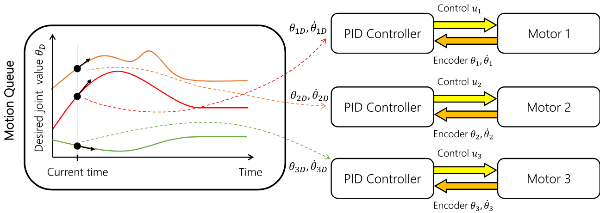
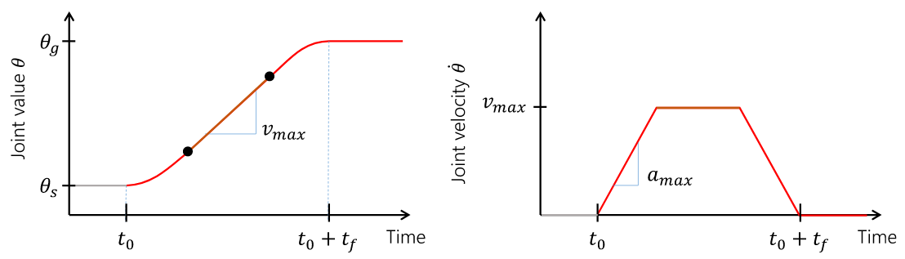

Control
=======================

Controllers provide the "glue" between the physical robot's actuators,
sensors, and planners. They are very similar to planners in that they
generate controls for the robot, but the main difference is that a
controller is expected to work online and synchronously within a fixed,
small time budget. As a result, they can only perform relatively light
computations.

Actuators
---------

At the lowest level, a robot is controlled by *actuators*. These receive
instructions from the controller and produce link torques that are used
by the simulator. Klamp't supports three types of actuator:

-  *Torque control* accepts torques and feeds them directly to links.
-  *PID control* accepts a desired joint value and velocity and uses a
   PID control loop to compute link torques servo to the desired
   position. Gain constants kP, kI, and kD should be tuned for behavior
   similar to those of the physical robot. PID controllers may also
   accept feedforward torques.
-  *Locked velocity control* drives a link at a fixed velocity.
   *Experimental*. (Note: this is different from "soft" velocity control
   which feeds a piecewise linear path to a PID controller)

Note that the PID control and locked velocity control loops are
performed as fast as possible with the simulation time step. This rate
is typically faster than that of the robot controller. Hence a PID
controlled actuator typically performs better (rejects disturbances
faster, is less prone to instability) than a torque controlled actuator
with a simulated PID loop at the controller level.

.. important::
   When using Klamp't to prototype behaviors for a physical
   robot, the simulated actuators should be calibrated to mimic the robot's
   true low-level motor behavior as closely as possible. It is also the
   responsibility of the user to ensure that the controller uses the
   simulated actuators in the same fashion as it would use the robot's
   physical actuators. For example, for a PID controlled robot with no
   feedforward torque capabilities, it would not be appropriate to use
   torque control in Klamp't. If a robot does not allow changing the PID
   gains, then it would not be appropriate to do so in Klamp't. Klamp't
   will not automatically configure your controller for compatibility with
   the physical actuators, nor will it complain if such errors are made.

Controllers
-----------

|Controller illustration|

The number of ways in which a robot may be controlled is infinite, and
can range from extremely simple methods, e.g., a linear gain, to
extremely complex ones, e.g. an operational space controller or a
learned policy. Yet, all controllers are structured as a simple callback
loop: repeatedly read off sensor data, perform some processing, and
write motor commands. The implementation of the internal processing is
open to the user.

Default motion queue controller
~~~~~~~~~~~~~~~~~~~~~~~~~~~~~~~

|Motion queue illustration|

The default controller for each robot is a motion-queued controller with
optional feedforward torques, which simulates typical controllers for
industrial robots. It supports piecewise linear and piecewise cubic
interpolation, as well as time-optimal acceleration-bounded
trajectories. The trajectory interpolation profile is the standard
trapezoidal velocity profile, except it also accepts interruption and
arbitrary start and goal velocities.

|Trapezoidal velocity profiles|

(Note: One limitation of the API is that it is impossible to have
certain joints controlled by a motion queue, while others are controlled
by PID commands.)

API summary
~~~~~~~~~~~~

**Basic commands**

-  ``controller = sim.getController(RobotModel or robot index)``:
   retrieves the simulation controller for the given wobot
-  ``controller.setPIDGains (kP,kI,kD)``: overrides the PID gains in the
   RobotModel to kP,kI,kD (lists of floats of lengths
   robot.numDrivers())
-  ``controller.setRate(dt)``: sets the time step of the internal
   controller to update every dt seconds
-  ``controller.setPIDCommand(qdes,[dqes])``: sets the desired PID
   setpoint
-  ``controller.setVelocity(dqdes,duration)``: sets a linearly
   increasing PID setpoint for all joints, starting at the current
   setpoint, and slopes in the list dqdes. After duration time it will
   stop.
-  ``controller.setTorque(t)``: sets a constant torque command t, which
   is a list of n floats.

**Motion queue operations (wraps around a PID controller)**

Convention: ``setX`` methods move immediately to the indicated
milestone, ``add/append`` creates a motion from the end of the motion
queue to the indicated milestone

-  ``controller.remainingTime()``: returns the remaining time in the
   motion queue, in seconds.
-  ``controller.set/addMilestone(qdes,[dqdes])``: sets/appends a smooth
   motion to the configuration qdes, ending with optional joint
   velocities dqdes.
-  ``controller.addMilestoneLinear(qdes)``: same as addMilestone, except
   the motion is constrained to a linear joint space path (Note:
   addMilestone may deviate)
-  ``controller.set/appendLinear(qdes,dt)``: sets/appends a linear
   interpolation to the destination qdes, finishing in dt seconds
-  ``controller.set/addCubic(qdes,dqdes,dt)``: moves immediately along a
   smooth cubic path to the destination qdes with velocity dqdes,
   finishing in dt seconds

**Querying robot state**

-  ``controller.getCommandedConfig()``: retrieve PID setpoint
-  ``controller.getCommandedVelocity()``: retrieve PID desired velocity
-  ``controller.getSensedConfig()``: retrieve sensed configuration from
   joint encoders
-  ``controller.getSensedVelocity()``: retrieve sensed velocity from
   joint encoders
-  ``controller.sensor(index or name)``: retrieve SimRobotSensor
   reference by index/name

Custom control loops
~~~~~~~~~~~~~~~~~~~~

To define a custom controller, the user should implement a
custom control loop. At every time step, read the robot's sensors,
compute the control, and then send the control to the robot via the
``setPIDCommand`` or ``setTorqueCommand`` methods.

The following example shows a very simple example that just moves
the commanded configuration by 1 radian / sec over 10 seconds.

.. code:: python

    import klampt
    world = klampt.WorldModel()
    world.readFile("my_world_file.xml")
    sim = klampt.Simulator(world)
    controller = sim.getController(0)
    dt = 0.01
    while sim.getTime() < 10:
        #TODO put your control code here
        q = controller.getCommandedConfig()
        q[1] += 1*dt    #move at 1 radian / sec
        controlller.setPIDCommand(q,[0]*len(q))

        #advance the simulation
        sim.simulate(dt)
    print("End configuration:",controller.getSensedConfig())

In general, your control loop can make use of sensors and planners. There
are countless ways to implement robot behaviors, and you are only limited by
your imagination.

Experimental controller API
~~~~~~~~~~~~~~~~~~~~~~~~~~~~

The ``klampt_sim`` script also accepts arbitrary feedback controllers
given as input. To do so, provide as input a .py file with a
single ``make(robot)`` function that returns a controller object. This
object should be an instance of a subclass ``BaseController`` in
`control.controller <https://github.com/krishauser/klampt/blob/master/Python/control/controller.py>`__. For example,
to see a controller that interfaces with ROS, see
`control/roscontroller.py <https://github.com/krishauser/klampt/blob/master/Python/control/roscontroller.py>`__.

A ``BaseController`` interface is a very simple object with three important
methods:

-  ``output(self,**inputs)``: given a set of named inputs, produce a
   dictionary of named outputs. The semantics of the inputs and outputs
   are defined by the caller.
-  ``advance(self,**inputs)``: advance by a single time step, performing
   any necessary changes to the controller's state. 

   .. note:: 
      ``output`` should NOT change internal state! The only state-changing
      functions should be implemented in advance.

-  ``signal(self,type,**inputs)``: sends some asynchronous signal to the
   controller. The usage is caller dependent. (This method is never
   called directly by ``klampt_sim``, but some higher controllers may
   call it.)

``klampt_sim`` will structure a sensor message as the inputs to ``output`` and ``advance``.
Specifically, this is a dictionary of named sensor items containing
the following elements:

-  t: the current simulation time
-  dt: the controller time step
-  q: the robot's current sensed configuration
-  dq: the robot's current sensed velocity
-  qcmd: the robot's current commanded configuration
-  dqcmd: the robot's current commanded configuration
-  The names of each sensors in the simulated robot controller, mapped
   to a list of its measurements.

``klampt_sim`` expects ``output`` to return a dictionary that
represents a command message.  A command message can have one of the
following combinations of keys, signifying which type of joint
control should be used:

-  qcmd: use PI control.
-  qcmd and dqcmd: use PID control.
-  qcmd, dqcmd, and torquecmd: use PID control with feedforward torques.
-  dqcmd and tcmd: perform velocity control with the given actuator
   velocities, executed for time tcmd.
-  torquecmd: use torque control.

Several existing controllers have been implemented in
`control/controller.py <https://github.com/krishauser/klampt/blob/master/Python/control/controller.py>`__  to make the design and composition
of controllers a bit easier, e.g., finite state machines, switching
controllers, linear controllers, etc.

Internally the controller can produce arbitrarily complex behavior.
Several common design patterns are implemented in
`control/controller.py <https://github.com/krishauser/klampt/blob/master/Python/control/controller.py>`__:

-  ``TimedControllerSequence``: runs a sequence of sub-controllers,
   switching at predefined times.
-  ``MultiController``: runs several sub-controllers in parallel, with
   the output of one sub-controller cascading into the input of another.
   For example, a state estimator could produce a better state estimate
   q for another controller.
-  ``ComposeController``: composes several sub-vectors in the input into
   a single vector in the output. Most often used as the last stage of a
   MultiController when several parts of the body are controlled with
   different sub-controllers.
-  ``LinearController``: outputs a linear function of some number of
   inputs.
-  ``LambdaController``: outputs ``f(arg1,...,argk)`` for any arbitrary
   Python function ``f``.
-  ``StateMachineController``: a base class for a finite state machine
   controller. The subclass must determine when to transition between
   sub-controllers.
-  ``TransitionStateMachineController``: a finite state machine
   controller with an explicit matrix of transition conditions.

A trajectory tracking controller is given in
`control/trajectory\_controller.py <https://github.com/krishauser/klampt/blob/master/Python/control/trajectory_controller.py>`__.
Its make function accepts a robot model (optionally ``None``) and a
linear path file name.

A preliminary velocity-based operational space controller is implemented
in
`control/OperationalSpaceController.py <https://github.com/krishauser/klampt/blob/master/Python/control/OperationalSpaceController.py>`__,
but its use is highly experimental at the moment.

State estimation
~~~~~~~~~~~~~~~~~

Controllers may or may not perform state estimation. 

Using the controller.py interface, state estimators can be implemented
as ``BaseController`` subclasses that calculate the estimated state
objects in the ``output()`` method.

.. |Controller illustration| image:: _static/images/concepts-controller.png

