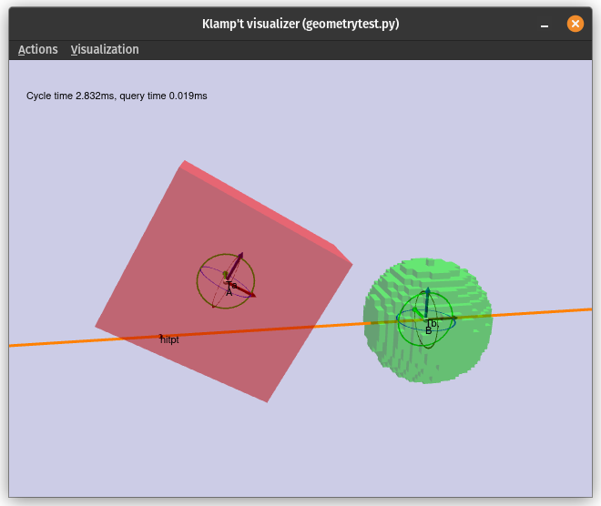
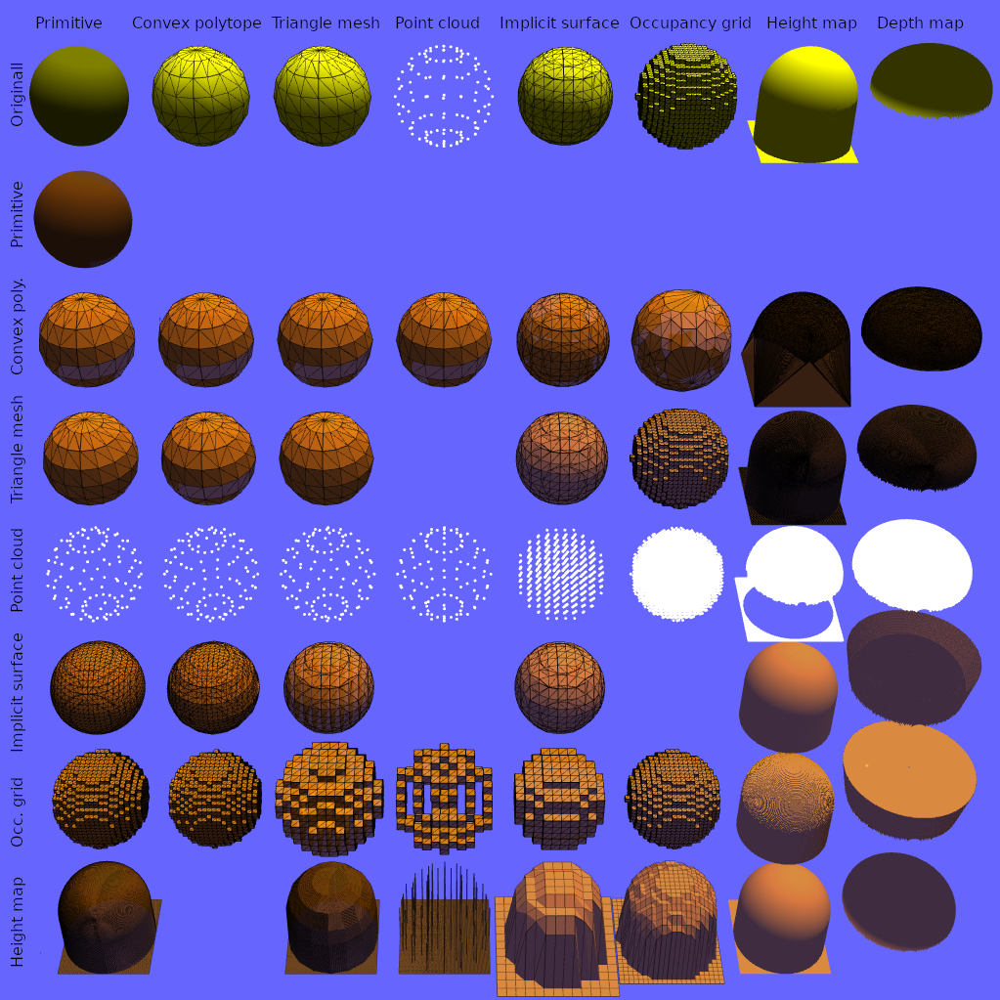
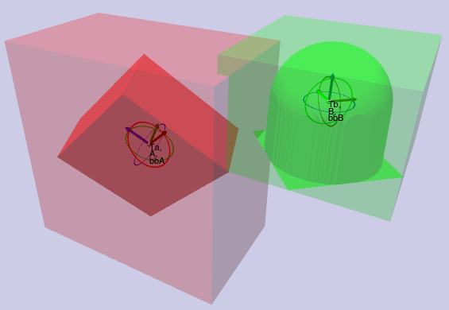
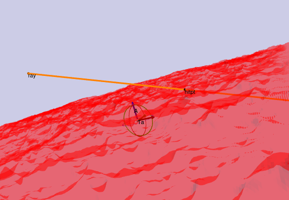
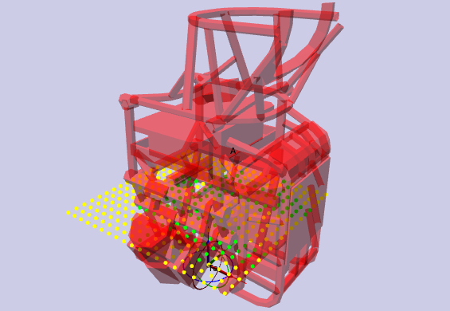
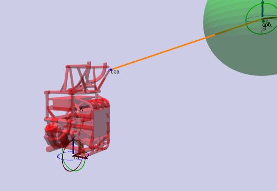
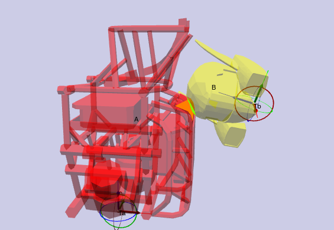
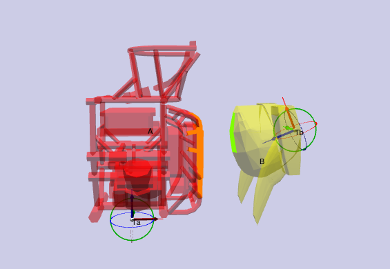

Geometry and Appearance
=======================================

Klamp't supports a whole menagerie of geometry types, including geometric primitives,
triangulated meshes, point clouds, convex hulls, implicit surfaces (SDFs), occupancy grids,
and heightmaps. Each geometry may also be associated with an `Appearance <#appearance>`_, which
allows you to customize its display.

Geometries and collision geometries
-----------------------------------

Klamp't stores Geometry datain an object's local frame.

|Illustration of concepts|

.. |Illustration of concepts| image:: _static/images/concepts-geometry.png


The notion of a *collision geometry* combines some underlying geometric
data with transformations and collision acceleration structures.

Collision geometries have a *current transformation* that sets where
they exist in space, and is used for collision testing.

Collision geometries also support an additional, nonnegative *collision margin*
setting that "expands" the underlying geometry when performing collision testing. The
margin does not actually affect the geometric data, but rather it
changes the distance threshold that is used to consider colliding vs.
noncolliding geometries.

If either object has a collision margin, the collision detection functions
treat the underyling data as though it were "expanded" by that amount.  So,
for distance queries, the sum of the objects' collision margins is subtracted
from the distance result.

.. note::
   In visualization, a geometry is drawn in its current transformation, but
   **its collision margin is not**.  If collision detection is reporting that
   two objects are touching but they don't appear to be, you should check their
   collision margins.

Geometric representations
~~~~~~~~~~~~~~~~~~~~~~~~~~~

The following geometric representations are currently supported:
- *Geometric primitive* (``Primitive``): axis-aligned boxes, oriented boxes, lines, rays, segments, triangles, planar polygons, spheres, ellipsoids, and planar circles.
- *Convex polytope* (``ConvexHull``): A convex hull of a set of points.
- *Triangle mesh* (``TriangleMesh``): the most common geometry representation used in video games and CAD models.  Can also contain appearance data.
- *Point cloud* (``PointCloud``): most commonly used in laser scanners and RGBD sensors.  Can also contain color and other per-point properties.  If the `radius` property is given, then each point is treated like a sphere. 
- *Implicit surface voxel grid* (``ImplicitSurface``): a volumetric representation where values < 0 are inside, 0 is the surface, and > 0 are outside. Usually a signed distance function (SDF).  Can also represent other implicit functions and TSDFs for some operations (visualization, conversion, inside-outside tests).
- *Occupancy map voxel grid* (``OccupancyGrid``): a volumetric representation where values > 0.5 (or some other value) are occupied.
- *Height map / depth map* (``Heightmap``): an elevation map or a perspective depth map.  Can also contain color and other properties.

In addition, there is a notion of a geometry *Group*, which can combine multiple
sub-geometries.


Geometric operation support
~~~~~~~~~~~~~~~~~~~~~~~~~~~

Not all representations support all operations, and some representations yield much better performance
(speed and accuracy) than others. To get optimal performance from your program, you should learn which
`operations are suited for which representations <https://motion.cs.illinois.edu/RoboticSystems/Geometry.html>`_. 

To get a better sense of how operations affect the geometries, the ``geometrytest.py`` test program in
``Klampt-examples`` can be used.  This allows you to convert any two geometries into any supported format
and perform various queries.  Use the Actions menu to convert and switch between proximity query modes. 
Klampt-examples and `geometrytest.py <https://github.com/krishauser/Klampt-examples/blob/master/Python3/testing/geometry/geometrytest.py>`_ on Github.

|geometrytest.py|



The rest of this section provides detailed information about Klampt's support for various geometry operations.  (Here, 🕑 means support is on the TODO list for the near future.)
More details and experimental data can be found in the `C++ geometry manual <https://github.com/krishauser/Klampt/blob/master/Cpp/docs/Manual-Geometry.md>`_.


Loading / saving
`````````````````

All types supported.

Triangle meshes can be saved/loaded from nearly all types (STL, OBJ, OFF, PLY, GLTF, etc), unless you are building from source and Assimp is unavailable at build time.

Point clouds can be saved/loaded from PCL format. 

Primitives, convex hulls, and voxel grids use custom formats. 

Heightmaps are stored in a custom JSON format. Heightmap images can be loaded from many image file formats on Windows or if ImageMagick was installed while KrisLibrary is built; otherwise, only BMP, TGA, and PPM are supported.  

OpenGL drawing
``````````````

+---------------------+-----------------+---------------+-------------+------------------+----------------+-----------+
| Geometric primitive | Convex polytope | Triangle mesh | Point cloud | Implicit surface | Occupancy grid | Heightmap |
+=====================+=================+===============+=============+==================+================+===========+
| ✔️                   | ✔️               | ✔️             | ✔️           | ✔️                | ✔️              | ✔️         |
+---------------------+-----------------+---------------+-------------+------------------+----------------+-----------+

Type conversions
````````````````

(Converting from the type listed in column to type listed in row.)

+---------------+---------------------+-----------------+---------------+-------------+------------------+----------------+-----------+
| From → / To ↓ | Geometric primitive | Convex polytope | Triangle mesh | Point cloud | Implicit surface | Occupancy grid | Heightmap |
+===============+=====================+=================+===============+=============+==================+================+===========+
| **GP**        |                     | ❌              | ❌            | ❌          | ❌               | ❌             | ❌        |
+---------------+---------------------+-----------------+---------------+-------------+------------------+----------------+-----------+
| **CP**        | ✔️                   |                 | ✔️¹            | ✔️           | ✔️                | ✔️              | ✔️         |
+---------------+---------------------+-----------------+---------------+-------------+------------------+----------------+-----------+
| **TM**        | ✔️                   | ✔️               |               | ❌          | ✔️                | ✔️              | ✔️         |
+---------------+---------------------+-----------------+---------------+-------------+------------------+----------------+-----------+
| **PC**        | ✔️                   | ✔️               | ✔️             |             | ✔️                | ✔️              | ✔️        |
+---------------+---------------------+-----------------+---------------+-------------+------------------+----------------+-----------+
| **IS**        | ✔️                   | ✔️               | ✔️             | ❌          |                  | ❌             | ✔️         |
+---------------+---------------------+-----------------+---------------+-------------+------------------+----------------+-----------+
| **OG**        | ✔️                   | ✔️               | ✔️             | ✔️           | ✔️                |                | ✔️         |
+---------------+---------------------+-----------------+---------------+-------------+------------------+----------------+-----------+
| **HM**        | ✔️                   | ❌              | ✔️             | ✔️           | ✔️                |  ✔️             |           |
+---------------+---------------------+-----------------+---------------+-------------+------------------+----------------+-----------+

1. Convex decomposition of a non-convex watertight mesh can be performed with an appropriate parameter to the convert function.

These are shown in the following image:

|Geometry conversion image|



Note that a depth map is considered to be viewed from the "bottom up", so the occupied space is considered to be any space above the map.  Here, the depth values outside of the sphere are assumed invalid.

Indirect conversions to a third type can be used to do some unsupported conversions.  For example, convex polytope -> triangle mesh -> heightmap can replace the unsupported convex polytope -> heightmap conversion. Occupancy grid -> triangle mesh -> implicit surface can replace the unsupported occupancy grid -> implicit surface conversion.

Many conversions (mesh -> convex polytope, implicit surface, occupancy grid, heightmap) also depend on a resolution parameter.  If the resolution is set too low, then the fidelity of the resulting geometry may suffer.  As an example, the below image shows a CAD model of the Boston Dynamics Atlas torso converted to an implicit surface at two different resolutions:

|Implicit surface conversion image|

.. |Implicit surface conversion image| image::_static/images/conversion_resolution.png

If in doubt, you should visualize the result (in Python, you can simply run ``from klampt import vis; vis.debug(geom)``).


Proximity query acceleration data structures
`````````````````````````````````````````````

To accelerate proximity queries (collision, ray casting, distances, etc.), most geometries create auxiliary data structures. 
These are initialized when a proximity query is first called. These structures are cached
as long as the collision geometry undergoes rigid transforms via ``setCurrentTransform``. 

However, the data structures must be refreshed if the geometry data is changed.  The overhead of
precomputation can be small for simple geometries.  However, for complex geometries, the
overhead can be substantial, so it is best to avoid interleaving changes to the geometry data with proximity queries.

+-------------------------+------------------------------------+
| **Geometric primitive** | None                               |
+=========================+====================================+
| **Convex polytope**     | SOLID3 data structure              |
+-------------------------+------------------------------------+
| **Triangle mesh**       | PQP bounding volume hierarchy      |
+-------------------------+------------------------------------+
| **Point cloud**         | Sparse voxel grid and octree       |
+-------------------------+------------------------------------+
| **Implicit surface**    | Octree                             |
+-------------------------+------------------------------------+
| **Occupancy grid**      | List of occupied and surface cells |
+-------------------------+------------------------------------+
| **Heightmap**           | None                               |
+-------------------------+------------------------------------+


Miscellaneous queries
`````````````````````

Bounding box queries yield an axis-aligned (C++ and Python) or oriented bounding box (C++ only).

|Bounding boxes|



Ray casts find the first point of intersection between the geometry and a ray.

|Ray cast|



Support queries find the farthest point on the geometry in some direction.

+------------------+---------------------+-----------------+---------------+-------------+------------------+----------------+-----------+
|                  | Geometric primitive | Convex polytope | Triangle mesh | Point cloud | Implicit surface | Occupancy grid | Heightmap |
+==================+=====================+=================+===============+=============+==================+================+===========+
| **Bounding box** | ✔️                   | ✔️               | ✔️¹            | ✔️¹          | ✔️                | ✔️              | ✔️         |
+------------------+---------------------+-----------------+---------------+-------------+------------------+----------------+-----------+
| **Ray cast**     | ✔️                   | ❌²             | ✔️             | ✔️           | ✔️                | ✔️              | ✔️         |
+------------------+---------------------+-----------------+---------------+-------------+------------------+----------------+-----------+
| **Support**      | ✔️                   | ✔️               | ✔️             | ✔️           | ❌               | ❌             | ❌        |
+------------------+---------------------+-----------------+---------------+-------------+------------------+----------------+-----------+

1. A fast approximate method is available.
2. A limitation of SOLID3.

Point queries
`````````````

+-----------------+---------------------+-----------------+---------------+-------------+------------------+----------------+-----------+
|                 | Geometric primitive | Convex polytope | Triangle mesh | Point cloud | Implicit surface | Occupancy grid | Heightmap |
+=================+=====================+=================+===============+=============+==================+================+===========+
| **Containment** | ✔️                   | ✔️               | ✔️¹            | ✔️           | ✔️                | ✔️              | ✔️         |
+-----------------+---------------------+-----------------+---------------+-------------+------------------+----------------+-----------+
| **Distance**    | ✔️²                  | ✔️²              | ✔️             | ✔️²          | ✔️²               | 🕑             | 🕑        |
+-----------------+---------------------+-----------------+---------------+-------------+------------------+----------------+-----------+

1. uses a heuristic to determine inside/outside.
2. signed distance supported.

An example of point containment queries is shown below. 

|Point containment|



An example of a point distace query is shown below with the query asking for the distance and closest point on the red geometry to the center of the green circle. 

|Point distance|




Collision detection
```````````````````

Collision detection detects whether two objects overlap.  The extended version returns the element indices that overlap  up to some number of max contacts, and if max contacts = 1 this costs no more time than the simple (boolean) version.  Below, the orange triangles on the red object collide with the green triangles on the yellow object.

|Collision detection example|



+--------+---------------------+-----------------+---------------+-------------+------------------+----------------+-----------+
|        | Geometric primitive | Convex polytope | Triangle mesh | Point cloud | Implicit surface | Occupancy grid | Heightmap |
+========+=====================+=================+===============+=============+==================+================+===========+
| **GP** | ✔️²                  | ✔️²              | ✔️²            | ✔️²          | ✔️¹               | ✔️²             | ✔️³        |
+--------+---------------------+-----------------+---------------+-------------+------------------+----------------+-----------+
| **CP** | ✔️²                  | ✔️               | ✔️             | ✔️           | ❌               | ✔️³             | ✔️³        |
+--------+---------------------+-----------------+---------------+-------------+------------------+----------------+-----------+
| **TM** | ✔️²                  | ✔️               | ✔️             | ✔️           | ✔️³               | ✔️³             | ✔️³        |
+--------+---------------------+-----------------+---------------+-------------+------------------+----------------+-----------+
| **PC** | ✔️                   | ✔️               | ✔️             | ✔️           | ✔️                | ✔️³             | ✔️         |
+--------+---------------------+-----------------+---------------+-------------+------------------+----------------+-----------+
| **IS** | ✔️¹                  | ❌              | ✔️³            | ✔️           | ✔️³               | ✔️³             | ✔️³        |
+--------+---------------------+-----------------+---------------+-------------+------------------+----------------+-----------+
| **OG** | ✔️²                  | ✔️³              | ✔️³            | ✔️³          | ✔️³               | ✔️³             | ✔️         |
+--------+---------------------+-----------------+---------------+-------------+------------------+----------------+-----------+
| **HM** | ✔️³                  | ✔️³              | ✔️³            | ✔️           | ✔️³               | ✔️              | 🕑        |
+--------+---------------------+-----------------+---------------+-------------+------------------+----------------+-----------+

1. for a couple geometric primitives (usually point and sphere).
2. for common geometric primitives (usually point, sphere, box, and triangle)
3. not accelerated, or scaling to large geometries is poor.


Within-distance detection is a boolearn query that detects whether two objects are within a given distance from one another.  It is usually faster than distance calculation.  The extended version returns the element indices that overlap up to some number of max contacts, and if the max contacts = 1 then this costs no more time than the simple (boolean) version.   Below, the orange triangles on the red object are within 0.1 units from the green triangles on the yellow object.

|Within distance example|




+--------+---------------------+-----------------+---------------+-------------+------------------+----------------+-----------+
|        | Geometric primitive | Convex polytope | Triangle mesh | Point cloud | Implicit surface | Occupancy grid | Heightmap |
+========+=====================+=================+===============+=============+==================+================+===========+
| **GP** | ✔️²                 | ✔️²             | ✔️²           | ✔️²         | ✔️¹              | ✔️²            | ❌         |
+--------+---------------------+-----------------+---------------+-------------+------------------+----------------+-----------+
| **CP** | ✔️²                 | ✔️              | ✔️            | ✔️          | ❌                | ✔️³            | ❌         |
+--------+---------------------+-----------------+---------------+-------------+------------------+----------------+-----------+
| **TM** | ✔️²                 | ✔️              | ✔️            | ✔️          | ✔️³              | ✔️³            | ❌         |
+--------+---------------------+-----------------+---------------+-------------+------------------+----------------+-----------+
| **PC** | ✔️²                 | ✔️              | ✔️            | ✔️          | ✔️               | ✔️³            | ❌         |
+--------+---------------------+-----------------+---------------+-------------+------------------+----------------+-----------+
| **IS** | ✔️¹                 | ❌               | ✔️³           | ✔️          | ✔️³              | ✔️³            | ❌         |
+--------+---------------------+-----------------+---------------+-------------+------------------+----------------+-----------+
| **OG** | ✔️²                 | ✔️³             | ✔️³           | ✔️³         | ✔️³              | ❌              | ❌         |
+--------+---------------------+-----------------+---------------+-------------+------------------+----------------+-----------+
| **HM** | ❌                   | ❌               | ❌             | ❌           | ❌                | ❌              | ❌         |
+--------+---------------------+-----------------+---------------+-------------+------------------+----------------+-----------+

1. for a couple geometric primitives (usually point and sphere).
2. for common geometric primitives (usually point, sphere, box, and triangle)
3. not accelerated, or scaling to large geometries is poor.


Geometry caching
~~~~~~~~~~~~~~~~

When multiple objects load the same geometry file, Klamp't uses a
caching mechanism to avoid reloading the file from disk and re-creating
collision acceleration structures. This is essential for loading very
large scenes with many replicated objects. However, when geometries are
transformed by API calls, they are removed from the cache. So, to
achieve maximum performance with many duplicated geometries, it is
recommended to transform the geometry files themselves in advance rather
than dynamically through the API.

API summary
~~~~~~~~~~~

The :class:`~klampt.Geometry3D` container class is an abstraction of all supported types of
geometries.  Each data type is represented by one of the data classes, :class:`~klampt.GeometricPrimitive`,
:class:`~klampt.ConvexHull`, :class:`~klampt.TriangleMesh`, :class:`~klampt.PointCloud`,  and
:class:`~klampt.VolumeGrid`, and :class:`~klampt.Heightmap`.

**Basic construction**:

-  ``geom=Geometry3D()``: creates a new standalone geometry, not
   associated with any world object.
-  ``geom=Geometry3D(data)``: creates a new standalone geometry from a geometry
   data class.
-  ``geom=[RobotModelLink/RigidObjectModel/TerrainModel].geometry()``:
   retrieves a reference to the object's geometry.
-  ``geom.copy()``: duplicates the geometry.
-  ``geom.empty()``: returns True if the geometry is empty.
-  ``geom.free()``: if the geometry is standalone, deletes the data
   associated with it.
-  ``geom.set(geom2)``: copies the contents of geom2 into this
   geometry.
-  ``geom.loadFile(fn)``: loads a geometry from a file.
-  ``geom.saveFile(fn)``: saves a geometry to a file.
-  ``geom.convert(type, param=0)``: converts a geometry in-place to another type.

**Data access**:

-  ``geom.type()``: returns a string giving the type of the object.
-  ``geom.getGeometricPrimitive()``: a reference to the :class:`~klampt.GeometricPrimitive` data of the
   geometry if the type is ``'GeometricPrimitive'``
-  ``geom.getConvexHull()``: a reference to the :class:`~klampt.ConvexHull` data of the
   geometry if the type is ``'ConvexHull'``
-  ``geom.getTriangleMesh()``: a reference to the :class:`~klampt.TriangleMesh` data of the
   geometry if the type is ``'TriangleMesh'``
-  ``geom.getPointCloud()``: a reference to the :class:`~klampt.PointCloud` data of the
   geometry if the type is ``'PointCloud'``
-  ``geom.getImplicitSurface()``: a reference to the :class:`~klampt.VolumeGrid` data of the
   geometry if the type is ``'ImplicitSurface'``
-  ``geom.getOccupancyGrid()``: a reference to the :class:`~klampt.VolumeGrid` data of the
   geometry if the type is ``'OccupancyGrid'``
-  ``geom.getHeightmap()``: a reference to the :class:`~klampt.Heightmap` data of the
   geometry if the type is ``'Heightmap'``
-  ``geom.setX(data)``: sets the geometry to an object of the given type.  If this was the
   previously retrieved reference to this geometry's data, then the collision data will be refreshed.
-  ``geom.numElements()``: returns the number of elements.
-  ``geom.getElement(id)``: returns a sub-object of a Group, TriangleMesh, or
   PointCloud geometry.

**Modifying current transform and collision margin**

The current transform of a geometry of a world object is updated
when its configuration changes.  However, if you are using standalone
geometries, you will have to set the transformation yourself.  All quantities
are measured with respect to world coordinates.

-  ``geom.setCurrentTransform(R,t)``: sets the object's current transformation to the
   rotation R and translation t
-  ``geom.getCurrentTransform()``: returns the object's current transformation.

To change the collision margin, use the following.  Collision margins are
by default 0.

-  ``geom.setCollisionMargin(margin)``: sets the object's collision margin
-  ``geom.getCollisionMargin()``: gets the object's collision margin.


Collision detection
-------------------

The :class:`~klampt.Geometry3D` class allows collision testing between
geometries. All the standard Klamp't geometry types (geometric
primitives, triangle meshes, point clouds) are supported.

For convenience, the :mod:`klampt.model.collide`
module provides utility functions for checking collision with sets of
objects, as well as a :class:`~klampt.model.collide.WorldCollider` class that by checks collision
between any set of objects and any other set of objects. These methods
return an iterator over collision pairs, which allows the user to either
stop at the first collision or enumerate all collisions.

API summary
~~~~~~~~~~~

The :class:`~klampt.Geometry3D` methods may be used for performing collision detection:

-  ``geom.getBB()``: returns a loose approximation to the object's bounding box, in
   its current configuration.
-  ``geom.getBBTight()``: returns a tight approximation to the object's bounding box, in
   its current configuration.  Slower than ``getBB``.
-  ``geom.collides(geom2)``: returns True if the objects collide.
-  ``geom.distance(geom2)``: returns the distance / signed distance between the
   objects.
-  ``geom.distance_simple(geom2,relErr=0,absErr=0)``: returns the distance / signed
   distance between the objects as a float.
-  ``geom.distance_point(pt)``: returns the distance / signed distance between the
   object and a point.
-  ``geom.rayCast(source,direction)``: casts a ray with a given source and direction.
-  ``geom.rayCast_ext(source,direction)``: same as rayCast, but returns the index of the
   first intersected element.

For more control over distance queries, you may use the following functions, which
have the suffix ``_ext`` and accept a :class:`~klampt.DistanceQuerySettings` object: 

-  ``geom.distance_ext(geom2,settings)``
-  ``geom.distance_point_ext(pt,settings)``

The following :class:`~klampt.model.collide.WorldCollider` methods are used most often:

-  ``collisions()``: checks for all collisions.
-  ``collisions(filter)``: checks for all collisions between objects for
   which filter(obj) returns True
-  ``collisions(filter1,filter2)``: checks for all collisions between
   pairs of objects for which filter1(objA) and filter2(objB) both
   return True
-  ``robotSelfCollisions``, ``robotObjectCollisions``,
   ``robotTerrainCollisions``, ``objectObjectCollisions``, and
   ``objectTerrainCollisions`` check collisions only between the
   indicated robots/objects/terrains.
-  ``rayCast(s,d)``: performs ray casting against objects in the world
   and returns the nearest collision found.


Appearance
----------


Klampt appearances are relatively simple materials that work with OpenGL and can specify:

- Color
- Transparency
- Vertex / edge / face drawing with separate color/transparency
- Vertex / edge size
- 1D, 2D, or 3D textures
- Texture projection mapping
- Per-vertex / per-face colors
- Mesh creasing
- Silhouette drawing

See the :class:`~klampt.Appearance` API for detailed documentation.

Silhouette data and mesh creasing require some precomputation overhead,
which can be substantial for complex geometries.  To avoid incurring
this overhead, turn them off.

Some geometry types (TriangleMesh, PointCloud, Heightmap) can also contain
appearance data.  An appearance created from these objects will load the
associated apperance data upon initialization. 

All geometry types except for point clouds are converted to a triangle mesh
for rendering.  This mesh is cached; if you change the geometry data, ``Appearance.refresh()``
will need to be called.  Note that this will read the geometry's appearance again. 

Proper rendering of transparent objects requires some care to draw objects from
back to front. The Python ``vis`` module handles this automatically. Artifacts
may still appear between elements within an object, which are not automatically ordered.
