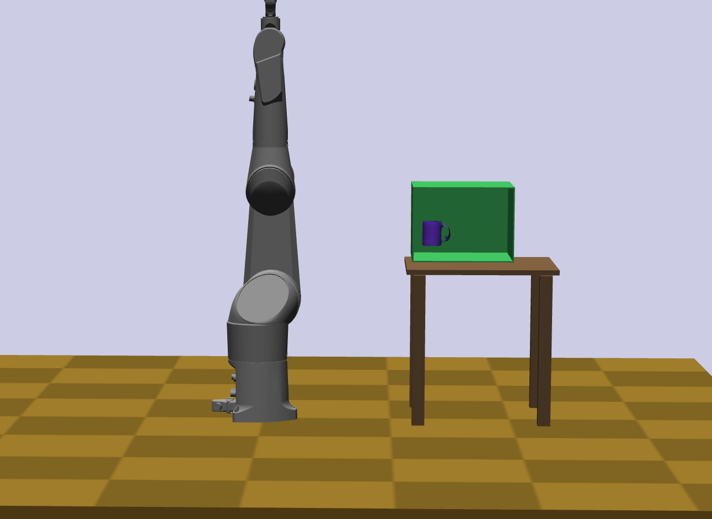
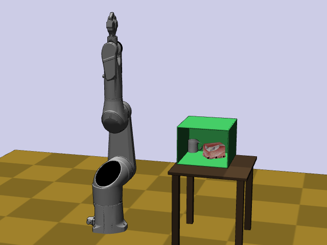

Kinematic modeling
==================================

Every physical object in Klamp't, whether real or imaginary, belongs to
a World Model. Specifically, a `World Model <#world-models>`_
contains some number of entities, which can be of the types robot, robot
link, rigid object, or terrain, as follows:

-  `Robots <#robot-models>`_ are articulated and possibly actuated
   objects containing multiple robot links
-  `Robot links <#robot-link-models>`_ are individual links of a
   robot
-  `Rigid objects <#rigid-object-models>`_ can rotate and
   translate, no independent actuation
-  `Terrains <#terrain-models>`_  do not move

Each robot link, rigid object, and terrain has an associated body, which
has a coordinate frame and usually some attached
`Geometry <Manual-Geometry.html>`_ and
`Appearance <Manual-Geometry.html#appearance>`_ .

|World elements illustration|

World Models
------------

A World Model can also:

-  be drawn in OpenGL
-  Can be created dynamically or loaded from an XML file (examples in
   ``Klampt-examples/data/*.xml``)
-  Load robots, rigid objects, and terrains from many formats (examples
   are in ``Klampt-examples/data/robots``, ``Klampt-examples/data/objects``, and
   ``Klampt-examples/data/terrains``)
-  Can be copied quickly without copying geometries
-  Can be saved to disk

Each entity in a world has

-  An index into the list of entities of that type
-  A unique ID# in the World
-  A name string, which is ideally unique.
-  Consists of one (or more) bodies.

Note that the entity's ID# is not the same as its index. The index is
the index into the array containing it; this is not unique when compared
across entity types. For example, a robot and a terrain could have index
0 (the first robot and the first terrain) but they will have different
ID#s.

If names are not unique, entities must be addressed by index.
Furthermore, some modules like ``klampt.model.coordinates`` assume names
are unique; if not, unexpected behavior may result.

API summary
~~~~~~~~~~~

A world is implemented in the :class:`~klampt.WorldModel` class.

The key functions are:

-  ``world = WorldModel()``: constructor
-  ``world.readFile([world file])``: reads from XML doc
-  ``world.loadElement([robot, object or terrain file])``: adds an
   element to the World. Accepts .rob, .urdf, .obj, .env, or geometry
   files
-  ``world.num[Robots,RigidObjects,Terrains]()``: returns the number of
   elements of the given type
-  ``world.[robot,rigidObject,terrain](index)``: returns a reference to
   the index'th element of the given type
-  ``world.[robot,rigidObject,terrain](name)``: returns a reference to
   the element of the given type with name name (name must be a str)
-  ``world.numIDs()``: returns the number of elements. Unique IDs run
   from 0 to ``numIDs()``-1.
-  ``world.geometry(id)``: returns the Geometry3D of the element with
   the given unique ID
-  ``world.appearance(id)``: returns the Appearance of the element with
   the given unique ID
-  ``world.drawGL()``: renders the world in OpenGL

Robot Models
------------

A Robot Model defines the kinematic structure of a robot, and more.
Robot Models provide the following functions

-  Describes a list of links with their parents (an open linkage,
   specified in topologically sorted order)
-  Stores kinematic characteristics: link lengths, joint axis types,
   joint stops, inertial characteristics, and link geometry.
-  Stores actuation limits
-  Stores a "current" robot configuration and velocity. *Note: these
   should be thought of as temporary variables, see notes below.*
-  Computes and stores the robot's "current" link frames via forward
   kinematics.
-  Computes the robot's Lagrangian dynamics terms.
-  Stores link collision geometries and performs collision detection.
-  Stores information about which links can self-collide.
-  Names each link and contains semantics of the how the degrees of
   freedom of the robot map to "joints" and actuators.
-  Loads and saves robot descriptions from disk.

For now, we will discuss only the kinematics of a Robot Model, saving
`discussion of dynamics <Manual-Dynamics.html>`__ for later. The basic
kinematic components are:

-  Contains NL degrees of freedom (DOFs) and NL Robot Links.
-  Each DOF has a numeric value describing its position. The list of all
   DOFs is the robot's Configuration.
-  Each DOF may also have a velocity. The set of all velocities is the
   robot's Velocity.
-  Each DOF has joint limits, velocity limits, acceleration limits, and
   torque limits.

.. important::
   The configuration / velocity of a Robot Model do not
   directly correspond with those of a physical / simulated robot. They do
   not even have to respect the joint/velocity limits. Think of them as
   temporary variables to help you perform calculations.

   (Sending commands to a physical / simulated robot will be `covered
   elsewhere <Manual-Control.html>`__.)

Klamp't works with arbitrary tree-structured articulated robots.
Parallel mechanisms are not directly supported.

API summary
~~~~~~~~~~~

The following lsits the key kinematic operations of the :class:`~klampt.RobotModel` class.

-  ``robot = world.robot([name or index])``: access RobotModel reference
   by name or index
-  ``robot.getID()``: gets the unique ID of the RobotModel in its
   WorldModel
-  ``robot.num[Links/Drivers]()``: returns the number of links or
   drivers (joints are abstracted away in the Python API)
-  ``robot.get[Link/Driver](index)``: returns a reference to the
   index'th RobotModelLink / RobotModelDriver
-  ``robot.get[Link/Driver](name)``: returns a reference to the
   RobotModelLink / RobotModelDriver with the given name (name must have
   type str)
-  ``robot.get[Config/Velocity]()``: returns the model's
   Configuration/Velocity as a list of floats with length ``numLinks()``
-  ``robot.setConfig(q)``: sets the model's Configuration to q given as
   a list/tuple of floats with length ``numLinks()``. Also, updates the
   forward kinematics of all Robot Links.
-  ``robot.setVelocity(dq)``: sets the model's Velocity to dq given as a
   list/tuple of floats with length ``numLinks()``
-  ``robot.get[Joint/Velocity/Acceleration]Limits()``: returns
   minimum/maximum of model's Configuration/Velocity/acceleration as a
   pair of lists of floats with length ``numLinks()``
-  ``robot.set[Joint/Velocity/Acceleration]Limits(vmin,vmax)``: sets
   minimum/maximum Configuration/Velocity/acceleration given two lists
   of floats with length ``numLinks()``
-  ``robot.drawGL()``: renders the robot in OpenGL

The configuration and velocity of a robot are a list of floats. A
``Config`` object is simply a list of floating point numbers, and the
robot model's configuration is retrieved / set using
``RobotModel.setConfig(q)``/ ``RobotModel.getConfig()``.
Upon calling ``setConfig()`` the link transforms and
geometries are automatically updated using forward kinematics.

Robot Link Models
-----------------

A Robot Link corresponds to one of the robot model's DOFs.

-  It holds all physical information about the link in its reference
   coordinate frame (name, index, parent, reference transform to parent,
   type of joint, joint axis, mass)
-  It contains a collision geometry, which may be empty. This model is
   specified relative to the link's coordinate system.
-  It also holds information regarding its current transformation given
   the robot model's current configuration.
-  It also helps you calculate Jacobians, velocities, etc

The parent index of each link must be less than the link's index
(topologically sorted order). A parent of -1 indicates that the link is
attached to the world coordinate frame. Each link may be *prismatic* or
*revolute* and moves along or around a link axis given by a 3D vector.

The current transformation of a link is calculated via forward
kinematics, and describes its coordinates (position and orientation)
*relative to the world frame*. For example, in the image shown below,
the transforms of each link are shown with red axis indicating the local
x direction, green axis indicating y, and blue axis indicating z. The
highlighted link is drawn with longer axes.

|Link illustration|

API summary
~~~~~~~~~~~

The link functionality is given in the :class:`~klampt.RobotModelLink` class. Changing from
revolute to prismatic types is not supported at the moment. 

Configuration-independent functions that define the kinematic structure
of the robot:

-  ``link = robot.link([name or index])``: access RobotModelLink
   reference
-  ``link.getID()``: gets the unique ID of this link in the WorldModel
-  ``link.getName()``: returns a string naming this link
-  ``link.getRobot()``: returns a RobotModel to which this link belongs
-  ``link.getIndex()``: returns the link index on the RobotModel for
   this link
-  ``link.getParent()``: returns the index of the link's parent (-1 for
   no parent)
-  ``link.setParent(p)``: sets the index of the link's parent (-1 for no
   parent)
-  ``link.getAxis()``: returns a 3-tuple of the link's
   rotation/translation axis in local coordinates
-  ``link.setAxis(axis)``: sets the link's rotation/translation axis to
   the given 3-tuple, specifying its local coordinates
-  ``link.getParentTransform()``: returns a pair (R,t) defining the
   reference coordinate transform of this link with respect to its
   parent (see klampt.so3 for the format of R)
-  ``link.setParentTransform(R,t)``: sets the reference coordinate
   transform of this link with respect to its parent (see klampt.so3 for
   the format of R)
-  ``link.geometry()``: returns a reference to the Geometry3D attached
   to this link
-  ``link.appearance()``: returns a reference to the Appearance attached
   to this link
-  ``link.getMass()``: returns the link's Mass structure
-  ``link.setMass(mass)``: sets the link's Mass structure
-  ``link.drawLocalGL()``: renders the link's geometry in OpenGL in
   local coordinates

Configuration-dependent functions that describe the physical layout of
the robot in its current configuration:

-  ``link.getTransform()``: returns a pair (R,t) defining the coordinate
   transform of this link with respect to the world frame (see
   klampt.so3 for the format of R)
-  ``link.setTransform(R,t)``: sets the coordinate transform of this
   link with respect to the world frame. Note\`\`\`: this does NOT
   perform inverse kinematics or change the transforms of any other
   links. The transform is overwritten when the robot's setConfig()
   method is called. (see klampt.so3 for the format of R)
-  ``link.getWorldPosition(pLocal)``: given a 3-tuple specifying the
   local coordinates of a point P, returns a 3-tuple giving the world
   coordinates of P. Equivalent to se3.apply(-
   \`\`\`link.getTransform(),pLocal).
-  ``link.getLocalPosition(pWorld)``: given a 3-tuple specifying the
   local coordinates of a point P, returns a 3-tuple giving the world
   coordinates of P. Equivalent to
   se3.apply(se3.inv(link.getTransform()),pWorld).
-  ``link.getWorldDirection(dLocal)``: given a 3-tuple specifying the
   local coordinates of a direction D, returns a 3-tuple giving the
   world coordinates of D. Equivalent to so3.-
   \`\`\`apply(link.getTransform()[0],dLocal).
-  ``link.getLocalDirection(dWorld)``: given a 3-tuple specifying the
   local coordinates of a point P, returns a 3-tuple giving the world
   coordinates of P. Equivalent to
   so3.apply(so3.inv(link.getTransform()[0]),dWorld).
-  ``link.getOrientationJacobian()``: returns a 3xNL matrix of the
   orientation Jacobian of this link
-  ``link.getPositionJacobian()``: given a 3-tuple specifying the local
   coordinates of a point P, returns a 3xNL matrix of the position
   Jacobian of this point
-  ``link.getJacobian(p)``: given a 3-tuple specifying the local
   coordinates of a point P, returns a 6xNL matrix of the orientation
   Jacobian stacked on the position Jacobian
-  ``link.drawWorldGL()``: renders the link's geometry in OpenGL in
   world coordinates

Kinematics Example
------------------

Load a planar 3R robot model and figure out where its end effector would
lie at the configuration [0,pi/4,pi/4].

.. code:: python

    >>> from klampt import WorldModel
    >>> import math
    >>> world = WorldModel()
    >>> world.loadElement("Klampt-examples/data/robots/planar3R.rob")
    Reading robot file robots/planar3R.rob...
       Parsing robot file, 3 links read...
    Loaded geometries in time 0.000598229s, 36 total primitive elements
    Initialized robot collision data structures in time 0.00084037s
    Done loading robot file robots/planar3R.rob.
    0
    >>> robot = world.robot(0)
    >>> robot.setConfig([0,math.pi/4,math.pi/4])
    >>> link = robot.link(2)
    >>> link.getWorldPosition([1,0,0])
    [1.7071067811865477, 0.0, 1.7071067811865475]

To get the Jacobian matrix corresponding to this configuration, all that
is needed is

.. code:: python

    >>> link.getPositionJacobian([1,0,0])
    [[-1.7071067811865475, -1.7071067811865475, -1.0], [0.0, 0.0, 0.0], [1.7071067811865477, 0.7071067811865477, 1.5701957963021318e-16]]

(The second row is all zeroes because the robot moves in the X-Z plane.)

Robot Joints and Drivers
------------------------

The DOFs of a robot are considered as generic variables that define the
extents of the articulations between links. However, more information
about how sets of DOFs group together and map to motors also available
in the Robot Model. A Robot Model's DOFs are organized into NJ ≤ NL
*Joints*, and ND ≤ NL *Drivers*

-  ``Joint``: topology of one or more DOFs. Joints can be normal,
   welded, freely rotating, or free floating. Joints specify how to
   handle interpolation, and the distance between configurations.
-  ``Driver``: mapping from actuator controls to movement of one or more
   DOFs. They specify how actuator commands are transmitted to forces /
   torques on links (e.g., the transmission).
-  For fixed-base, fully actuated robots, each DOF has a single joint
   and a single driver: NL=NJ=ND

**Joints.** Most Joints will be of the ``normal`` type, which map
directly to a single DOF in the normal way. However, free-floating bases
and other special types of Joints designate groups of DOFs that should
be interpreted in special ways. These special Joints include:

-  ``weld`` joints, which indicate that a DOF should not move.
-  ``spin`` joints, which are able to rotate freely and infinitely.
-  ``floating`` joints, which translate and rotate freely in 3D (e.g.,
   free-floating bases)
-  ``floatingplanar`` joints, which translate and rotate freely in 2D
   (e.g., mobile wheeled bases)
-  ``ballandsocket`` joints, which rotate freely in 3D.
-  ``closed`` joints, which indicate a closed kinematic loop. *Note:
   this is simply a placeholder for potential future capabilities; these
   are not yet handled in Klamp't.*

**Drivers.** Although many robots are driven by motors that transmit
torques directly to single DOFs, a Robot can represent other
drive systems that apply forces to multiple DOFs. For example, a
cable-driven finger may have a single cable actuating three links, a
mobile base may only be able to move forward and turn, and a satellite
may have thrusters. Free-floating bases may have no drive systems
whatsoever.

A robot is set up with a list of Drivers available to produce torques.

-  ``normal`` drivers act as one would expect a motor that drives a
   single DOF to behave.
-  ``affine`` drivers act as connected transmissions with linear
   relationships between multiple DOF (such as certain cable drives or
   gear linkages).
-  The other driver types are not fully tested and/or supported,
   although we hope to add some of this functionality in the future.

Floating bases and virtual links
~~~~~~~~~~~~~~~~~~~~~~~~~~~~~~~~

To represent free-floating bases, you should use a set of 5 massless
*virtual links* and 1 physical link that represent the x, y, and z
translations and rotations around the z, y, and x axes (roll-pitch-yaw
convention).

Likewise, a mobile robot may be represented by 2 virtual
links + 1 physical link: two for x, y translations connected by
prismatic joints, and the last for θ, connected to its parent by a
revolute joint.

A ball-and-socket joint may be represented by 2 virtual
links + 1 physical link.

API summary
~~~~~~~~~~~
See `klampt.model.create.moving_base_robot <klampt.model.create.html#module-klampt.model.create.moving_base_robot>`__ for a 
utility function for setting up a floating base.

Rigid Object Models
-------------------

A Rigid Object Model is movable rigid object.  It consists of a Collision
Geometry associated with a ``RigidTransform`` configuration, linear and
angular velocity, and other dynamic parameters. Rigid objects may
be loaded from ``.obj`` files or raw geometry files. In the latter case,
the dynamic parameters are set to default values (e.g., ``mass = 1``).

API summary
~~~~~~~~~~~

See the :class:`~klampt.RigidObjectModel` class.

Terrain Models
--------------

A Terrain Model is defined very simply as a Collision Geometry annotated
with friction coefficients. They may be loaded from .env files or raw
geometry files. In the latter case, some default friction value is
assigned (set to 0.5).

API summary
~~~~~~~~~~~

See the :class:`~klampt.TerrainModel` class.

World Creation Example
----------------------

In this example we will learn how to create a world using code. Inside
a simulation, world is generally defined as an instance of the
:class:`~klampt.WorldModel`
class containing robots, rigid objects, and static environment geometry.
Typically, a world file is specified using an XML file, as shown in the
`Build and edit a world file <https://github.com/krishauser/klampt/blob/master/Cpp/docs/Tutorials/Build-and-edit-world.md>`__
tutorial.  But in this example, we'll add objects into the world programmatically.

Let's start with the ``myworld.xml`` file created in the previous tutorial.  Now
create a Python file named ``world_create_test.py`` with the following contents:

.. code:: python

    from klampt import WorldModel
    from klampt import vis

    w = WorldModel()
    if not w.readFile("myworld.xml"):
        raise RuntimeError("Couldn't read the world file")
    vis.add("world",world)
    vis.run()

Running this, using::

    python world_create_test.py

will pop up the same visualization as in the RobotPose program.  Now, let's change this by
writing a function to modify the world.  This ``make_shelf`` function will add a cube shelf
as terrain to the world:

.. code:: python

    from klampt.model.create import primitives

    #you will need to change this to the absolute or relative path to Klampt-examples
    KLAMPT_EXAMPLES = 'Klampt-examples'

    def make_shelf(world,width,depth,height,wall_thickness=0.005):
        """Makes a new axis-aligned "shelf" centered at the origin with
        dimensions width x depth x height. Walls have thickness wall_thickness. 
        """
        left = Geometry3D()
        right = Geometry3D()
        back = Geometry3D()
        bottom = Geometry3D()
        top = Geometry3D()
        #method 1
        left.loadFile(KLAMPT_EXAMPLES+"/data/objects/cube.off")
        left.transform([wall_thickness,0,0,0,depth,0,0,0,height],[-width*0.5,-depth*0.5,0])
        right.loadFile(KLAMPT_EXAMPLES+"/data/objects/cube.off")
        right.transform([wall_thickness,0,0,0,depth,0,0,0,height],[width*0.5,-depth*0.5,0])
        #method 2
        back.loadFile(KLAMPT_EXAMPLES+"/data/objects/cube.off")
        back.scale(width,wall_thickness,height)
        back.translate([-width*0.5,depth*0.5,0])
        #equivalent to back.transform([width,0,0,0,wall_thickness,0,0,0,height],[-width*0.5,depth*0.5,0])
        #method 3
        bottom = primitives.box(width,depth,wall_thickness,center=[0,0,0])
        top = primitives.box(width,depth,wall_thickness,center=[0,0,height-wall_thickness*0.5])
        shelfgeom = Geometry3D()
        shelfgeom.setGroup()
        for i,elem in enumerate([left,right,back,bottom,top]):
            g = Geometry3D(elem)
            shelfgeom.setElement(i,g)
        shelf = world.makeTerrain("shelf")
        shelf.geometry().set(shelfgeom)
        shelf.appearance().setColor(0.2,0.6,0.3,1.0)
        return shelf

The code first creates the left, right, back, bottom and top pieces of
the shelf as a Geometry3D. A Geometry3D can either be a reference to
a world item's geometry, in which case modifiers change the world item's
geometry, or it can be a standalone geometry.  See the :class:`~klampt.Geometry3D`
documentation for more details.  This example shows three ways of creating the geometry:

1. Loading a mesh from disk and using the ``transform`` function.  The ``cube.off`` file
   in ``Klampt-examples/data/objects`` defines a unit cube.  The cube is then scaled
   with a scaling matrix and translated with some offset, similar to the steps used
   when building the world from XML.
2. Loading a mesh from disk and using the ``scale``, ``translate``, and ``rotate`` functions.
   This is often more convenient than defining the full transform matrix.
3. Using the helpers in :mod:`klampt.model.create.primitives` module. 

Lastly, the function groups the seperate pieces together,
combines it as one terrain named "shelf", and assigns a color to the
shelf.

We now make changes to ``world_create_test.py`` to include the
``make_shelf`` function.  Note that the function should be called after the
world has been loaded, but before it is drawn.

::

    from klampt import WorldModel,Geometry3D
    from klampt import vis
    from klampt.math import vectorops,so3,se3
    from klampt.model.create import primitives

    #you will need to change this to the absolute or relative path to Klampt-examples
    KLAMPT_EXAMPLES = 'Klampt-examples'

    shelf_dims = (0.4,0.4,0.3)
    shelf_offset_x=0.8
    shelf_offset_y = 0.1
    shelf_height = 0.65

    def make_shelf(world,width,depth,height,wall_thickness=0.005):
        """Makes a new axis-aligned "shelf" centered at the origin with
        dimensions width x depth x height. Walls have thickness wall_thickness. 
        """
        left = Geometry3D()
        right = Geometry3D()
        back = Geometry3D()
        bottom = Geometry3D()
        top = Geometry3D()
        #method 1
        left.loadFile(KLAMPT_EXAMPLES+"/data/objects/cube.off")
        left.transform([wall_thickness,0,0,0,depth,0,0,0,height],[-width*0.5,-depth*0.5,0])
        right.loadFile(KLAMPT_EXAMPLES+"/data/objects/cube.off")
        right.transform([wall_thickness,0,0,0,depth,0,0,0,height],[width*0.5,-depth*0.5,0])
        #method 2
        back.loadFile(KLAMPT_EXAMPLES+"/data/objects/cube.off")
        back.scale(width,wall_thickness,height)
        back.translate([-width*0.5,depth*0.5,0])
        #equivalent to back.transform([width,0,0,0,wall_thickness,0,0,0,height],[-width*0.5,depth*0.5,0])
        #method 3
        bottom = primitives.box(width,depth,wall_thickness,center=[0,0,0])
        top = primitives.box(width,depth,wall_thickness,center=[0,0,height-wall_thickness*0.5])
        shelfgeom = Geometry3D()
        shelfgeom.setGroup()
        for i,elem in enumerate([left,right,back,bottom,top]):
            g = Geometry3D(elem)
            shelfgeom.setElement(i,g)
        shelf = world.makeTerrain("shelf")
        shelf.geometry().set(shelfgeom)
        shelf.appearance().setColor(0.2,0.6,0.3,1.0)
        return shelf
    
    w = WorldModel()
    if not w.readFile("myworld.xml"):
        raise RuntimeError("Couldn't read the world file")

    shelf = make_shelf(w,*shelf_dims)
    shelf.geometry().translate((shelf_offset_x,shelf_offset_y,shelf_height))

    vis.add("world",w)
    vis.run()

Running this script again, you can see that in addition to what was in the world XML file,
there should be a new shelf lying on the table surface:

Now we can add some rigid objects to the scene, which can be moved and simulated.  To make
things interesting, let's load a point cloud object from a PCD file.

::

    obj = w.makeRigidObject("point_cloud_object")
    obj.geometry().loadFile(KLAMPT_EXAMPLES+"/data/objects/apc/genuine_joe_stir_sticks.pcd")
    #set up a "reasonable" inertial parameter estimate for a 200g object
    m = obj.getMass()
    m.estimate(obj.geometry(),0.200)
    obj.setMass(m)
    #move the object into the shelf, slightly away from the coffee cup
    obj.setTransform(so3.identity(),[shelf_offset_x+0.05,shelf_offset_y,shelf_height+0.01])

Each Geometry3D and RigidObjectModel also stores a "current" transform, which poses it
in space without modifying the underlying geometry data.  All collision queries (including
those used in physics simulation) are performed with respect to the transformed geometry,
rather than the underlying geometry.  For a stand-alone geometry, you set it using ``Geometry3D.setCurrentTransform``
and for RigidObjectModels you set it using the ``RigidObjectModel.setTransform`` function.
(Setting RigidObjectModel transforms automatically updates the geometry's current transform,
as does setting a RobotModel's configuration.)

With this setup, you'll see the object near the coffee cup like the following image:

Just for fun, we can make a little adjustment to the visualizer to set up a simulation
that gives you control over a mouse-controlled "ghost" configuration, shown in green.
Right click on the robot's joints to drive the robot around.  Have fun trying to pick
up the box!  It can be done...

::

    from klampt import WorldModel,Geometry3D
    from klampt import vis
    from klampt.math import vectorops,so3,se3
    from klampt.model.create import primitives

    #you will need to change this to the absolute or relative path to Klampt-examples
    KLAMPT_EXAMPLES = '.'

    shelf_dims = (0.4,0.4,0.3)
    shelf_offset_x=0.8
    shelf_offset_y = 0.1
    shelf_height = 0.65

    def make_shelf(world,width,depth,height,wall_thickness=0.005):
        """Makes a new axis-aligned "shelf" centered at the origin with
        dimensions width x depth x height. Walls have thickness wall_thickness. 
        """
        left = Geometry3D()
        right = Geometry3D()
        back = Geometry3D()
        bottom = Geometry3D()
        top = Geometry3D()
        #method 1
        left.loadFile(KLAMPT_EXAMPLES+"/data/objects/cube.off")
        left.transform([wall_thickness,0,0,0,depth,0,0,0,height],[-width*0.5,-depth*0.5,0])
        right.loadFile(KLAMPT_EXAMPLES+"/data/objects/cube.off")
        right.transform([wall_thickness,0,0,0,depth,0,0,0,height],[width*0.5,-depth*0.5,0])
        #method 2
        back.loadFile(KLAMPT_EXAMPLES+"/data/objects/cube.off")
        back.scale(width,wall_thickness,height)
        back.translate([-width*0.5,depth*0.5,0])
        #equivalent to back.transform([width,0,0,0,wall_thickness,0,0,0,height],[-width*0.5,depth*0.5,0])
        #method 3
        bottom = primitives.box(width,depth,wall_thickness,center=[0,0,0])
        top = primitives.box(width,depth,wall_thickness,center=[0,0,height-wall_thickness*0.5])
        shelfgeom = Geometry3D()
        shelfgeom.setGroup()
        for i,elem in enumerate([left,right,back,bottom,top]):
            g = Geometry3D(elem)
            shelfgeom.setElement(i,g)
        shelf = world.makeTerrain("shelf")
        shelf.geometry().set(shelfgeom)
        shelf.appearance().setColor(0.2,0.6,0.3,1.0)
        return shelf

    w = WorldModel()
    if not w.readFile("myworld.xml"):
        raise RuntimeError("Couldn't read the world file")

    shelf = make_shelf(w,*shelf_dims)
    shelf.geometry().translate((shelf_offset_x,shelf_offset_y,shelf_height))

    obj = w.makeRigidObject("point_cloud_object")
    obj.geometry().loadFile(KLAMPT_EXAMPLES+"/data/objects/apc/genuine_joe_stir_sticks.pcd")
    #set up a "reasonable" inertial parameter estimate for a 200g object
    m = obj.getMass()
    m.estimate(obj.geometry(),0.200)
    obj.setMass(m)
    #we'll move the box slightly forward so the robot can reach it
    obj.setTransform(so3.identity(),[shelf_offset_x-0.05,shelf_offset_y-0.3,shelf_height+0.01])

    vis.add("world",w)
    vis.add("ghost",w.robot(0).getConfig(),color=(0,1,0,0.5))
    vis.edit("ghost")
    from klampt import Simulator

    sim = Simulator(w)
    def setup():
        vis.show()

    def callback():
        sim.controller(0).setPIDCommand(vis.getItemConfig("ghost"),[0]*w.robot(0).numLinks())
        sim.simulate(0.01)
        sim.updateWorld()

    vis.loop(setup=setup,callback=callback)

.. |World elements illustration| image:: _static/images/modeling-world.png
.. |Link illustration| image:: _static/images/modeling-link-frame.png

