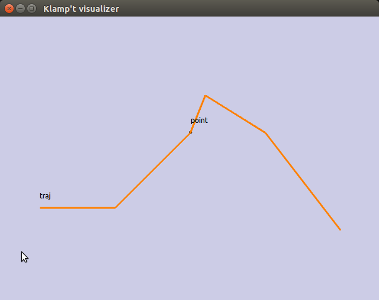

Paths and Trajectories
======================================

Klamp't distinguishes between *paths* and *trajectories*: paths are
geometric, time-free curves, while trajectories are paths with an
explicit time parameterization. Mathematically, paths are expressed as a
continuous curve

    :math:`y(s):[0,1] \rightarrow C`

while trajectories are expressed as continuous curves

    :math:`y(t):[t_i,t_f] \rightarrow C`

where :math:`C` is the configuration space and :math:`t_i,t_f` are the initial and
final times of the trajectory, respectively.

Classical motion planners compute paths, because time is essentially
irrelevant for fully actuated robots in static environments. However, a
robot must ultimately execute trajectories, so a planner must somehow
prescribe times to paths before executing them. Various methods are
available in Klamp't to convert paths into trajectories. For example, to
send a motion planner output to a controller in Python, call
``klampt.model.trajectory.execute_trajectory``.

Path and trajectory representations
-----------------------------------

+-----------+---------------+-----------+-----------------------------------------------------------------+
| Type      | Continuity    | Timed?    | Description                                                     |
+===========+===============+===========+=================================================================+
| Configs   | C1            | No        | The simplest path type: a  list of ``Config``  milestones*      |
|           |               |           | that should be piecewise linearly interpolated.  *These are     |
|           |               |           | outputted from kinematic motion planners*.                      |
+-----------+---------------+-----------+-----------------------------------------------------------------+
| Piecewise | C1            | Yes       | Given by a   list of  ``times`` and  ``milestones``             |
| linear    |               |           | that should be piecewise linearly interpolated.  *The most      |
|           |               |           | compatible trajectory  type*.                                   |
+-----------+---------------+-----------+-----------------------------------------------------------------+
| Cubic     | C2            | Yes       | Piecewise cubic curve, with time.                               |
| spline    |               |           |                                                                 |
+-----------+---------------+-----------+-----------------------------------------------------------------+
| MultiPath | C1 or C2      | Either    | A rich container type for paths/trajectories annotated with     |
|           |               |           | changing contacts and  IK constraints.                          |
+-----------+---------------+-----------+-----------------------------------------------------------------+

*Note: to properly handle a robot's rotational joints, milestones should
be interpolated via robot-specific interpolation functions. Cartesian
linear interpolation does not correctly handle floating and spin joints.
See the functions in ``RobotModel.interpolate()`` *to do so*.  We also
provide the ``RobotTrajectory`` class to do this automatically.

Especially for legged robots, the preferred path type is ``MultiPath``,
which allows storing both untimed paths and timed trajectories. It can
also store multiple path sections with inverse kinematics constraints on
each section. More details on the ``MultiPath`` type `are given below <#multipaths>`__.

API summary
~~~~~~~~~~~

Piecewise linear trajectories are given in the :class:`~klampt.model.trajectory.Trajectory`,
:class:`~klampt.model.trajectory.SO3Trajectory`, :class:`~klampt.model.trajectory.SE3Trajectory`,
and :class:`~klampt.model.trajectory.RobotTrajectory` classes of
`klampt.model.trajectory <klampt.model.trajectory.html>`__.

Members include:

-  ``times``: an array of N floats, in increasing order, listing points in time.
-  ``milestones`` a list of N ``Config`` milestones reached at each of those times.

Typically, a trajectory has ``times[0]=0``, but this is not required.

The difference between these classes is the space in which "straight line"
interpolation is performed. 

- The standard ``Trajectory`` class assumes the space is an N-D Euclidean space. 
- ``RobotTrajectory`` requires that each milestone is a ``Config`` for the
  specified robot. It will also take any special joints, like freely-rotating
  joints, into account during interpolation, so that, for
  example, a mobile base robot will interpolate its orientation DOF from 0.1
  radians to 6.1 radians the "short way around".
- ``SO3Trajectory`` interpolates in SO(3), in the space of rotation matrices.
  Each milestone is a 9-element rotation matrix (see the `so3 module <klampt.math.so3.html>`__)
  and interpolation is performed using geodesics in SO(3).
- ``SE3Trajectory`` interpolates in SE(3), in the space of rigid transforms.
  Each milestone is a 12-element rotation matrix + translation vector concatenated
  together (see the `se3 module <klampt.math.se3.html>`__) and interpolation
  is performed using geodesics in SE(3).

The basic API uses the following methods:

- ``traj = Trajectory()``: constructs an empty trajectory.  You will need to
  populate the ``times`` and ``milestones`` attributes before using any other
  methods.
- ``traj = Trajectory([t0,t1,...,tn],[q0,q1,...qn])``: constructs a trajectory with
  times t0,t1,...tn and milestones q0,q1,...qn.
- ``traj = Trajectory(milestones=[q0,q1,,...,qn])``: constructs a trajectory with
  milestones q0,q1,...,tn and default uniform timing, times 0,1,...,n.
- ``traj.eval(t)``: evaluates the trajectory, handling out-of-bounds
  times by clamping.  O(log n) time, where n is the number of milestones.
- ``traj.eval(t,'loop')``: evaluates the trajectory, handling out-of-bounds
  times by cycling.
- ``traj.deriv(t)``: evaluates the trajectory derivative, handling out-of-bounds
  times by clamping.  O(log n) time, where n is the number of milestones.
- ``traj.deriv(t,'loop')``: evaluates the trajectory derivative, handling
  out-of-bounds times by cycling.
- ``traj.start/endTime()``: returns the start/end time.
- ``traj.duration()``: returns traj.endTime()-traj.startTime().
- ``traj.load/save(fn)``: loads / saves to a file on disk.

Trajectories can also be modified through concatenation and splicing operations:

- ``traj.concat(suffix,relative=False,jumpPolicy='strict')``: appends a suffix Trajectory
  onto this one.
- ``traj.before/after(t)``: returns the portion of the path before and after time t.
- ``traj.split(t)``: equivalent to ``(traj.before(t),traj.after(t))``
- ``traj.splice(suffix,time=None,relative=False,jumpPolicy='strict')``: splices
  another Trajectory onto this one at a given time.

The ``relative`` parameter, if set to True, means that the suffix starts at
time 0, but should be time-shifted so that it starts at the given insertion
time.  ``jumpPolicy='strict'`` means that an exception will be thrown if the
suffix does not match the trajectory at the insertion time

The knot points in the time domain can also be revised without modifying the
shape of the path (much):

- ``traj.insert(t)``: inserts a milestone at time t, if one doesn't exist.
- ``traj.discretize(dt)``: makes milestones evenly spaced in time, with time dt
  apart. This might slightly change the shape of the path.
- ``traj.remesh(times)``: inserts new milestones at each of the points in
  times.  Equivalent to ``for t in times: traj.insert(t)``, but faster.

Hermite spline interpolation is available in the :class:`~klampt.model.trajectory.HermiteTrajectory`
class in `klampt.model.trajectory <klampt.model.trajectory.html>`__.  You may
either set tangents manually or automatically using the ``makeSpline`` method,
as follows:

.. code:: python

    from klampt.model import trajectory

    traj = trajectory.Trajectory()
    #... set up traj
    traj2 = trajectory.HermiteTrajectory()
    traj2.makeSpline(traj)

Conversions between path types are found in
`klampt.model.trajectory <klampt.model.trajectory.html>`__,
in particular the :meth:`~klampt.model.trajectory.path_to_trajectory` method,
which converts an untimed path into a timed trajectory.

Example
~~~~~~~~~~~~

It is a common task to take a sequence of waypoints, either from a planner or
from manual editing, and convert them into a timed trajectory to be executed.

A list of waypoints is also known as a ``Configs`` object.  We will first 
define 7 milestones manually, on an XZ plane:

.. code:: python

    from klampt.model import trajectory

    milestones = [[0,0,0],[0.02,0,0],[1,0,0],[2,0,1],[2.2,0,1.5],[3,0,1],[4,0,-0.3]]

Now let's create a ``Trajectory`` out of it.  The constructor will just assign
a default timing, which is uniformly spaced in time.

.. code:: python

    traj = trajectory.Trajectory(milestones=milestones)

Now, let's see how the eval function works:

.. code:: python

    #prints milestones 0-5
    print 0,":",traj.eval(0)
    print 1,":",traj.eval(1)
    print 2,":",traj.eval(2)
    print 3,":",traj.eval(3)
    print 4,":",traj.eval(4)
    print 5,":",traj.eval(5)
    print 6,":",traj.eval(6)
    #print some interpolated points
    print 0.5,":",traj.eval(0.5)
    print 2.5,":",traj.eval(2.5)
    #print some stuff after the end of trajectory
    print 7,":",traj.eval(7)
    print 100.3,":",traj.eval(100.3)
    print -2,":",traj.eval(-2)

OK, that seems reasonable.  But it's a little hard to understand what this
looks like through text printouts.  Let's use the visualization to see
how this path behaves:

.. code:: python

    from klampt import vis

    vis.add("point",[0,0,0])
    vis.animate("point",traj)
    vis.add("traj",traj)
    vis.spin(float('inf'))   #show the window until you close it

This will pop up a visualization, show the path, and animate a point along it
as well. 

It looks a little like a mountain, and the point moves slowly at the start
before moving along the curve.

Let's now look at what happens when we convert this to a HermiteTrajectory...

.. code:: python

    traj2 = trajectory.HermiteTrajectory()
    traj2.makeSpline(traj)

    vis.animate("point",traj2)
    vis.spin(float('inf'))

Now the point curves smoothly through the milestones we defined! 

.. note::
    Hermite splines can't be drawn directly, but you can use the
    :meth:`~klampt.model.trajectory.HermiteTrajectory.configTrajectory`
    method to show the spline.  The vis module only draws straight lines
    between milestones, so to show the curves of the spline, the
    ``discretize`` method should be used to get a path with finer
    resolution, like so:

    .. code:: python

        vis.hide("traj")
        vis.add("traj2",traj2.configTrajectory().discretize(0.1))
        vis.spin(float('inf'))

    .. image:: _static/images/traj_test2.png

Finally we might want to address the problem that the milestones are executed
uniformly in the time domain, even though the first two milestones are
identical.  The :meth:`~klampt.model.trajectory.path_to_trajectory` function
has a whole host of options, and you can play around with them until you
get the results that you want.

.. code:: python

    traj_timed = trajectory.path_to_trajectory(traj,vmax=2,amax=4)
    #next, try this line instead
    #traj_timed = trajectory.path_to_trajectory(traj,timing='sqrt-L2',speed='limited',vmax=2,amax=4)
    #or this line
    #traj_timed = trajectory.path_to_trajectory(traj2.configTrajectory().discretize(0.1),timing='sqrt-L2',speed=0.3)
    vis.animate("point",traj_timed)
    vis.spin(float('inf'))

Multipaths
----------

A :class:`~klampt.model.multipath.MultiPath` is a rich path representation
for legged robot motion.
They contain one or more path(or trajectory) *sections* along with a set
of IK constraints and holds that should be satisfied during each of the
sections. This information can be used to interpolate between milestones
more intelligently, or for controllers to compute feedforward torques
more intelligently than a raw path. They are loaded and saved to XML
files.

Each ``MultiPath`` section maintains a list of IK constraints in the
``ikObjectives`` member, and a list of ``Hold``\ s in the holds member.
There is also support for storing common holds in the ``MultiPath``\ s
``holdSet`` member, and referencing them through a section's
``holdNames`` or ``holdIndices`` lists (keyed via string or integer
index, respectively). This functionality helps determine which
constraints are shared between sections, and also saves a bit of storage
space.

``MultiPath``\ s also contain arbitrary application-specific settings,
which are stored in a string-keyed dictionary member ``settings``.
Common settings include:

-  ``robot``, which indicates the name of the robot for which the path
   was generated.
-  ``resolution``, which indicates the resolution to which a path has
   been discretized. If resolution has not been set or is too large for
   the given application, a program should use IK to interpolate the
   path.
-  ``program``, the name of the procedure used to generate the path.
-  ``command_line``, the shell command used to invoke the program that
   generated the path.

Sections may also have custom settings. No common settings have yet been
defined for sections, these are all application-dependent.

API summary
~~~~~~~~~~~

Details can be found in the :class:`~klampt.model.multipath.MultiPath` documentation.

The ``klampt_path`` script can also be run to perform various simple transformations
on ``MultiPath``\ s.

Also, you may see the utility scripts in

  ``Klampt-examples/Python/utils/multipath\_to\_path.py``

and

  ``Klampt-examples/Python/utils/multipath\_to\_timed\_path.py``

for examples.

Cartesian Trajectories
----------------------

TODO: see the
`cartesian\_trajectory <klampt.model.cartesian_trajectory.html>`__ module.

Trajectory Execution
--------------------

Sending to a Klamp't simulated robot
~~~~~~~~~~~~~~~~~~~~~~~~~~~~~~~~~~~~

The simplest way to send a path to a :class:`~klampt.SimRobotController` is to use
:meth:`~klampt.model.trajectory.execute_path` (untimed path) or
:meth:`~klampt.model.trajectory.execute_trajectory` (timed trajectory).

For greater control, you may either run an ``eval(t)`` loop to send position
commands, or use the `controller motion queuing process <Manual-Control.html#default-motion-queue-controller>`__.

If you have built or installed the Klampt binaries, you may use the SimTest
program to observe a trajectory in simulation.  Save the file to disk as
a ``LinearPath`` and the starting ``Config``, then run

.. code:: sh

    SimTest [world file] -path [name of path file] -config [start config]

Sending to a real robot
~~~~~~~~~~~~~~~~~~~~~~~

To send paths to your own robot, you will most likely have to build your own
control loop. 

**If your robot accepts PID commands**

First, convert the path to a Trajectory.  Then, run something like this:

.. code:: python

    import time

    #this code assumes traj is already given, and your controller provides a function pid_command(q,dq)

    def convert_klampt_config(q):
        """Converts klampt config to my robot's config, e.g., extract DOFs,
        convert units, account for joint offsets. 

        Right now, does a straight pass-through.
        """
        return q

    def convert_klampt_velocity(dq):
        """Converts klampt velocity to my robot's velocity, e.g., extract DOFs,
        convert units. 

        Right now, does a straight pass-through.
        """
        return dq

    dt = 0.01  #approximately a 100Hz control loop
    t0 = time.time())
    while True:
        t = time.time()-t0
        if t > traj.endTime():
            break
        qklampt = traj.eval(t)
        dqklampt = traj.eval(t)
        qrobot = convert_klampt_config(qklampt)
        dqrobot = convert_klampt_velocity(dqklampt)
        pid_command(qrobot,dqrobot)
        time.sleep(dt)
    print "Done"

**If your robot accepts queued, timed waypoints**

First, convert the path to a Trajectory.  Then, run something like this:

.. code:: python

    #this code assumes traj is already given, and your controller provides a function queue_move(q,duration)
    move_home_duration = 10  #moves slowly to the home configuration over 10 seconds
    lastt = None
    for t,q in zip(traj.times,traj.milestones):
        if lastt is None:
            queue_move(q,move_home_duration)
        else:
            queue_move(q,t-lastt)
        lastt = t

You can also build your own ROS ``JointTrajectory`` messages.
