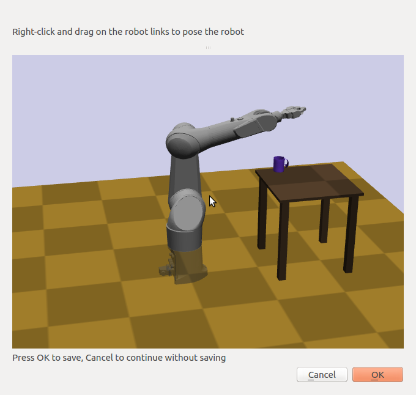
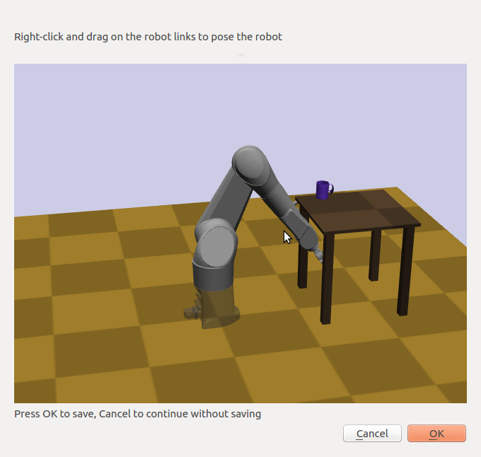
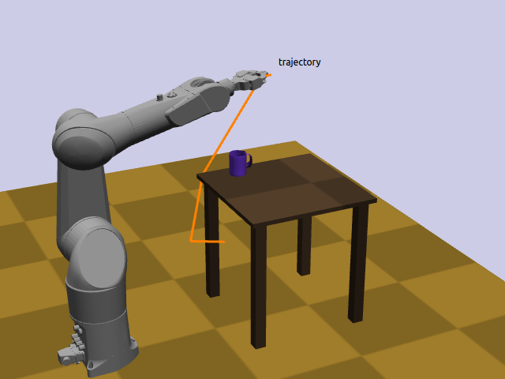
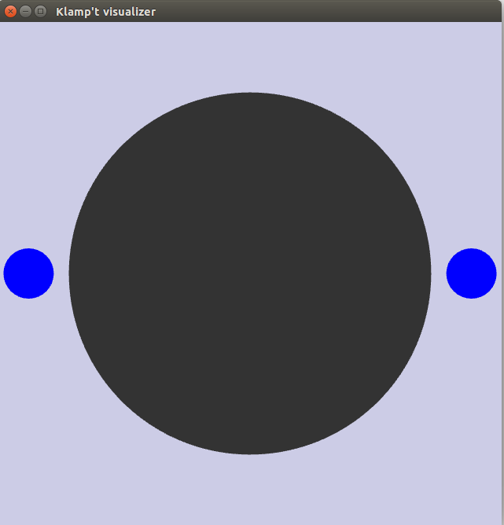
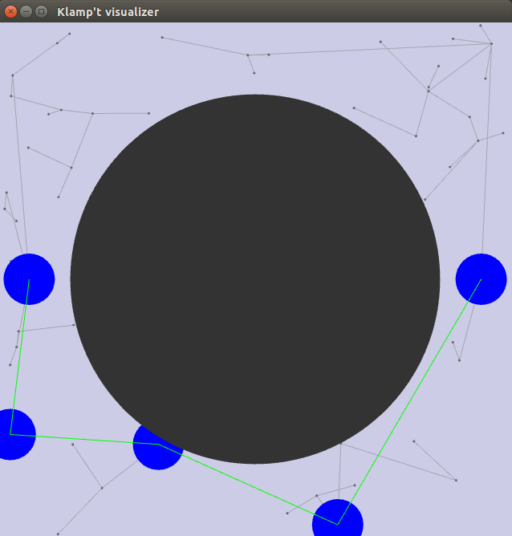
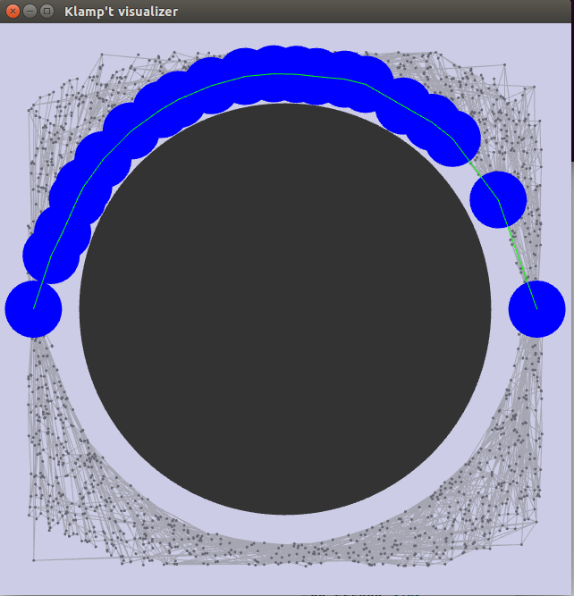

Motion Planning
========================

Motion planning is the problem of connecting two configurations with a
feasible kinematic path or dynamic trajectory under certain constraints.
The output may also be required to satisfy some optimality criteria.
Klamp't has the ability to plan:

-  Collision-free kinematic paths in free space,
-  Collision-free, stable kinematic paths on constraint manifolds,
-  Minimum-time executions of a fixed trajectory under velocity and
   acceleration constraint,
-  Minimum-time executions of a fixed trajectory under torque and
   frictional force constraints,
-  Replanning under hard real-time constraints.

A variety of kinematic planning algorithms are supported, including:

**Feasible planners**: (only care about the first feasible solution)

-  Probabilistic Roadmap (PRM) [Kavraki et al 1996]
-  Rapidly-Exploring Random Tree (RRT) [LaValle and Kuffner 2001]
-  Expansive Space Trees (EST ) [Hsu et al 1999]
-  Single-Query Bidirectional Lazy Planner (SBL) [Sanchez-Ante and
   Latombe 2004]
-  Probabilistic Roadmap of Trees [Akinc et al 2005] w/ SBL (SBL-PRT)
-  Multi-Modal PRM (MMPRM), Incremental-MMPRM [Hauser and Latombe 2009]

**Optimizing planners**: (incrementally improve the solution quality --
path length -- over time)

-  RRT\* [Karaman and Frazzoli 2009]
-  PRM\* [Karaman and Frazzoli 2009]
-  Lazy-PRM\*, Lazy-RRG\* [Hauser 2015]
-  Lower-Bound RRT\* (LB-RRT\*) [Salzman and Halperin 2014]
-  Fast Marching Method (FMM) [Sethian 1996]
-  Asymptotically optimal FMM (FMM\*) [Luo and Hauser 2014]
-  Minimum Constraint Removal (MCR) and Minimum Constraint Displacement
   (MCD) [Hauser 2013]
-  Randomized path shortcutting
-  Random restarts

There are two levels of planning interface. The *robot-level* interface
is a higher-level interface automatically defines notions of sampling,
collision checking, etc. (similar to the functionality of MoveIt!) The
*configuration space* interface is much lower level and more abstract,
and requires the user to define feasibility tests and sampling routines
(similar to the functionality of OMPL). The lower level approach is more
tedious, but provides greater power.

Regardless of which interface you use, the general pipeline is as
follows:

#. Construct a **planning problem**. Define the configuration space
   (C-space) and terminal conditions (start and goal configurations, or
   in general, sets)
#. Instantiate a **planning algorithm**. *Take care: some algorithms
   work with some problems and not others*.
#. **Call the planner**. Sampling-based planners are set up for use in
   any-time fashion:

   #. Plan as long as you want in a while loop, OR
   #. Set up a termination criterion

   Any-time planning means that the likelihood of success increases as
   more time spent. For *optimizing planners*, the quality of path
   improves too.

#. **Retrieve** the path (sequence of milestones)

The resulting paths is then ready for execution or for postprocessing
(smoothing).

Robot-level kinematic motion planning
-------------------------------------

High-level kinematic motion planning generates collision-free paths for
robots. The most basic form of planning considers fixed-base robots in
free space (i.e., not in contact with the environment or objects).

-  Standard Robot C-Space: avoids collisions
-  Contact C-space: avoids collisions, maintains IK constraints
-  Stance C-space: same as Contact C-space, but also enforces balance
   under gravity

You are allowed to do some additional modifications, like adding
constraints.

API summary
~~~~~~~~~~~

The highest level **convenience functions** in the ``klampt.plan.robotplanning`` module
are the functions :meth:`~klampt.plan.robotplanning.planToConfig`,
:meth:`~klampt.plan.robotplanning.planToCartesianObjective`, and
:meth:`~klampt.plan.robotplanning.planToSet`.  These automatically set up planners
that are ready to use to generate collision-free plans for a robot to reach
either a goal configuration, IK target, or set. 

The ``planTo*`` functions generate an instance of a :class:`~klampt.plan.cspace.MotionPlan`, 
planner:

.. code:: python

    from klampt.plan import robotplanning
    #assumes world is a WorldModel and robot is a RobotModel,
    #which is already set to the start configuration

    qgoal = robot.getConfig()
    qgoal[3] += 2.0   #move the 4th joint 2 radians from the start
    planner = robotplanning.planToConfig(world,robot,qgoal)

Planning options can be configured and extra constraints fed into the planner
using these functions. You can even pass in a :class:`SubRobotModel` to plan
for selected parts of a robot, such as an arm of a multi-armed robot.

For even greater control, you should may create an appropriate C-space 
(a subclass of a :class:`~klampt.plan.cspace.CSpace`) for your problem and then
set up the :class:`~klampt.plan.cspace.MotionPlan` manually.
A C-space defines all of the kinematic constraints of the problem,
excluding terminal conditions.  You will set the terminal conditions in the 
:class:`~klampt.MotionPlan`.

:meth:`~klampt.plan.robotplanning.makeSpace` will automatically configure a
CSpace ready for use with a given robot.  This function accepts a wide variety of options,
including extra constraints, ignored collision pairs, a subset of active DOFs, and IK constraints.

Alternatively, there are several robot-level C-spaces are available for you in
``klampt.plan.robotcspace``.

-  :class:`~klampt.plan.robotcspace.RobotCSpace`: avoids collisions with
   other objects in the world.
-  :class:`~klampt.plan.robotcspace.ContactCSpace`: avoids collisions,
   and maintains IK constraints.
-  :class:`~klampt.plan.robotcspace.StanceCSpace`: same as ``ContactCSpace``,
   but also enforces balance under gravity given known points of contact.

These instances require you to provide as input a robot and a
:class:`klampt.model.collide.WorldCollider`: instance, as follows:

.. code:: python

    import klampt
    from klampt.plan.robotcspace import RobotCSpace
    from klampt.plan import cspace
    from klampt.model import collide
    world = WorldModel()
    ... set up world ...
    robot = world.robot(0)
    space = RobotCSpace(robot,collide.WorldCollider(world))
    # (Can also create it without the collider to ignore all self-and environment collisions)
    #Optionally:
    #Call space.addFeasibilityTest(func,name=None) on the space with as many additional feasibility tests as you want
    qinit = robot.getConfig()
    qgoal = robot.getConfig()
    qgoal[3] += 2.0       #move 2 radians on joint 3
    

Once you create a CSpace, you should then
pass your CSpace a ``MotionPlan`` object given your C-space object as the argument
to its constructor, and then set its terminal conditions, as follows:

.. code:: python

    planner = cspace.MotionPlan(space,type="rrt*")
    planner.setEndpoints(qinit,qgoal)
    #now the planner is ready to use...

Motion Planners
---------------

Planner Attributes
~~~~~~~~~~~~~~~~~~

-  ``type``: the overall planner type. Values include:

   -  ``any`` (default): equivalent to ``sbl``.
   -  ``prm``: the Probabilistic Roadmap algorithm
   -  ``rrt``: the Rapidly Exploring Random Trees algorithm
   -  ``sbl``: the Single-Query Bidirectional Lazy planner
   -  ``sblprt``: the probabilistic roadmap of trees (PRT) algorithm
      with SBL as the inter-root planner.
   -  ``rrt*``: the RRT\* algorithm for optimal motion planning
   -  ``prm*``: the PRM\* algorithm for optimal motion planning
   -  ``lazyprm*``: the Lazy-PRM\* algorithm for optimal motion planning
   -  ``lazyrrg*``: the Lazy-RRG\* algorithm for optimal motion planning
   -  ``fmm``: the fast marching method algorithm for
      resolution-complete optimal motion planning
   -  ``fmm*``: an anytime fast marching method algorithm for optimal
      motion planning

   The KrisLibrary C++ code also contains the following algorithms, but
   the Python interface is not yet implemented.

       -  ``lazyprm``: the Lazy-PRM algorithm
       -  ``perturbation``: the PerturbationTree algorithm
       -  ``est``: the Expanding Space Tree algorithm

   If KrisLibrary is built with OMPL support, you can also use the type
   specifier "ompl:``[X]``" where ``[X]`` is one of:

       - ``prm``, ``lazyprm``, ``prm*``, ``lazyprm*``, ``spars``
       - ``rrt``, ``rrtconnect``, ``birrt``, ``lazyrrt``, ``lbtrrt``, ``rrt*``, ``informedrrt*``
       - ``est``, ``fmt``, ``sbl``, ``stride``

   (Note that OMPL's ``lazyprm*`` implementation performs much worse than
   the one in Klampt.)

-  ``knn``: k-nearest neighbors parameter. Default is 10 for most
   planners.
-  ``connectionThreshold``: maximum distance over which a connection
   between two configurations is attempted.
-  ``perturbationRadius``: maximum expansion radius for RRT and SBL.
-  ``bidirectional``: 1 if bidirectional planning should be used. Valid
   for RRT, SBL, RRT\*.
-  ``shortcut``: 1 if post-processing smoothing should be used. Turns a
   planner into an optimizing planner.
-  ``restart``: 1 if random-restarts should be used -- turns a planner
   into an optimizing planner. If activated, ``restartTermCond`` must be
   present as well
-  ``restartTermCond``: a string that can be converted into a JSON
   object describing the termination condition. For example,
   ``"{foundSolution:1,maxIters:1000}"`` restarts the underlying planner
   if it found a solution and spent 1000 iterations of planning.
-  ``suboptimalityFactor``: Used in RRT\* and PRM\*
-  ``ignoreConnectedComponents``: Used in PRM to connect nodes in the
   same connected component (default 0)
-  ``gridResolution``: Used in FMM, FMM\*, SBL, SBLPRT
-  ``pointLocation``: Specifies the point location data structure used in
   PRM, RRT, PRM\*, RRT\*, Lazy-RRG\*, .
   Accepted values are "" (brute force), "kdtree" (k-D tree), "random"
   (pick random point), "randombest [k]" (sample k points, pick closest)

These can also be specified in JSON format. Examples are found in
the ``.settings`` files in the Klampt-examples project
`Klampt-examples/Cpp/PlanDemo <https://github.com/krishauser/Klampt-examples/tree/master/Cpp/PlanDemo>`__.

For a complete description of the accepted options, see the
`motionplanning.setPlanSetting <klampt.plan.motionplanning#setPlanSetting>`__
documentation

API summary
~~~~~~~~~~~

The :class:`~klampt.plan.cspace.MotionPlan` class supports various options
that are accepted upon construction of a planner, including:

-  'type': the planning algorithm type.
-  'knn': k-nearest neighbors parameter.
-  'connectionThreshold': maximum distance over which a connection
   between two configurations is attempted.
-  'perturbationRadius': maximum expansion radius for RRT and SBL.
-  Any other key-value attribute pair `as described
   above <#planner-attributes>`__

To set the terminal conditions, you will use the
``MotionPlan.setEndpoints(qstart,qgoal)`` function.  If qstart and qgoal
are configurations, the planner is configured to perform point-to-point
planning. 

Alternatively, qgoal can be a goal set.  The preferred way of
specifying a goal set is to pass in a pair of functions (f,s), in which
f(q) is a predicate to determine whether q is in the goal set, and s() which 
is a method for sampling goal configurations.  You can also just pass in
f, but this is usually far more computationally expensive and is not compatible
with some planners.

To run the planner, call ``MotionPlan.planMore(N)`` with the desired number
of iterations. Continue calling it until ``MotionPlan.getPath()`` returns a
non-empty list, or ``MotionPlan.getPathEndpoints()`` returns non-None.  The
following code gives an example of how to do so.

.. code:: python

    ...
    planner = cspace.MotionPlan(space,type="sbl",connectionThreshold=0.2,shortcut=1)  #accepts keyword arguments
    planner.setEndpoints(qstart,qgoal)
    increment = 100                #there is a little overhead for each planMore call, so it is best not to set the increment too low
    t0 = time.time()
    while time.time() - t0 < 20:   #max 20 seconds of planning
        planner.planMore(increment)
        path = planner.getPath()
        if len(path) > 0:
            print("Solved, path has",len(path),"milestones")
            print("Took time",time.time()-t0)
            break
    planner.close()   #frees a little memory... this is only really necessary if you are creating lots of planners

Debugging your planner
~~~~~~~~~~~~~~~~~~~~~~

It can often be challenging to figure out why a motion planner is not working.
Typically, a planner will not work when the CSpace feasibility tests are
defined improperly, or the MotionPlan settings are far outside of the reasonable
range for your problem.  Or, you may simply have an infeasible problem!

To debug or inspect the results of a planner, the
``MotionPlan.getRoadmap()`` or ``MotionPlan.planner.getStats()`` methods
can be used.  ``CSpace.getStats()`` is also very useful to debug whether
some feasibility tests are preventing progress.

Motion Planning for Articulated Robots
~~~~~~~~~~~~~~~~~~~~~~~~~~~~~~~~~~~~~~~

For RobotModels, it is far more convenient to use the existing robot-level classes.
Open up a new Python file in a text editor, and enter in the following code:

.. code:: python
    
    import klampt
    from klampt.plan import cspace,robotplanning
    from klampt.io import resource
    import time

    world = klampt.WorldModel()
    world.readFile("Klampt-examples/data/tx90cuptable.xml")
    robot = world.robot(0)

    #this is the CSpace that will be used.  Standard collision and joint limit constraints 
    #will be checked
    space = robotplanning.makeSpace(world,robot,edgeCheckResolution=0.05)

    #fire up a visual editor to get some start and goal configurations
    qstart = robot.getConfig()
    qgoal = robot.getConfig()
    save,qstart = resource.edit("Start config",qstart,"Config",world=world)
    #it's worthwile to make sure that it's feasible
    while save and not space.feasible(qstart):
        print("Start configuration isn't feasible, please pick one that is collision-free")
        save,qstart = resource.edit("Start config",qstart,"Config",world=world)

    save,qgoal = resource.edit("Goal config",qgoal,"Config",world=world)
    while save and not space.feasible(qgoal):
        print("Goal configuration isn't feasible, please pick one that is collision-free")
        save,qgoal = resource.edit("Goal config",qgoal,"Config",world=world)

This will pop up some windows so you can edit the start and goal configuration for a motion plan.
It is worthwhile to first check these configurations for feasibility with respect to the
configuration space, because otherwise the planner will complain.

Now that we have some feasible start and goal configurations, let's create a planner and 
run it for some amount of time.  Add this code to the end of the file, and run again:

.. code:: python
    
    settings = {'type':'rrt',
        'perturbationRadius':0.25,
        'bidirectional':True,
        'shortcut':True,
        'restart':True,
        'restartTermCond':"{foundSolution:1,maxIters:1000}"
    }
    t0 = time.time()
    print("Creating planner...")
    #Manual construction of planner 
    planner = cspace.MotionPlan(space, **settings)
    planner.setEndpoints(qstart,qgoal)
    print("Planner creation time",time.time()-t0)
    t0 = time.time()
    print("Planning...")
    numIters = 0
    for round in range(10):
        planner.planMore(500)
        numIters += 1
        if planner.getPath() is not None:
          break
    print("Planning time,",numIters,"iterations",time.time()-t0)

    path = planner.getPath()
    if path is not None:
        print("Got a path with",len(path),"milestones")
    else:
        print("No feasible path was found")

Great! This took some time, and we got a printout at the end.  But is the plan correct?  Moreover, the planner might have failed, and we don't necessarily know why.  For example, if we make it tough for the planner by asking the robot to go under the table, the planner may or may not succeed.  We typically will want to do some inspection of the results, either looking at the planning statistics or visualizing the result.  We may also want to save the result to disk, in case we'd like to look at it later.

.. code:: python
    
    #provide some debugging information
    V,E = planner.getRoadmap()
    print(len(V),"feasible milestones sampled,",len(E),"edges connected")

    print("CSpace stats:")
    spacestats = space.getStats()
    for k in sorted(spacestats.keys()):
        print(" ",k,":",spacestats[k])

    print("Planner stats:")
    planstats = planner.getStats()
    for k in sorted(planstats.keys()):
        print(" ",k,":",planstats[k])

    if path:
        #save planned milestone path to disk
        print("Saving to my_plan.configs")
        resource.set("my_plan.configs",path,"Configs")

        #visualize path as a Trajectory resource
        traj = RobotTrajectory(robot,range(len(path)),path)
        resource.edit("Planned trajectory",traj,world=world)

        #Here's another way to do it: visualize path in the vis module
        from klampt import vis
        vis.add("world",world)
        vis.animate(("world",robot.getName()),path)
        vis.add("trajectory",traj)   #this draws the end effector trajectory
        vis.spin(float('inf'))

If you're running lots of plans, you may want to also perform these final cleanup steps:

.. code:: python

    #play nice with garbage collection
    planner.space.close()
    planner.close()

See Klampt-examples/Python3/demos/planningtest.py for more information.

Randomized kinematic planning with closed-chain constraints
-----------------------------------------------------------

Klamp't has utilities to plan for collision-free motions that satisfy
closed chain constraints (e.g., that a robot's hands and feet touch a
support surface). For the most part, once the CSpace has been set up,
planning is identical to a standard CSpace. However, the planner will
construct a path whose milestones satisfy the constraints, but the
*straight line path in C-Space between milestones will violate
constraints*. This is because the feasible motion lies on a
lower-dimensional, nonlinear constraint manifold in configuration space.
Rather, the path should be discretized finely on the constraint manifold
before sending it to any function that assumes a configuration-space
path, like a controller.

API summary
~~~~~~~~~~~

The ``planTo*`` functions in klampt.plan.robotplanning accept arbitrary
inverse kinematics constraints using the ``equalityConstraints`` keyword
argument.  If these constraints are given, these functions return an instance
of the :class:`~klampt.plan.robotcspace.ContactCSpace` class.

The result from a successful plan will be a sequence of milestones that
satisfy the closed-chain constraints.  In order to convert a milestone path
to a piecewise linear path that satisfies contact constraints, the
``space.discretizePath(path,epsilon=1e-2)`` convenience function is
provided.

C-space-level kinematic motion planning
---------------------------------------

For even more control over the planning process, the base C-space
interfaces can be overridden with custom behavior. A wide variety of
systems can be defined in the configuration space framework, including
vehicles and other non-robotic mechanisms.

At the configuration-space-level interface, there is no notion of even a
robot, just an abstract configuration space. Instead, you must manually
implement the callbacks used by the planning algorithm:

-  Feasibility tester ``feasible(q)``
-  Visibility tester ``visible(a,b)``
-  Sampling strategy ``q <- sample()``
-  Perturbation sampling strategy ``q <- sampleneighborhood(c,r)``
-  Distance metric ``d <- distance(a,b)``
-  Interpolation function ``q <- interpolate(a,b,u)``

The default implementation each callbacks assumes a Cartesian space
without obstacles.

The feasibility test is an *authoritative* representation of C-space
obstacles, and will be called thousands of times during planning. For
sampling-based planners to work well, this must be fast (ideally,
microseconds).

API summary
~~~~~~~~~~~

Each C-space is a subclass of the configuration space interface
``CSpace`` defined in klampt.plan.cspace. At a minimum, the subclass
should set up the following:

-  ``bound``: a list of pairs ``[(a1,b1),...,(an,bn)]`` giving an
   n-dimensional bounding box containing the free space
-  ``eps``: a visibility collision checking tolerance, which defines the
   resolution to which motions are checked for collision.
-  ``feasible(x)``: returns true if the vector ``x`` is in the feasible
   space. (an alternative to overriding ``feasible`` is to call
   ``addFeasibilityTest(func,name)`` for each constraint test in the
   contructor.)

To implement non-Euclidean spaces, users may optionally override:

-  ``sample()``: returns a new vector x from a superset of the feasible
   space. If this is not overridden, then subclasses should set bound to
   be a list of pairs defining an axis-aligned bounding box.
-  ``sampleneighborhood(c,r)``: returns a new vector x from a neighborhood
   of c with radius r
-  ``visible(a,b)``: returns true if the path between a and b is feasible.
   If this is not overridden, then paths are checked by subdivision,
   with the collision tolerance eps.
-  ``distance(a,b)``: return a distance between a and b
-  ``interpolate(a,b,u)``: interpolate between a, b with parameter u in the
   range [0,1].

Setting up and invoking motion planners is the same as in the
robot-level interface.

Example
~~~~~~~~

An example to illustrate the C-space level motion planning process is given
in ``Klampt-examples/Python3/exercises/motionplanning/ex.py``.

Open up the Python file using a text editor.  It defines CircleObstacleCSpace,
which is a CSpace subclass, as well as some visualization routines.

After the robot and obstacles have been defined in the configuration
space, the motion planner needs to be configured.

.. code:: python

   class CSpaceObstacleProgram(GLProgram):
       def __init__(self,space,start=(0.1,0.5),goal=(0.9,0.5)):
           GLProgram.__init__(self)
           self.space = space
           #PRM planner
           MotionPlan.setOptions(type="prm",knn=10,connectionThreshold=0.1)
           self.optimizingPlanner = False

In this class, "PRM" is chose to be the motion planning algorithm,
"knn": k value for the k-nearest neighbor connection strategy (only
for PRM), "connectionThreshold": a milestone connection threshold,
"self.optimizingPlanner = False" means that currently the algorithm
is not an optimal motion planning algorithm.

klamp't has many motion planning algorithms and they can be switched by
changing the type name.

For example, an optimal RRT algorithm can be turned on by setting

.. code:: python

            MotionPlan.setOptions(type="rrt*")
            self.optimizingPlanner = True

``ex.py`` has already included the codes of different motion planning
algorithms, which are reasonable defaults for this problem. 
Uncomment them to switch between methods.

.. code:: python

            #FMM* planner
            #MotionPlan.setOptions(type="fmm*")
            #self.optimizingPlanner = True
            
            #RRT planner
            #MotionPlan.setOptions(type="rrt",perturbationRadius=0.25,bidirectional=True)
            #self.optimizingPlanner = False
            
            #random-restart RRT planner
            #MotionPlan.setOptions(type="rrt",perturbationRadius=0.25,bidirectional=True,shortcut=True,restart=True,restartTermCond="{foundSolution:1,maxIters:1000}")
            #self.optimizingPlanner = True

Now let's run this ex.py. The following figure will show up:

 
Press "p" to see the path after planning for 100 iteration. Press
"space" to see the path planning for each iteration.

Continue until a green line appears.  This is the final trajectory.

Looking closer at this trajectory, we will be able to tell that the robot
will collide with the obstacle and the boundary of the platform. 
Why is this the case?

Currently, in the CSpace, only the center is checked against obstacles, but
the robot is actually a disk, so the sides of the disk may collide with boundary and obstacles.

Feasibility Test
^^^^^^^^^^^^^^^^

To solve this problem, we must redefine the CSpace feasibility test.
Previously, the configuration space is defined with respect to
the center of the robot. This works if the robot can be considered as
a point mass. However, in our exercise, the robot is modeled as a
rigid circular body with radius r. So one easy way is to redefine the
configuration space and make sure that the distance between the center
of the robot and the boundary and the obstacle is at least r. So the
method can be modified to be

.. code:: python

        def feasible(self,q):
            #the radius of the robot r is 0.05
            #bounds test
            # We should decrease the size of the bound due to the radius of the mobile robot
            self.bound = [(0.05,0.95),(0.05,0.95)]
            if not CSpace.feasible(self,q): 
                return False       
            #make sure center point at least distance r from obstacles   
            for o in self.obstacles:
                if o.contains(q): return False
            return True

Now the motion planning result looks like this:

.. image:: _static/images/motion_planning3.jpg

Optimizing Planners
^^^^^^^^^^^^^^^^^^^

Up to now, we have not used the optimal motion planning algorithm. This part we will show how to use the motion planning algorithm with optimization. Inside the CSpaceObstacleProgram class, comment our default "#PRM planner" and uncomment the " #RRT* planner" :

.. code:: python

        #RRT* planner
        MotionPlan.setOptions(type="rrt*")
        self.optimizingPlanner = True

Run this python script again. Press "p" continuously, you will find the the algorithm connects the new generated path which to make the final path towards a smooth path.

There are several other motion planning methods in this file (Fast Marching Method*, Random-Restart RRT + shortcutting) that can also be uncommented for testing. 

Choosing planners and tuning parameters
---------------------------------------

Klampt provides a large number of planners and parameter choices, and in order to understand them thoroughly you would to read the motion planning literature fairly extensively.  For most users, however, you will choose these for your problem scenario through empirical tuning.  Here are a few tips for the parameter tuning process:

- ``eps`` governs the speed of edge collision checking, and while testing it helps to
  set this this to a large value to speed up planning.  Later it should be shrunk to
  ensure plans are valid. 
- ``eps``, ``perturbationRadius``, ``connectionThreshold``, ``gridResolution`` should
  be set proportional to the size of your configuration space.
- Planners ``fmm`` and ``fmm*`` perform an entire grid search each iteration, so when
  you run ``planMore(N)``, ``N`` should be much smaller than the sampling-based planners.
- In unbounded C-spaces, the ``sbl``-based planners can be applied directly  because
  they only use perturbations.  Care must be taken with ``prm``, ``rrt``, ``rrt*``,
  ``lazyprm*``, and ``lazyrrg*`` in order to ensure that the ``sample`` function implements
  a reasonable sampling distribution (such as a logarithmic prior). 
  Planners ``fmm`` and``fmm*`` should *never* be used.  
- Planners "lazyprm*", "lazyrrg*", and "sbl" are almost always faster than their
  non-lazy variants (``prm*``, ``rrt*``, ``rrt``) when collision checks are expensive.
- Do not combine ``restart`` and ``shortcut`` with the optimizing planners ``rrt*``,
  ``lazyprm*``, and ``lazyrrg*``.  Do not combine ``restart`` with ``fmm`` and ``fmm*``.
- In general, FMM-based planners work extremely well up to around 4D, the ``lazyprm*``
  and ``lazyrrg*`` up to around 7D, and SBL / RRT + shortcutting work well up to
  around 15-40D.  Usually, the optimality of these planners becomes worse as the
  dimension of the C-space grows.

The example ``.settings`` files in `Klampt-examples/Cpp/PlanDemo
<https://github.com/krishauser/Klampt-examples/tree/master/Cpp/PlanDemo>`__
are a good place to start.
