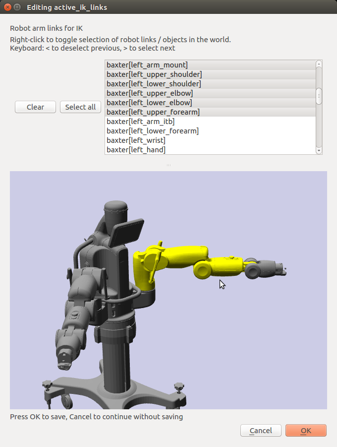

Resource management
===================

When building a large, complex robot system, you will typically
encounter dozens or hundreds of robot configurations, transforms,
inverse kinematics constraints, and paths. Klamp't has many functions to
help make managing these elements easier.

*Visual editing* is a sort of what-you-see-is-what-you-get (WYSIWYG)
editing approach for robotics, and Klamp't tries to make visual editing
part of the robot hacking workflow in as painless a manner as possible.

This is made more convenient through the Klamp't resource management
mechanism. When working on a large project, it is recommended that
configurations, paths, holds, etc. be stored in dedicated sub-project
folders to avoid polluting the main Klamp't folder. Resources are
compatible with the RobotPose app, as well as the C++ and Python APIs.

The `klampt.io.resource <klampt.io.html#module-klampt.io.resource>`__
module allows you to easily load,
save, or edit resources. Visual editing is supported for Config,
Configs, Vector, and RigidTransform types. As an example, the below code
loads an xform resource, and visually edits it if it doesnt exist:

.. code:: python

    from klampt.io import resource
    from klampt.math import se3
    resource.get("test.xform",type="RigidTransform",default=se3.identity())

See the ``Klampt-examples/Python3/demos/resourcetest.py`` demo for more
examples about how to use this module.

Currently supported types include:

-  Config (.config)
-  Configs (.configs): A configuration list
-  Trajectory (.path): A piecewise linear trajectory object
-  MultiPath (.xml): See klampt.model.multipath
-  Hold (.hold)
-  Stance (.stance)
-  Grasp (.xml)
-  GeometricPrimitive (.geom)
-  TriMesh (.off, .tri, etc.)
-  PointCloud (.pcd)
-  Robot (.rob)
-  RigidObject (.obj)
-  World (.xml)

Klamp't also supports the following additional types which do not have a
dedicated file extension:

-  Vector3
-  Matrix3
-  RigidTransform
-  Matrix
-  IKGoal

Visual editing and visualization support
----------------------------------------

The resource types that can be visually edited include

+--------------------------------------+---------------+-------------------+----------------------------------------+
| Type                                 | ``vis.add``   | ``resource.edit`` | ``resource.get`` / ``resource.edit``   |
+======================================+===============+===================+========================================+
| Vector3                              | Y             | Y                 | Y                                      |
+--------------------------------------+---------------+-------------------+----------------------------------------+
| Matrix3                              | Y             | Y                 | Y                                      |
+--------------------------------------+---------------+-------------------+----------------------------------------+
| RigidTransform                       | Y             | Y                 | Y                                      |
+--------------------------------------+---------------+-------------------+----------------------------------------+
| Config                               | Y             | Y                 | Y                                      |
+--------------------------------------+---------------+-------------------+----------------------------------------+
| Configs                              | Y             | Y                 | Y                                      |
+--------------------------------------+---------------+-------------------+----------------------------------------+
| Trajectory                           | Y             | Y                 | Y                                      |
+--------------------------------------+---------------+-------------------+----------------------------------------+
| MultiPath                            | Y             | N                 | N                                      |
+--------------------------------------+---------------+-------------------+----------------------------------------+
| Hold                                 | Y             | N                 | N                                      |
+--------------------------------------+---------------+-------------------+----------------------------------------+
| Stance                               | Y             | N                 | N                                      |
+--------------------------------------+---------------+-------------------+----------------------------------------+
| Grasp                                | Y             | N                 | N                                      |
+--------------------------------------+---------------+-------------------+----------------------------------------+
| Geometry3D                           | Y             | N                 | N                                      |
+--------------------------------------+---------------+-------------------+----------------------------------------+
| Robot                                | Y             | Y (config)        | N                                      |
+--------------------------------------+---------------+-------------------+----------------------------------------+
| RigidObject                          | Y             | Y (transform)     | N                                      |
+--------------------------------------+---------------+-------------------+----------------------------------------+
| World                                | Y             | N                 | Y                                      |
+--------------------------------------+---------------+-------------------+----------------------------------------+
| Anything in the coordinates module   | Y             | N                 | N                                      |
+--------------------------------------+---------------+-------------------+----------------------------------------+

The object types with a Y in the first column can be visually inspected
using ``vis.add(name,object)``. In the second column, you can edit them
using ``vis.edit(name)``

Calling ``resource.get`` or ``resource.edit`` on a supported object will
use the corresponding classes in vis.editors. In addition, you can also
use the following editors:

-  ObjectTransformEditor: edit RigidObject transforms
-  SelectionEditor: edit subsets of a RobotModel

As an example, you can run

.. code:: python

    import klampt
    from klampt.vis import editors
    world = klampt.WorldModel()
    if not world.readFile("Klampt-examples/data/robots/baxter.rob"):
        raise RuntimeError("Can't read the Baxter file")
    links = editors.run(editors.SelectionEditor("active_ik_links",
                    value=[15,16,17,18,19,20],
                    description="Robot arm links for IK",
                    world=world))
    print("Selected links",links)

The editor will pop up as follows, and you may click on links in the
scene or in the list to change the selected links:

Resource browsing app
---------------------

The Klamp't Python API comes with the ``klampt_browser`` script to quickly
browse through resources, and even edit them. It allows you to navigate
a directory tree and select multiple objects and resources to display.

If you have selected resources of any type that can be edited in the ``vis``
module (see list above), you can click the "Edit" button and then save the
edited value to disk.

See the `klampt\_browser <Manual-Apps.html#klampt-browser>`__ docs for more
details.

RobotPose
---------

If you have built from source, the RobotPose app can also browse and
edit resources.  See the `RobotPose documentation <https://github.com/krishauser/Klampt/blob/master/Cpp/docs/Manual-Apps.md#robotpose>`__
for more details.
