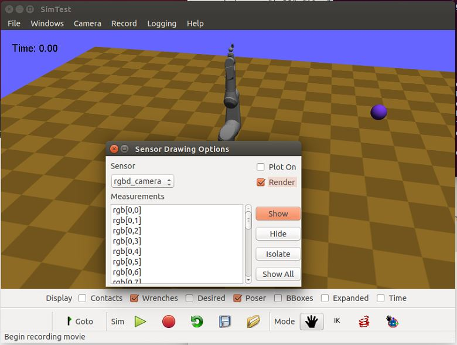
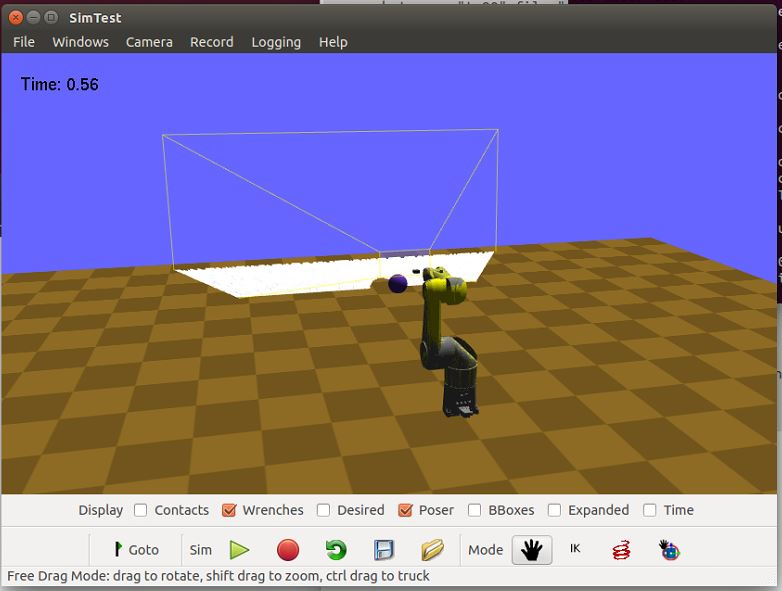
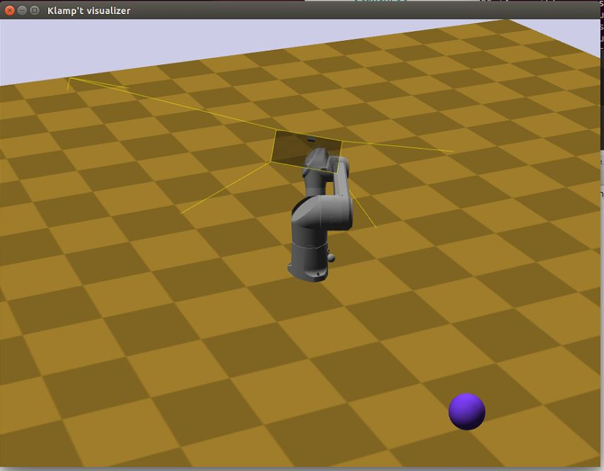

Sensors
========

Klamp't can emulate a handful of sensors typically found on robots. 
These sensors can be used in the simulation environment to monitor
the robot's state and provide feedback for your robot's
controller. Each sensor has a set of properties that describe its
location on the robot (or in the world) and govern its behavior,
e.g. resolution, noise level, update rate, etc. In the case of
camera sensor these parameters include the field of view and
resolution.

The following sensor types are natively supported:

-  Joint sensors

   -  ``JointPositionSensor``: Standard joint encoders.
   -  ``JointVelocitySensor``: Velocity sensors. Here velocities are
      treated as raw measurements, rather than differencing from a position
      encoder, and hence they are rarely found in real sensors. However,
      these will be good approximations of differenced velocity estimates
      from high-rate encoders.
   -  ``DriverTorqueSensor``: Torques fed back from a robot's motors.

-  Visual sensors

   -  ``CameraSensor``: An RGB or RGB-D camera.
   -  ``LaserRangeSensor``: A laser rangefinder sensor.

-  Tactile sensors

   -  ``ContactSensor``: A contact switch/sensor defined over a rectangular
      patch.
   -  ``ForceTorqueSensor``: A force/torque sensor at a robot's joint. Can
      be configured to report values from 1 to 6DOF.

-  Inertial Sensors

   -  ``Accelerometer``: An accelerometer. Can be configured to report
      values from 1 to 3 channels.
   -  ``TiltSensor``: A tilt sensor. Can be configured to report values
      from 1 to 2 axes, and optionally tilt rates.
   -  ``GyroSensor``: A gyroscope. Can be configured to report
      accelerations, velocities, or absolute rotations.
   -  ``IMUSensor``: An inertial measurement unit that uses an
      accelerometer and/or gyroscope to provide estimates of a link's
      transformation and its derivatives. It will fill in the gaps that are
      not provided by the accelerometer / gyro using either integration or
      differencing.

-  Miscellaneous "virtual sensors"

   -  ``FilteredSensor``: Simply filters the measurements provided by another sensor.
   -  ``CorruptedSensor``: Corrupts the measurements provided by another sensor.
   -  ``TransformedSensor``: Transforms the measurements provided by another sensor
      using some scaling and bias (good for simulating sensors that provide non-MKS units).
   -  ``TimeDelayedSensor``: Delays the measurements provided by another sensor.

Every simulation time step, a sensor produces a set of measurements, which is
just a vector of floating-point numbers. The interpretation of these
measurements is sensor-dependent. It is up to the controller to process these raw
measurements into meaningful information.

Each sensor obeys a standard interface for configuring the sensor's settings and
retrieving its measurements.  A sensor's settings are configured via
attribute/value pairs, which are fed to the sensor's ``setSetting`` method.
More details on measurements and sensor-specific settings are
`listed below <#sensor-measurements-and-attributes>`__.

XML configuration
-------------------

To use sensors in a simulation, they must either be defined in a
simulation world file or programmatically.

In XML world files, sensors and their settings are defined, via an XML tag
of the form

.. highlight:: xml

::

   <sensors>
      <TheSensorType name="some_name" attr1="value1" attr2="value2" >
   </sensors>

.. highlight:: python

These XML strings can be inserted into several places:

#. .rob files referring to an external sensor XML file under a line::

      property sensors [SENSORS_XML_FILE]

   or embedded in the .rob file::

      property sensors <sensors> <TheSensorType name="some_name" attr1="value1" attr2="value2" > </sensors>

#. URDF files under the ``<klampt>`` element, and

#. World XML files under the ``<simulation>`` and ``<robot>`` elements.

See the Hubo-II+
model ``Klampt-examples/data/robots/huboplus/huboplus_col.rob`` for an example of
configuring sensors in a .rob file, and the simulation sensor test
environment ``Klampt-examples/data/simulation_test_worlds/sensortest.xml`` for an
example of configuring sensors in a world XML file.

API summary
------------

The main interface to sensors is :class:`~klampt.SimRobotSensor`.

-  ``sensor = controller.sensor(index or name)``: retrieves a
   SimRobotSensor reference from a :class:`SimRobotController`.
-  ``sensor = SimRobotSensor(controller,name,type)``: creates a new
   sensor for the SimRobotController of the given name and type string.
-  ``sensor.name()``: gets the sensor’s name string
-  ``sensor.type()``: gets the sensor’s type string
-  ``sensor.measurementNames()``: returns a list of strings naming the
   sensor’s measurements
-  ``sensor.getMeasurements()``: returns a list of floats giving the
   sensor’s measurements at the current time step
-  ``sensor.setSetting(name,value)``: sets a setting for the sensor.
   value must be a string
-  ``sensor.getSetting(name)``: retrieves a setting for the sensor,
   returned as a string

It is often useful to retrieve hypothetical sensor data without actually
running a physics simulation, in particular for visual sensors.  This can
be accomplished using the kinematic simulation functions:

-  ``sensor.kinematicSimulate(world,dt)``: kinematically simulates the
   sensor for its corresponding robot in the given world.
-  ``sensor.kinematicReset()``: resets any internal state for the
   kinematic simulation.

The `sensing <klampt.model.sensing.html>`__
module contains utility functions for reading sensor transforms and
converting camera measurements to images (Numpy arrays) and point
clouds.

Sensor measurements and attributes
----------------------------------

Formal documentation is not yet complete for some sensors. For the most
part, the attributes of a sensor match the members of the corresponding
C++ class. Please see the C++ class attributes and comments for the most
complete information.

``JointPositionSensor``
~~~~~~~~~~~~~~~~~~~~~~~

Settings are:

-  ``indices`` (list of ints): a list of link indices actually read. May
   also be empty to indicate all DOFs on the robot are read.
-  ``qresolution`` (list of floats): resolution of each reading, in radians.
   E.g. "0.01 ... 0.01" indicates that each reading will be rounded to
   the nearest 0.01 radian
-  ``qvariance`` (list of floats): variance of each reading, in radians

`C++ API
documentation <http://motion.cs.illinois.edu/software/klampt/latest/klampt_docs/classJointPositionSensor.html>`__.

``JointVelocitySensor``
~~~~~~~~~~~~~~~~~~~~~~~

Settings are:

-  ``indices`` (list of ints): a list of link indices actually read. May
   also be empty to indicate all DOFs on the robot are read.
-  ``qresolution`` (list of floats): resolution of each reading, in rad/s.
   E.g. "0.1 ... 0.1" indicates that each reading will be rounded to the
   nearest 0.1 rad/s
-  ``qvariance`` (list of floats): variance of each reading, in rad/s.

`C++ API
documentation <http://motion.cs.illinois.edu/software/klampt/latest/klampt_docs/classJointVelocitySensor.html>`__.

``CameraSensor``
~~~~~~~~~~~~~~~~~~~~~~~

Simulates a camera or RGB-D sensor. Measurements give the pixel
measurements of the RGB sensor (if present) followed by the pixel
measurements of the depth sensor (if present). RGB measurements are
give the RGB channels of each pixel, in scan-line order (left to right,
top to bottom). Depth measurements follow the same scan-line order, but are
given in meters.

RGB values are packed in a somewhat odd way.  An RGB triple (r,g,b) consists of 
three byte-valued measurements in the range [0,255]. They are then packed into
an integer and then cast to a float.  In other words, the value you receive is
``float(r<<16 | g << 8 | b)``.

To convert an RGB measurement v to an (r,g,b) triple, you can use the
following code:

.. code:: python

    temp = int(v)
    r,g,b = (v>>16)%0xff,(v>>8)%0xff,v%0xff

See also the :func:`~klampt.model.sensing.camera_to_images` and :func:`~klampt.model.sensing.camera_to_points`
utility functions.

Settings are:

-  ``link`` (int): the link on which this sensor lies.  -1 indicates the world frame.
-  ``rgb`` (bool): if true, the camera provides RGB output.
-  ``depth`` (bool): if true, the camera provides depth output.
-  ``xres``, ``yres`` (int): the x and y resolution of the sensor.
-  ``xfov``, ``yfov`` (float): the x and y field of view, in radians.
-  ``zmin``, ``zmax`` (float): minimum and maximum range of the depth
   sensor.
-  ``zresolution`` (float): the resolution of the depth sensor. 0 indicates no quantization.
-  ``zvarianceLinear``, ``zvarianceConstant`` (float): the simulated noise of the depth sensor has variance ``zvarianceLinear * depth + zvarianceConstant``
-  ``Tsensor`` (RigidTransform): the camera's transform on the designated link.  Z is forward, X is right, and Y is down.
   Use :func:`~klampt.model.sensing.set_sensor_xform` and
   :func:`~klampt.model.sensing.get_sensor_xform` to easily set and get this value.

`C++ API
documentation <http://motion.cs.illinois.edu/software/klampt/latest/klampt_docs/classCameraSensor.html>`__.

``LaserRangeSensor``
~~~~~~~~~~~~~~~~~~~~~~~

See the `C++ API documentation <http://motion.cs.illinois.edu/software/klampt/latest/klampt_docs/classLaserRangeSensor.html>`__ for attributes.

``DriverTorqueSensor``
~~~~~~~~~~~~~~~~~~~~~~~

See the `C++ API documentation <http://motion.cs.illinois.edu/software/klampt/latest/klampt_docs/classDriverTorqueSensor.html>`__ for attributes.

``ContactSensor``
~~~~~~~~~~~~~~~~~~~~~~~

See the `C++ API documentation <http://motion.cs.illinois.edu/software/klampt/latest/klampt_docs/classContactSensorSensor.html>`__ for attributes.

``ForceTorqueSensor``
~~~~~~~~~~~~~~~~~~~~~~~

See the `C++ API documentation <http://motion.cs.illinois.edu/software/klampt/latest/klampt_docs/classForceTorqueSensor.html>`__ for attributes.

``Accelerometer``
~~~~~~~~~~~~~~~~~~~~~~~

See the `C++ API documentation <http://motion.cs.illinois.edu/software/klampt/latest/klampt_docs/classAccelerometer.html>`__ for attributes.

``TiltSensor``
~~~~~~~~~~~~~~~~~~~~~~~

See the `C++ API documentation <http://motion.cs.illinois.edu/software/klampt/latest/klampt_docs/classTiltSensor.html>`__ for attributes.

``GyroSensor``
~~~~~~~~~~~~~~~~~~~~~~~

See the `C++ API documentation <http://motion.cs.illinois.edu/software/klampt/latest/klampt_docs/classGyroSensor.html>`__ for attributes.

``IMUSensor``
~~~~~~~~~~~~~~~~~~~~~~~

See the `C++ API documentation <http://motion.cs.illinois.edu/software/klampt/latest/klampt_docs/classIMUSensor.html>`__ for attributes.

``FilteredSensor``
~~~~~~~~~~~~~~~~~~~~~~~

See the `C++ API documentation <http://motion.cs.illinois.edu/software/klampt/latest/klampt_docs/classFilteredSensor.html>`__ for attributes.

Example
---------------

You may set the properties of a robot's sensors using the ``<sensor>`` XML
tag. An excerpt from a world definition file is shown below to demonstrate
how to give a robot simulated sensors.

.. highlight:: xml

::

    <world>
        <terrain file="Klampt-examples/data/terrains/plane.off" translation="0 0 0"/>
        <robot name="tx90" file="Klampt-examples/data/robots/tx90ball.rob">
            <sensors>
                <JointPositionSensor name="encoders"/>
                <JointVelocitySensor name="dencoders"/>
                <!-- <ContactSensor name="contact" link="6" Tsensor="1 0 0 0 1 0 0 0 1 0 0 0.03" patchMin="-0.01 -0.01" patchMax="0.01 0.01" patchTolerance="0.005" hasForce="0 0 1"/>
                <ForceTorqueSensor name="f/t" link="6" hasForce="1 1 1" hasTorque="1 1 1"/>
                <Accelerometer name="accelerometer" link="6" hasAxis="1 1 1"/>
                <IMUSensor name="imu" link="6" hasAxis="1 1 1" hasAngAccel="1" hasAngVel="1"/>
                <LaserRangeSensor name="lidar" link="6" Tsensor="0 1 0 -1 0 0 0 0 1 0 0 0" depthMaximum="4.0" depthMinimum="0.1" depthResolution="0.01" depthVarianceLinear="0.0001"/> -->
                <CameraSensor name="rgbd_camera" link="6" Tsensor="0 1 0 -1 0 0 0 0 1 0 0.1 0" xres="256" yres="128" xfov="1.05" yfov="0.6" zmin="0.4" zresolution="0.01" zvarianceLinear="0.00001"/>
            </sensors>
        </robot>
        <rigidObject name="sphere" position="2 0 1.00000">
            <geometry mesh="Klampt-examples/data/objects/sphere.geom" scale="0.1"/>
            <physics mass="1.000000" automass="1" kRestitution="1" kFriction="0.500000" kStiffness="inf" kDamping="inf"/>
        </rigidObject>
        <simulation>
            <terrain index="0">
                <geometry kRestitution="0.500000" kFriction="0.500000" kStiffness="inf" kDamping="inf" padding="0.001" preshink="1"/>
            </terrain>
        </simulation>
    </world>

.. highlight:: python

To get this to work, you may need to edit the location of the Klampt-examples repository. 
Note that sensors can be enabled / disabled using the XML comment tags ``<!--`` and ``-->``.

SimTest App
~~~~~~~~~~~

If you have built from source, sensors can be visualized in the SimTest app,
providing a convenient way
to test their behavior without writing a custom simulation script.
Copy the above XML code into a file ``sensortestworld.xml``.
Now launch ``SimTest sensortestworld.xml``.
If you check 

can be accessed in the SimTest under ``Windows->Sensor Plot`` menu, or by
pressing ``Ctrl+P``. The ``Sensor Drawing Options`` window will pop up as follows:

If you select the ``rgbd_camera`` sensor and check the ``Render`` checkbox,
you can see a live display of what the simulated ``rgbd_camera`` is recording.
Begin the simulation by pressing the ``Play`` button, and move the configuration around
so the end effector points toward the ball.  The simulation environment will then show
something like this:

showing that depth information is being recorded.

Reading Sensors in Code 
~~~~~~~~~~~~~~~~~~~~~~~~~

Copy the above XML code into a file ``sensortestworld.xml``.
Let's now create a new Python file with the following code.

.. code:: python

    import klampt
    from klampt import vis
    from klampt.math import so3,se3,vectorops
    from klampt.vis.glinterface import GLPluginInterface
    import time

The first part of the code initializes a world model and
configures it by reading in a world file. The simulator is also created,
and a reference to a sensor is created using the sensor method of the
:class:`SimRobotController` 
class. In this instance, the sensor is referred to by its name, but it
is also possible to use its integer index (i.e.
sim.controller(0).sensor(0))

.. code:: python

    world = klampt.WorldModel()
    world.readFile("sensortestworld.xml")
    robot = world.robot(0)

    vis.add("world",world)

    sim = klampt.Simulator(world)
    sensor = sim.controller(0).sensor("rgbd_camera")

In the following lines, the ``getSetting`` method is used to query the link
index the sensor is attached to, and its relative transformation to that
link's origin. The ``setSetting`` method is used to modify the sensor's
parent link, attaching to the world instead of the robot. The link's
relative position and orientation is also changed to a random
location/direction.

.. code:: python

    print(sensor.getSetting("link"))
    print(sensor.getSetting("Tsensor"))
    sensor.setSetting("link",str(-1))
    T = (so3.sample(),[0,0,1.0])
    sensor.setSetting("Tsensor",' '.join(str(v) for v in T[0]+T[1]))

The remainder of the code adds the sensor to the visualization, defines
the object that interfaces with the visualization system, and sets up
the loop that performs the simulation stepping.

.. code:: python

    vis.add("sensor",sensor)

    class SensorTestWorld (GLPluginInterface):
      def __init__(self):
        robot.randomizeConfig()
        sim.controller(0).setPIDCommand(robot.getConfig(),[0.0]*7)

      def idle(self):
        sim.simulate(0.01)
        sim.updateWorld()
        return True

      def keyboardfunc(self,c,x,y):
        if c == ' ':
          robot.randomizeConfig()
          sim.controller(0).setPIDCommand(robot.getConfig(),[0.0]*7)

    vis.run(SensorTestWorld())

If we run this file, the simulation visualization looks something like this:

where the camera is no longer mounted on the robot.  Every time you press the spacebar,
the robot will go to a new configuration, and you can watch this on the
sensor visualization.

Now, let's see how to process the sensor data.
The following code defines a function which we can run once each
simulation time step to process the depth data. In this case, we simply
perform a min and max operation over every pixel of our depth camera to
determine the depth range of each frame and print it to the console.
This snippet demonstrates two of the methods provided by the sensor
class: ``getMeasurements`` and ``getSetting``.

As the name indicates, ``getMeasurements`` is used to get the state of the
sensors for the current time step. The ``getSetting`` method allows you to
query the sensor model for its parameters. The form of the data returned
by ``getMeasurements`` and the available settings vary for each sensor.

.. code:: python

    def processDepthSensor(sensor):
      data = sensor.getMeasurements()
      w = int(sensor.getSetting("xres"))
      h = int(sensor.getSetting("yres"))
      mind,maxd = float('inf'),float('-inf')
      for i in range(h):
        for j in range(w):
          pixelofs = (j+i*w)
          rgb = int(data[pixelofs])
          depth = data[pixelofs+w*h]
          mind = min(depth,mind)
          maxd = max(depth,maxd)
      print("Depth range",mind,maxd)

Now, change the idle function to read this:

.. code:: python

      def idle(self):
        processDepthSensor(sensor)
        sim.simulate(0.01)
        sim.updateWorld()
        return True

We should now see many print statements on the console that change as the
robot moves.

Extracting data for camera sensors into an array is so common that we
have provided a convenience routine :meth:`klampt.model.sensing.camera_to_images`
that processes the camera measurements into images (either Python Imaging Library (PIL) Images,
or Numpy arrays).  For example, the following code will save the images to disk
each time it is called.

.. code:: python

    def processDepthSensor(sensor):
      rgb,depth = sensing.camera_to_images(sensor)
      rgb.save("last_rgb_image.jpg","JPEG")
      depth.save("last_depth_image.jpg","JPEG")

(Note that another convenience routine, :meth:`klampt.model.sensing.camera_to_points`, processes
the camera measurements into point clouds.)

Interactions between camera sensors and threading
--------------------------------------------------

Although most sensors can be used very straightforwardly offline or in conjunction 
with the `klampt.vis <Manual-visualization.html>`__ module, camera sensors have a bit of
an odd interaction.  For optimal performance they will use OpenGL when it is
initialized, but will fall back to (much slower) software emulation if OpenGL has 
not been initialized.  These two methods provide different results, and so OpenGL
is preferred.  However, OpenGL has subtle interactions with threading and
windowing systems, including the ``klampt.vis`` module.  There are four ways to
get this to work:

Method 1: No OpenGL.  If you are running a console program or in Jupyter notebook,
the sensor simulator will fall back to software emulation.

Method 2: :class:`~klampt.vis.glinterface.GLPluginInterface`.  Here, all of your
simulation code should go into this plugin interface and run in a ``klampt.vis`` GUI.
As in the example shown above, there are no negative interactions between the GUI and
the renderer.

Method 3: ``klampt.vis`` thread injection.  Call your simulation code within the
visualization thread using the :func:`~klampt.vis.visualization.threadCall`
function.  This is fully compatible with the visualizer.

Method 4: manual OpenGL context creation. This method is suitable for console scripts
that don't use the ``klampt.vis`` module.  The easiest way to do this in Python is with
GLUT, creating a tiny window that doesn't really show up.  Note that you have to set up
your own lighting and background color; otherwise, the RGB scene will be really dark. 

.. code :: python

    #WORKAROUND FOR OPENGL INITIALIZATION... call before simulating sensor
    from OpenGL.GLUT import *
    from OpenGL.GL import *
    glutInit ([])
    glutInitDisplayMode (GLUT_RGB | GLUT_DOUBLE | GLUT_DEPTH | GLUT_MULTISAMPLE)
    glutInitWindowSize (1, 1);
    windowID = glutCreateWindow ("test")

    # Default background color
    glClearColor(0.8,0.8,0.9,0)

    # Default light source
    glLightfv(GL_LIGHT0,GL_POSITION,[0,-1,2,0])
    glLightfv(GL_LIGHT0,GL_DIFFUSE,[1,1,1,1])
    glLightfv(GL_LIGHT0,GL_SPECULAR,[1,1,1,1])
    glEnable(GL_LIGHT0)

    glLightfv(GL_LIGHT1,GL_POSITION,[-1,2,1,0])
    glLightfv(GL_LIGHT1,GL_DIFFUSE,[0.5,0.5,0.5,1])
    glLightfv(GL_LIGHT1,GL_SPECULAR,[0.5,0.5,0.5,1])
    glEnable(GL_LIGHT1)

