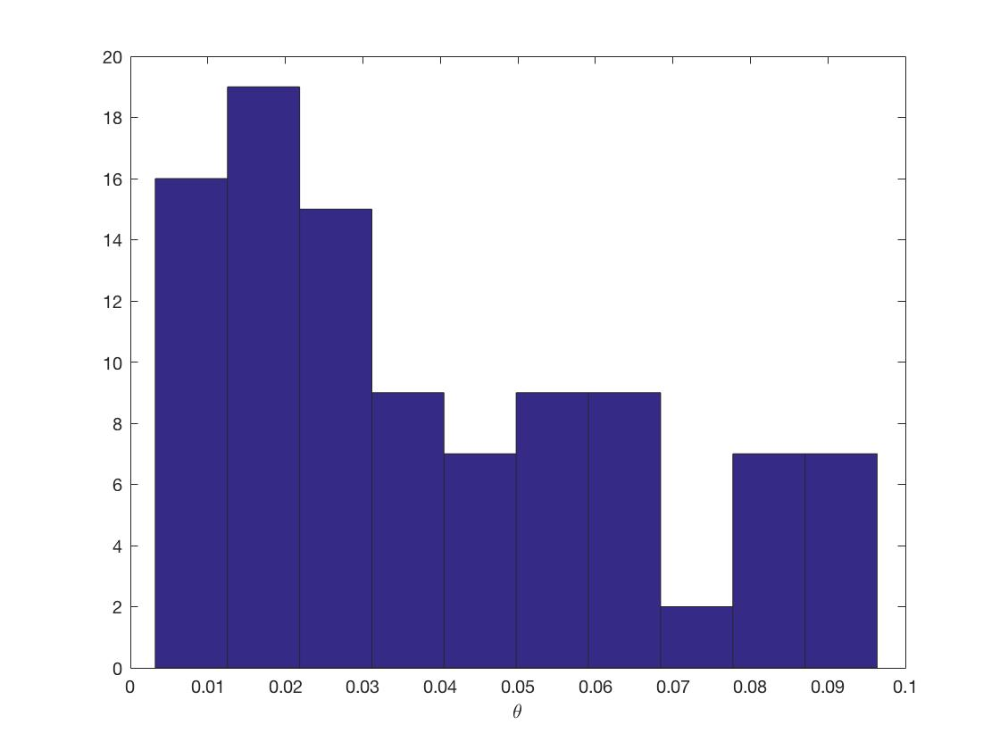
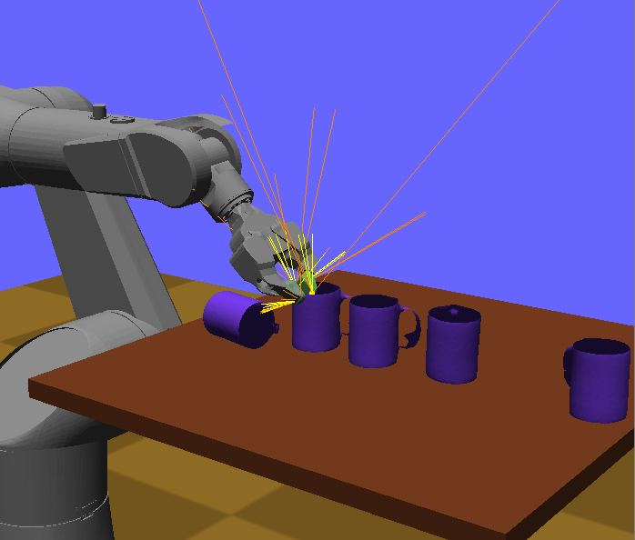
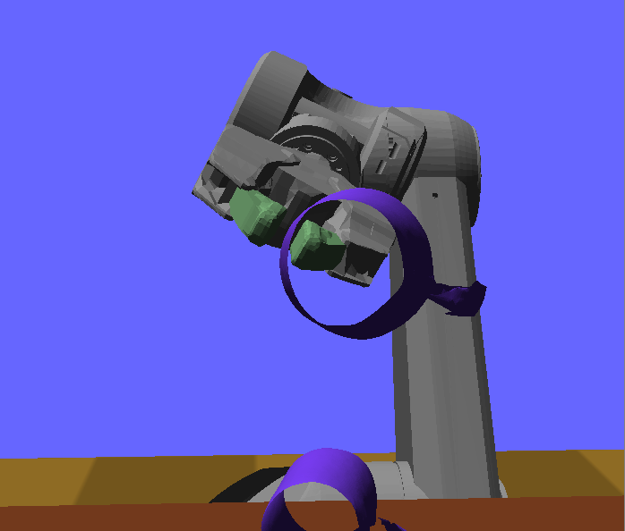

Simulation
==========================

Simulation functionality in Klamp't is built on top of the Open Dynamics
Engine (ODE) rigid body simulation package, but adds emulators for robot
sensors and actuators, and features a robust contact handling mechanism.
When designing new robots and scenarios, it is important to understand a
few details about how Klamp't works in order to achieve realistic
simulations.

Boundary-layer contact detection.
---------------------------------

Other rigid body simulators tend to suffer from significant collision
handling artifacts during mesh-mesh collision: objects will jitter
rapidly, interpenetrate, or react to "phantom" collisions. The primary
cause is that contact points, normals, and penetration depths are
estimated incorrectly or inconsistently from step-to-step. Klamp't uses
a new *boundary layer contact detection* procedure that leads to
accurate and consistent estimation of contact regions. Moreover, the
boundary layer can simulate some limited compliance in the contact
interface, such as soft rubber coatings or soft ground.

In Klamp't, contact is detected along the boundary layers rather than
the underlying mesh. The thickness of the boundary layer is a simulation
parameter called *padding*. Padding for each body can be set in XML world files
via the padding attribute in
the `<simulation>{<robot>,<object>,<terrain>}<geometry>` element, or using
the :meth:`SimBody.setCollisionPadding` / :meth:`SimBody.getCollisionPadding`
functions.

All bodies padded with 2.5mm by default. This allows it to handle
thin-shell meshes as illustrated in the following figures.

| |Simulation boundary layer 1|
| |Simulation boundary layer 2|
| |Simulation boundary layer 3|
| |Simulation boundary layer 4|

The first step of Klamp't's collision handling routine is to compute all
contacts between all pairs of geometric primitives within the padding
range. This is somewhat slow when fine meshes are in contact. In order
to reduce the number of contacts that must be handled by ODE, Klamp't
then performs a clustering step to reduce the number of contacts to a
manageable number. The maximum number of contacts between two pairs of
bodies is given by the *maxContacts* global parameter, which can be set
as an attribute in the XML <simulation> tag.

For more details, please see: *K. Hauser. Robust Contact Generation for
Robot Simulation with Unstructured Meshes. In proceedings of
International Symposium of Robotics Research, 2013.*

Collision response
------------------

In addition to padding, each body also has coefficients of restitution,
friction, stiffness, and damping.  The stiffness and damping coefficients
can be set to non-infinite values to simulate softness in the boundary layer.
Please note, however, that soft boundary layers are more prone to being
fully penetrated through, and may lead the simulation to be less robust,
unless the collision padding is quite large.

These can be set for each simulation body in world XML files
(``kRestitution``, ``kFriction``, ``kStiffness``, and ``kDamping`` attributes
in ``<simulation>{<robot>,<object>,<terrain>}<geometry>`` XML elements). 
They can also be modified after loading a world using the :class:`SurfaceParameters`
object used by :meth:`SimBody.getSurface` and :meth:`SimBody.setSurface`.

When two bodies come into
contact, their coefficients are blended using arithmetic mean for
`kRestitution`, and harmonic means for `kFriction`, `kStiffness`, and
`kDamping`.
The blending mechanism is convenient because only one set of parameters
needs to be set for each body, rather than each pair of bodies, and is a
reasonable approximation of most material types. Currently there is no
functionality to specify custom properties between pairs of bodies.

Actuator simulation
-------------------

Klamp't handles actuators in one of two modes: PID control and torque
control modes. It also simulates dry friction (stiction) and viscous
friction (velocity-dependent friction) in joints using the dryFriction
and viscousFriction parameters in .rob files. Actuator commands are
converted to torques (if in PID mode), capped to torque limits, and then
applied directly to the links. ODE then handles the friction terms.

In PID mode, the torque applied by the actuator is

.. math::

   \tau=k_P(\theta_D - \theta_A)+k_D(\dot{\theta}_D - \dot{\theta_A})+k_I I 

where

-  :math:`k_P`, :math:`k_I`, and :math:`k_D` are the PID constants,
-  :math:`\theta_D` and :math:`\dot{\theta}_D` are the desired position and velocity,
-  :math:`\theta_A` and :math:`\dot{\theta}_A` are the actual position and velocity,
-  and I is an integral error term.

The friction forces resist the motion of the joint, and Klamp't uses a
simple stick-slip friction model where the sticking mode breaking
force is equal to :math:`\mu_D` and the sliding mode friction force is

.. math::

   -sgn(\dot{\theta}_A)(\mu_D+\mu_V|\dot{\theta}_A|)

where :math:`\mu_V` is the viscous friction force. *Note: passive damping should be
handled via the friction terms rather than the PID gain kD*.

Like all simulators, Klamp't does not perfectly simulate all of the
physical phenomena affecting real robots. Some common phenomena include:

-  Backlash in the gears.
-  Back EMF.
-  Angle-dependent torques in cable drives.
-  Motor-induced inertial effects, which are significant particularly
   for highly geared motors. Can be approximated by adding a new motor
   link connected by an affine driver to its respective link.
-  Velocity-dependent torque limits (e.g. power limits). Can be
   approximated in a controller by editing the robot's driver torque
   limits depending on velocity. 
-  Motor overheating. Can be implemented manually by simulating heat
   production/dissipation as a differential equation dependent on
   actuator torques. 

API summary
-----------

To create and manage a simulation:

-  ``sim = Simulator(world)``: creates a simulator for a given ``WorldModel``
   (note: cannot modify the number of entities in the world at this
   point, undefined behavior will occur if you do!)
-  ``sim.getWorld()``: retrieves the simulation’s WorldModel
-  ``sim.updateWorld()``: updates the WorldModel to reflect the current
   state of the simulator
-  ``sim.simulate(dt)``: advances the simulation by time dt (in seconds)
-  ``sim.fakeSimulate(dt)``: fake-simulates. Useful for fast prototyping
   of controllers
-  ``sim.getTime()``: returns the accumulated simulation time
-  ``sim.getState()``: returns a string encoding the simulation state
-  ``sim.setState(state)``: sets the simulation state given the result
   from a previous ``getState()`` call
-  ``sim.reset()``: reverts the simulation back to the initial state
-  ``sim.setGravity(g)``: sets the gravity to the 3-tuple ``g`` (default
   (0,0,-9.8))
-  ``sim.setSimStep(dt)``: sets the internal simulation time step to
   ``dt``. If ``simulate()`` is called with a larger value dt', then the
   simulation will integrate physics forward over several substeps of
   length at most ``dt``

To modify the properties of simulated rigid bodies: [NOTE: reference
frame is centered at center of mass]

-  ``body = sim.body([RobotLinkModel or RigidObjectModel])``: retrieves
   the simulated body according to a link or rigid object.
-  ``body.getID()``: retrieves integer ID of associated object in world
-  ``body.enable(enabled=True)/isEnabled()``: pass ``False`` to disable
   simulation of the body
-  ``body.enableDynamics(enabled=True)/isDynamicsEnabled()``: pass
   ``False`` to drive a body kinematically along a given path
-  ``body.getTransform()/setTransform(R,t)``: gets/sets SE(3) element
   representing transform of body coordinates w.r.t. world
-  ``body.getVelocity()/setVelocity(w,v)``: gets/sets the angular
   velocity w and translational velocity v of the body coordinates
   w.r.t. world
-  ``body.getSurface()/setSurface(SurfaceParameters)``: gets/sets the
   body’s surface parameters
-  ``body.getCollisionPadding()/setCollisionPadding(m)``: gets/sets the
   body’s collision margin (nonzero yields more robust collision
   handling)
-  ``body.applyForceAtPoint(fw,pw)``, applyForceAtLocalPoint(fw,pl):
   adds a world-space force fw to a point, either pw in world
   coordinates or pl in body coordinates. Applied over duration of next
   Simulator.simulate() call
-  ``body.applyWrench(f,t)``: adds a force f at COM and torque t over
   the duration of te next Simulator.simulate() call

To inspect the contact status of objects:

-  ``sim.enableContactFeedbackAll()``: turns on contact feedback for all
   objects
-  ``sim.enableContactFeedback(id1,id2)``: turns on contact feedback for
   contacts between objects with ids id1 and id2
-  ``sim.inContact/hadContact(id1,id2)``: returns ``True`` if objects
   id1 and id2 are in contact at the end of the time step / had contact
   during the prior time step
-  ``sim.hadPenetration/hadSeparation(id1,id2)``: returns True if
   objects id1 and id2 penetrated / were separated at any point during
   the prior time step
-  ``sim.getContacts(id1,id2)``: returns a list of contacts between id1
   and id2 on the current time step. Each contact is a 7-list
   ``[px,py,pz,nx,ny,nz,kFriction]``
-  ``sim.getContactForces(id1,id2)``: returns a list of contact forces,
   one for each of the contacts in ``sim.getContacts(id1,id2)``
-  ``sim.contactForce/contactTorque(id1,id2)``: returns the contact
   force / torque at the end of last time step
-  ``sim.meanContactForce(id1,id2)``: returns the mean contact force
   over the entire last time step
-  ``from model import contact; contact.simContactMap(sim)``: returns a
   map from (id1,id2) pairs to ``contact.ContactPoint`` objects.

Example
-------------------------------

In this example we'll work from the template in Klampt-examples/Python3/demos/gl_vis.py. 
First, copy Klampt/Python3/demos/gl_vis.py to your own folder and
rename it, for example, ``myapp.py``. 

First, let's change to using the ATHLETE robot on a fractal terrain.
Change the file being read from "../../data/hubo_plane.xml" to
"Klampt-examples/data/athlete_fractal_1.xml".  Now, if you run

::

    python myapp.py 

and press 's', the simulation will proceed with the ATHLETE robot dropping onto
the terrain, but not doing anything in particular. 

Sending commands 
~~~~~~~~~~~~~~~~~~

Next, let's try sending a leg lift and lower motion to the controller.
We'll replace the first two lines of the ``idle`` method with the following code.

::

     sim = self.sim
     if sim.getTime() >= 2.0 and sim.getTime()-self.dt < 2.0:
         q=sim.controller(0).getCommandedConfig()
         q[7]-=1.0
         sim.controller(0).setMilestone(q)
         q[7]+=1.5
         sim.controller(0).addMilestone(q)

Now run the simulation and see what happens.

Sending a trajectory to the controller
~~~~~~~~~~~~~~~~~~~~~~~~~~~~~~~~~~~~~~

Here we'll use a trajectory that's been saved to disk, using the
klampt.trajectory module. Unlike the prior example, which used the
controller's trajectory queue, we'll send this motion at a high rate to
the robot using PID commands. (These override the controller's
trajectory queue.)

First, we'll load the trajectory into a class variable by putting these
lines at the end of the **__init__** method:

::

        self.traj = trajectory.RobotTrajectory(self.world.robot(0))
        self.traj.load("Klampt-examples/data/motions/athlete_flex.path")

\... and then we will put the following code in the idle function to
replace the code outlined above:

::

        sim = self.sim
        traj = self.traj
        starttime = 2.0
        if sim.getTime() > starttime:
            (q,dq) = (traj.eval(self.sim.getTime()-starttime),traj.deriv(self.sim.getTime()-starttime))
            sim.controller(0).setPIDCommand(q,dq)

That's it! 

Playing God: applying forces and constraining velocities
~~~~~~~~~~~~~~~~~~~~~~~~~~~~~~~~~~~~~~~~~~~~~~~~~~~~~~~~

The robot controller is not able to apply arbitrary forces to its body
or the world. This encapsulation is deliberate, because a robot cannot
"play God" -- it can only affect its body or the world via its
actuators. But it is often useful to generate simulation scenarios by
"playing God," and to do so, you must access the SimBody elements that
give you direct access to the rigid bodies in the underlying simulator.

The first step in doing so is to access the SimBody out of the Simulator
corresponding to the desired object in the WorldModel. To do so, you
would call something like this:

::

    body = sim.body(world.robotlink(my_robot_index,my_link_index));
    #or...
    body = sim.body(world.rigidObject(my_object_index));

To apply forces, you may use the SimBody.applyForceAtPoint function as
follows:

::

    body.applyForceAtPoint([fx,fy,fz],[px,py,pz]);

Where the force (fx,fy,fz) and point (px,py,pz) are in world
coordinates. You may also call SimBody.applyWrench to apply a
force/torque about the center of mass.

Directly controlling the movement of a body (e.g., to move along a
predetermined path, or according to a joystick) is possible but takes a
few extra steps, because Klamp't by default gives control of the body to
the simulator. First, you will need to know the translational and
angular velocity along which the body should be moving at each time
step. Let us assume you have determined these quantities as (vx,vy,vz)
and (wx,wy,wz); both are in world coordinates. Then, you will need to
disable dynamic simulation, and during your time step you will need to
set the velocities directly as follows:

::

    body.enableDynamics(False)
    body.setVelocity((wx,wy,wz),(vx,vy,vz))

Note the angular velocity is provided as the first argument.

Extracting contacts and contact forces
---------------------------------------

It is often useful to examine and record the
contact forces generated by the simulation, and Klamp't provides several
functions for doing so. 

The first step in extracting contact feedback is to enable it. Contact
feedback can be 1) enabled for everything, or 2) enabled on a per body pair basis.
The first option is as simple as calling:

.. code:: python

   sim.enableContactFeedbackAll()

Option 2 can be chosen to save a little overhead in computation
and memory.  (This overhead is relatively minor, so ``enableContactFeedbackAll`` is
usually the better choice.) To do this, we will need the IDs of the pairs of objects we want
to get feedback from. 

Each SimBody in the world, including environment objects and robot links, is given a unique
ID, and this ID is used to identify the corresponding body in the
simulator. To get the ID of an object in the world you call ``getID()``
on it:

::

    terrainid = world.terrain(terrain_index).getID()
    objectid = world.rigidObject(object_index).getID()
    linkid = world.robot(robot_index).link(link_index).getID()
    #equivalent to
    linkid = world.robotlink(robot_index,link_index).getID()

IDs are constant throughout the life of the simulation. 

.. note::
   IDs will change if you add or remove elements from the world, but adding and removing
   objects from worlds is not yet supported in simulation.

We can then just do something like this to enable only collision feedback
between the terrain and all links on the robot:

::

    for i in range(world.robot(robot_index).numLinks())
      sim.enableContactFeedback(terrainid,world.robotlink(robot_index,i).getID())

IDs are assigned contiguously, and hence it is possible to just loop
through integers ranging from 0 to world.numIDs()-1 to enable all
contact pairs. 

Now, once we have enabled contact feedback, during the
simulation loop we can use the following code to see what objects are
in contact, and examine the contact forces/torques:

::

    contacted=False
    for i in range(world.numIDs()):
      for j in range(i+1,world.numIDs()):
        #you could loop over a selective set of id pairs rather than i and j, if you wanted...
        if sim.inContact(i,j):
          if not contacted:
            print("Touching bodies:",i,j)
            contacted=True
          f = sim.contactForce(i,j)
          t = sim.contactTorque(i,j)
          print(" ",world.getName(i),"-",world.getName(j),"contact force",f,"and torque",t)

Even more detailed information about the latest contact points can be
retrieved using the ``sim.getContacts()`` function. This returns a list of
7-lists, each of which contains the 3D contact point, 3D contact normal,
and the friction coefficient. So the following code would print out all
contacts between the given objects:

::

    contactlist = sim.getContacts(objectid,linkid)
    for c in contactlist:
      print("Contact point",c[0:3],"normal",c[3:6],"friction coefficient",c[6])

Batch simulation example
-------------------------

This example will do a very simple Monte Carlo example on a 1-link
robot in the ``Klampt-examples/Python3/exercises/control`` example,
just to cover the basics on how
to run the batch simulation module.

First, create a new file in ``Klampt-examples/Python3/exercises/control``
called ``batch_test.py`` and use text editor to open it.
In this example, we want to test if the controller works from different
initial joint angles within the range [-pi, pi]. After a preset
simulation time, we want to see if the angle is successfully controlled
to the desired value.

First we have to import necessary modules, and load the xml file which
defines the world. The world contains a one-link robot with an actuator.

.. code:: python

    import klampt
    from klampt.sim import batch
    import random, math

    world = klampt.WorldModel()
    fn = "world1.xml"
    res = world.readFile(fn)
    if not res:
        raise RuntimeError("Unable to load world "+fn)

Each simulation is initialized from some initial conditions that will be
sampled at random, but we need to specify which parts of the world are
actually sampled. We use the `map <klampt.model.map.html>`__ module
which can set and get named values in a world or simulation.
Please refer to the `map module documentation  <klampt.model.map.html>`__
to learn more about how to use it.

We begin by defining a zero-argument sampling function that will sample
the first DOF position of the robot from -pi to pi, as follows:

.. code:: python

    item = 'robots[0].config[0]'
    itemsampler = lambda: random.uniform(-math.pi, math.pi)
    initialConditionSamplers = {item:itemsampler}

For each of the N Monte-Carlo runs, `itemsampler()` will be
called and the returned value will be assigned to the item that ``map``
accesses using the `'robots[0].config[0]'` path.
Any number of items in the world can be sampled by adding them to the
`initialConditionSamplers` dictionary. For example, to sample the initial
velocity, you would define a sampler for the `'robots[0].velocity[0]'`
item.

From these sampled initial conditions, ``batch.monteCarloSim`` will create a
new :class:`~klampt.Simulator` instance and run a simulation trace.
To customize the behavior of the simulation trace we can define three
callback functions:

- ``simInit``, which is called when the simulation begins,
- ``simStep``, which is called every step, and
- ``simTerm``, which is called to determine whether the
  simulation should stop.

Here we'll just change the ``simInit`` function,
which is a one-argument function taking in a ``Simulator``. In it we define
some parameters of the robot's controller:

.. code:: python

    def simInitFun(sim):
        controller = sim.controller(0)
        controller.setPIDCommand([0],[0])
        kP = 20
        kI = 8
        kD = 5
        controller.setPIDGains([kP],[kI],[kD])

which sets the target (0,0) and PID constants. (See the controller
tutorial for more details about what these parameters mean.)

Next, we define an array ``returnItems`` that defines what data we want to
retreive after each simulation run. In this example it means both the
joint configuration and the joint velocity of the robot. Then we define
duration of simulation and number of simulations, and call the
``batch.monteCarloSim`` function to simulate. See the documentation of
:meth:`~klampt.sim.batch.monteCarloSim` for other options.
The return value is a list of (initial condition, return
items) pairs.

.. code:: python

    returnItems = ['robots[0].config','robots[0].velocity']
    duration = 5
    N = 100
    res = batch.monteCarloSim(world,duration,initialConditionSamplers,N,returnItems, simInit=simInitFun)

Finally, we print the start and end configuration at each run, and use a
file to record the data for post processing.

.. code:: python

    f = open('result.txt', 'w')
    for i in range(N):
        initialCond,results = res[i]
        startConfig = initialCond['robots[0].config[0]']
        endConfig = results[returnItems[0]]
        print(startConfig,"->",endConfig)
        f.write('%lf\n'%(endConfig[0]))
    f.close()

Then run the example by calling

::

    python batch_test.py

After plotting the resulting error of the 0 angle, we obtain the
following distribution:

which is a histogram of the final joint angle. From this figure we can
know how the controller performs in order to control the joint angle
from arbitrary value to 0 within 5 seconds. This can provide
information on how the controller works based on how the parameters
are tuned.

More advanced usage could add random parameters to the controller, which
are sent as arguments to the simInit, simStep, and simTerm functions.
This is accomplished using the special initial condition named 'args',
which is a tuple that gets passed to each of these functions. For
example, if we wanted to sample the target angle of the controller, we
can do so as follows:

.. code:: python

    item = 'robots[0].config[0]'
    itemsampler = lambda: random.uniform(-math.pi, math.pi)
    initialConditionSamplers = {item:itemsampler}
    initialConditionSamplers['args'] = lambda:(random.uniform(-0.5, 0.5),)

    def simInitFun(sim,targetAngle):
        controller = sim.controller(0)
        controller.setPIDCommand([targetAngle],[0])
        kP = 20
        kI = 8
        kD = 5
        controller.setPIDGains([kP],[kI],[kD])

    returnItems = ['robots[0].config']
    duration = 5
    N = 100
    res = batch.monteCarloSim(world,duration,initialConditionSamplers,N,returnItems, simInit=simInitFun)

    f = open('result.txt', 'w')
    for i in range(N):
        #print(res[i][1])
        initialCond,results = res[i]
        startConfig = initialCond['robots[0].config[0]']
        endConfig = results[returnItems[0]]
        print("from",startConfig,"to",initialCond["args"][0],"->",endConfig)
        f.write('%lf\n'%(endConfig[0]))
    f.close()

.. |Simulation boundary layer 2| image:: _static/images/simulation-contact2.png
.. |Simulation boundary layer 3| image:: _static/images/simulation-contact3.png

