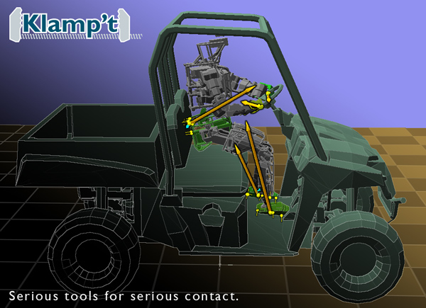

# Klamp't 

Klamp't (Kris' Locomotion and Manipulation Planning Toolbox) is an open-source, cross-platform software package for robot modeling, simulating, planning, optimization, and visualization. It aims to provide an accessible, wide range of programming tools for learning robotics, analyzing robots, developing algorithms, and prototyping intelligent behaviors. It has particular strengths in robot manipulation and locomotion.

Historically, it began development at Indiana University since 2009 primarily as a research platform. Beginning in 2013 it has been used in education at Indiana University and Duke University. Since then, it has been adopted by other labs around the world.

More information can be found on the Klamp't website (http://klampt.org)

- [Features](#features)
- [Installation](#installation)
- [Documentation](#documentation)
- [Version history](#version-history)
- [Who uses Klamp't?](#who-uses-klampt)
- [Comparison to related packages](#comparison-to-related-packages)
- [Contributors](#contributors)

## Features

- Unified C++ and Python package for robot modeling, kinematics, dynamics, control, motion planning, simulation, and visualization.
- Supports legged and fixed-based robots.
- Interoperable with [Robot Operating System](http://ros.org) (ROS) and [Open Motion Planning Library](https://ompl.kavrakilab.org/) (OMPL).
- Many sampling-based motion planners implemented.
- Fast trajectory optimization routines.
- Real-time motion planning routines.
- Forward and inverse kinematics, forward and inverse dynamics
- Contact mechanics computations (force closure, support polygons, stability of rigid bodies and actuated robots)
- Planning models are fully decoupled from simulation models. This helps simulate uncertainty and modeling errors.
- Robust rigid body simulation with triangle mesh / triangle mesh collisions.
- Simulation of PID controlled, torque controlled, and velocity controlled motors.
- Simulation of various sensors including cameras, depth sensors, laser range finders, gyroscopes, force/torque sensors, and accelerometers.
- Works on several platforms:
    - \*nux environments
    - Windows
    - MacOS
    - Google Colab
    
(Please let us know if you are able to compile on other platforms in order to help us support them in the future.)

## Installation

Quick start (Python API only):
- `pip install klampt` (or `pip3 install klampt`)

To run a visualization (you may need to replace `pip` with `pip3` and `python` with `python3`):
- `pip install PyOpenGL`
- `pip install PyQt5`
- `git clone http://github.com/krishauser/Klampt-examples` (this is needed to run example programs)
- `cd Klampt-examples/Python3/demos`
- `python gl_vis.py`

Installation instructions are also available for
- [Linux](Cpp/docs/Tutorials/Install-Linux.md)
- [Windows](Cpp/docs/Tutorials/Install-Windows.md)
- [Mac OSX](Cpp/docs/Tutorials/Install-Mac.md)
- [Jupyter notebook](Jupyter/README.md)
- [Docker](Cpp/docs/Tutorials/Install-Docker.md)

Klamp't works best when it is installed on your local machine, but it can also be run online through your web browser using Google Colab or Binder (or any other Jupyterhub server).

- Google Colab 
- Binder 

Note that the UI functionality is drastically limited compared to a local installation.

## Documentation

[Python Manual and API Documentation](http://pythondocs.klampt.org/)

[C++ Manual](Cpp/docs/Manual.md)

API documentation is available here
- [Klamp't C++ API](http://cppdocs.klampt.org)
- [KrisLibrary C++ API](http://motion.cs.illinois.edu/software/krislibrary/krislibrary_docs)

## Reporting bugs and getting help

If you identify a programming bug or issue, please raise them on this Github site.
If you have general questions installing or programming with Klamp't, please ask them on the Klamp't forum, which
is available on GitQ: [https://gitq.com/krishauser/Klampt](https://gitq.com/krishauser/Klampt). 

## Version history

**Master** (2/22/2021)
-   Fixed bug in simulation of affine joints when the joint angle can go negative. Also, internal affine transmission coupling is simulated in a fashion that's sensitive to the driver's PID constants.
-   URDF import can now import multiple collision and visual geometries.
-   Python API: Workaround for Mac OSX Big Sur dropping support for OpenGL when importing PyOpenGL.
-   Python API: bug fixes for motion planning with affine drivers.
-   Python API: Added a function `klampt.model.types.transfer()` which transfers objects from one robot to another.
-   Python API: Added convenience functions in `klampt.model.sensing` for converting camera intrinsics between Klamp't cameras and openCV and numpy formats.
-   Minor bug fixes.

**0.8.6** (1/27/2021)
-   Fixed bug drawing Group geometries.
-   RGBD sensors now have a long range for RGB information like actual cameras do, rather than clipping to the sensor's specified depth range.
-   URDF mimic joints are now respected.
-   Fixed bug loading non-square textures.
-   Fixed bug with SubRobotModel editing in vis.
-   Python API: Moved some recently added routines from klampt.model.sensor to klampt.model.geometry.
-   Python API: klampt.io.ros integration with LaserScan messages and SimCameraSensor publishing. 
-   Python API: klampt.io.ros can now broadcast SimCameraSensor frames to ros.broadcast_tf.
-   Python API: Bug fix with SimRobotSensor.kinematicSimulate and multiple worlds.
-   Python API: Added visual editor for SimRobotSensor. Trajectory editor now has option to use RobotTrajectory interpolation.
-   Python API: Bug fixes for HTML and IPython visualizations.  vis.debug() now works for these modes, and removing text now works.  Misc bugs are also fixed in the Jupyter extension.
-   Python API: More thorough bounds checking in core C++ interface.
-   Python API: Used Pylance to squash lots of small bugs in infrequently used branches of the code.

**0.8.5  Bugfix version** (12/7/2020)
-   Fixed a few bad bugs in the pip release (klampt_browser crash; resource editor crash; HTML output with no animation; HTML output with custom entities).
-   More thorough integration of custom joints into the simulation, including reading from XML world files (see [Klampt-examples/data/simulation_test_worlds/jointtest.xml](https://github.com/krishauser/Klampt-examples/blob/master/data/simulation_test_worlds/jointtest.xml).
-   XML world files' simulation tags can now refer to named robots, rigid objects, and terrains.
-   Conversions from geometries to VolumeGrids now respect the geometry's collision margin.
-   Supports emissive and specular colors in OpenGL views and XML world files now.
-   The "automass" signal in .rob files and .obj (rigid object) files can now accept a parameter indicating how much mass is concentrated at the surface vs the interior of the object.  
-   A bug in the earlier automass inertia matrix calculation made inertias much larger than they should have been!  This may require re-calibrating robot PID constants to avoid jittering.  (This bug will not affect robot / object files that specify inertias matrices.)
-   Python API: Can now remesh triangle meshes, point clouds, and volume grids using `Geometry3D.convert(self.type(),resolution)`.
-   Python API: Easy vis.snapshot API added.

**0.8.3** (10/24/2020)
-   Convex hulls are a new geometry type.  They support conversion from multiple geometry types and conversion to meshes, visualization, and fast convex hull-convex hull proximity queries.  (Queries are not yet supported for convex hull vs anything else.)
-   Python API: Python 3 is now the default version used by Klamp't, and all further feature development will be focused on Python 3.  The Python 2 version will receive occasional bug fixes but will be deprecated by the next version.
-   Python API: The visualization API has a unified interface between PyQT, PyOpenGL, Jupyter notebooks, and HTML output. This makes it easy to convert your OpenGL visualizations into shareable, animated web pages (with some caveats).  Use vis.init() to select which visualization backend to use.
-   Python API: A new [klampt.math.autodiff](http://motion.cs.illinois.edu/software/klampt/0.8/pyklampt_docs/klampt.math.autodiff.html) module supports taking derivatives of many Klamp't functions.  This lets you use optimization for, say, trajectory optimization, deep learning, etc.  A Pytorch binding is supported.
-   Python API: A new kinematic trajectory optimization toolbox is available, [klampt.plan.kinetrajopt](http://motion.cs.illinois.edu/software/klampt/0.8/pyklampt_docs/klampt.plan.kinetrajopt.html). This uses convex hulls to enforce collision constraints along a path.
-   Python API: A new colorization module, [klampt.vis.colorize](http://motion.cs.illinois.edu/software/klampt/0.8/pyklampt_docs/klampt.vis.colorize.html), makes it easy to color-code point clouds and meshes for classy visualizations.
-   Python API: The [klampt.math.vis](http://motion.cs.illinois.edu/software/klampt/0.8/pyklampt_docs/klampt.vis.html) module now supports a debug function for one-line visualization, and a followCamera function that is helpful for making animations.
-   Python API: The Jupyter / HTML API backends are upgraded to use the latest version of three.js.
-   Python API: The [klampt.math.symbolic](http://motion.cs.illinois.edu/software/klampt/0.8/pyklampt_docs/klampt.math.symbolic.html) now supports tensor derivatives (e.g., the derivative of vector w.r.t. a matrix).
-   Python API: the RobotModel class now exposes reduce and mount methods.
-   Python API: The IKObjective, Geometry3D, GeometricPrimitive, TriangleMesh, PointCloud, VolumeGrid, and ConvexHull classes can now be pickled.  Geometry objects now have JSON loaders/savers.
-   Python API ray casting can now return an index of the triangle / point that was hit: Geometry3D.rayCast_ext.  VolumeGrids now support ray casting.
-   Python API: Trajectory functionality has been enhanced. Can now do acceleration-bounded and velocity-bounded minimum-time interpolation, smoothed (Hermite-like) geodesic interpolation on manifolds.  Hermite, SO(3), and SE(3) trajectories can now be saved/loaded to/from JSON.
-   Python API: [EXPERIMENTAL] Klamp't can now drive your robots with the new Python [klampt.control](http://motion.cs.illinois.edu/software/klampt/0.8/pyklampt_docs/klampt.control.html) module! The RobotInterfaceBase class provides a unified interface for working with real motor controllers. For example, if you build a robot with basic position-controlled servos, the RobotInterfaceCompleter class provides a unified interface for executing trajectories on servos, motion smoothing, emergency stops, and Cartesian control.  Also, if you build a robot consisting of multiple parts, such as an arm and a gripper, you can perform coordinated control using the MultiRobotInterface class.
-   Python API: Added SimJoint class to enable creation of sliding / hinge / fixed joints between bodies in the simulator.
-   C++ API: Robot class and the Python RobotModel class have methods to reduce the number of DOFs of a robot that contains fixed DOFs. 
-   Miscellaneous bug fixes, improvements to the docs.

**0.8.2** (11/15/2019)
-   Can now load almost all files from URLs!  Just use an http:// prefix to the filenames of worlds, robots,
    rigid objects, or geometries.  This also works for resources in Python.  (Resources in C++ are not done yet)
-   New mesh visualization shows smooth meshes and black silhouettes by default, making things look prettier.
-   Can now mount robots in URDF files (see [tutorial](Cpp/docs/Tutorials/Import-and-calibrate-urdf.md) for an example).
-   Added ability to specify cost functions in kinematic planning.
-   Added conversions to Numpy objects in Python API ([klampt.io.numpy_convert](http://motion.cs.illinois.edu/software/klampt/0.8/pyklampt_docs/klampt.io.numpy_convert.html))
-   Added much more [ROS](http://ros.org) support in Python API ([klampt.io.ros](http://motion.cs.illinois.edu/software/klampt/0.8/pyklampt_docs/klampt.io.ros.html) module).
-   Added conversions to [Open3D](http://open3d.org) objects in Python API ([klampt.io.open3d_convert](http://motion.cs.illinois.edu/software/klampt/0.8/pyklampt_docs/klampt.io.open3d_convert.html))
-   The Python loading API has changed to have a more complete list of types and file extensions.
-   Fixed some bugs when editing in the `klampt_browser` Python program.
-   Fixed some motion planning bugs (closed loop + moving subset spaces in Python, some planners in C++).
-   Fixed a bizarre Python 2 to 3 conversion bug in se3.mul.

**0.8.1** (1/3/2019)
-   Cleaned up documentation, separating C++ and Python docs.  Sphinx is now used for Python docs.
-   Added klampt_path utility to Python API.
-   Added Python API bindings for higher order dynamics functions that were already in the C++
    library (Cartesian accelerations, Hessians, derivatives of mass matrices).
-   Added rootfind Python C++ extension back.

**0.8.0** (12/17/2018)
-	Cleaner file structure, with C++ files in the Cpp directory.
-	Improved build system for Python, allowing easy installation via pip install python.
-	Integration with Jupyter Notebook 
-	Added Python utility programs (klampt_browse, klampt_sim, klampt_thumbnail).
-	Improvements support Python visualization on Mac.
-	Upgraded to PyQt5.  PyQt4 is still supported for now.
-	Geometry conversions exposed in Python via the convert function.
-	Improved usage of some graphics card resources for streaming point clouds.
-	Support for LOG4CXX logging.
-	Removed dependencies on Boost and upgraded to C++11.
-	Removed dependencies on GLUT and GLUI.  (Some examples still need to be upgraded to Qt.)
-	Cleaned up some cruft in KrisLibrary.

**0.7** (3/24/2017)

- Improved simulation stability, including adaptive time stepping and instability detection/recovery.
- The proprietary `.tri` geometry file format has been replaced with the Object File Format (OFF) for better compatibility with 3D modeling packages.
- Simulated visual, depth, and laser range sensors are now fully supported.
- ROS sensor simulation broadcasting is enabled in Klampt/IO/ROS.h.
- World XML files can now be saved to disk.
- Robot sensors and controllers can be attached directly to a robot model using the sensors / controller properties in the robot's `.rob` or `.urdf` file.
- The motion planning structure in KrisLibrary has been completely revamped in preparation for support of optimal and kinodynamic planning, but this should be a mostly transparent change to Klamp't users.
- The Python interface is now better organized.  _However, the module structure is incompatible with code developed for versions 0.6.2 and earlier_. In particular, math modules (`vectorops`, `so3`, `se3`) are now in the `math` subpackage, and visualization modules (`glprogram`, `glrobotprogram`, etc) are now in the vis subpackage.
- Custom Python simulations of sensors, actuators, and force appliers that work on fast simulation rates are easier to integrate with slower control loops in the sim.simulation module.
- Revamped and enhanced Python visualization functionality in the vis module. Multiple windows, simultaneous viewports, trajectory visualization, custom in-visualization plotting, automatic viewport determination, and thumbnail saving are now supported.
- Cartesian trajectory generation, file loading utilities are added to Python.

**0.6.2** (7/31/2016)

- New Python APIs for visualization
- Geometry caching helps load times and memory usage for large scenes
- A global IK solver has been added to the Python API
- ROS broadcasting / subscribing is enabled in the C++ API.

**0.6.1** (3/21/2015)

- Added functionality in Python API to load/save/edit resources, manipulate transforms and robot configurations via widgets, change appearance of objects, and run programs through Qt.
- Removed the Python `collide` module. All prior functionality is now placed in the `Geometry3D` class in the standard `klampt` module.
- Real-time planning interface has been greatly simplified.
- The `MilestonePathController` class will be deprecated, use `PolynomialPathController` instead.
- Minor bug fixes

**0.6** (7/4/2014)

- CMake build system makes it easier to build across multiple platforms
- Easy connections with external controllers via ROS or a serial protocol
- More user-friendly Qt application front ends
- More demos, example code, and tutorials
- Direct loading of URDF files with &lt;klampt&gt; XML tag
- More calibrated robots: Baxter, RobotiQ 3-finger adaptive gripper
- Unification of locomotion and manipulation via the GeneralizedRobot mechanism
- Fixed build for Cygwin
- More sophisticated logging capabilities in SimTest (contacts, commanded/actual/sensed paths)
- Miscellaneous debugging throughout

**0.5. Initial release** (11/17/2013)

## Who uses Klamp't?

(This is not an exhaustive list; if you are using Klampt and would like to be listed, let us know!)

* [Intelligent Motion Laboratory (IML)](http://motion.cs.illinois.edu), on the Baxter, [TRINA](http://motion.cs.illinois.edu/nursing), [RoboSimian](http://motion.cs.illinois.edu/locomotion/tactile.html), and UR5 robots.  Klamp't has also been used in dozens of academic papers.

* Multiple IML open-source projects, including:

  * [Global Redundancy Resolution](https://github.com/krishauser/GlobalRedundancyResolution)
  * [Semi-Infinite Optimization](https://github.com/krishauser/SemiInfiniteOptimization)
  * [Inverse Kinematics Database (IKDB)](https://github.com/krishauser/ikdb)
  * [Robotic Systems Open Textbook](https://github.com/krishauser/RoboticSystemsBook)

* Courses at UIUC (CS 498) and Duke (ECE 383, ECE 489)

* Team Duke in the Amazon Picking Challenge 2016-2018.

* [SimGrasp](https://web.stanford.edu/~shiquan/SimGrasp/sim-grasp-manual/about.html) at Stanford University

* Research labs at Brown, RPI, Columbia, and IIT Pisa

* TeamHubo in the DARPA Robotics Challenge

* [IROS 2016 Manipulation Challenge, Simulation Track](https://github.com/krishauser/IROS2016ManipulationChallenge)

## Comparison to related packages

- **ROS (Robot Operating System)** is a middleware system designed for distributed control of physical robots, and Klamp't is designed to be interoperable with it. Various ROS software packages can replicate many of the functions of Klamp't when used together (Gazebo, KDE, Rviz, MoveIt!), but this approach is difficult since these tools are not as tightly integrated as they are in Klamp't. ROS has limited support for legged robots, and is poorly suited for prototyping high-rate feedback control systems. ROS is heavy-weight, has a steep learning curve especially for non-CS students, and is also not completely cross-platform (only Ubuntu is fully supported).
- **OpenRAVE (Robotics and Animation Virtual Environment)** is similar to Klamp't and was developed concurrently by a similar group at CMU. OpenRAVE has more sophisticated manipulation planning functionality. Does not support planning for legged robots, but simulation is possible with some effort. Simulation models are often conflated with planning models whereas in Klamp't they are fully decoupled. OpenRAVE is no longer actively supported.
- **Gazebo, Webots, V-REP, etc** are robot simulation packages built off of the same class of rigid body simulations as Klamp't. They have more sophisticated sensor simulation capabilities, cleaner APIs, and nicer visualizations but are typically built for mobile robots and have limited functionality for modeling, planning, and optimization. Klamp't also has improved mesh-mesh collision handling that makes collision handling much more stable.

## Contributors

[Kris Hauser](mailto:kkhauser@illinois.edu) has been the primary maintainer throughout the project. Other major contributors include Zherong Pan, Gao Tang, Jordan Tritell, Jingru Luo, and Alessio Rocchi.

Adam Konnecker, Cam Allen, and Steve Kuznetsov have helped with the Mac build.  Hayden Bader helped with the prebuilt Docker container.

As an open-source project, we welcome contributions and suggestions from the community.

